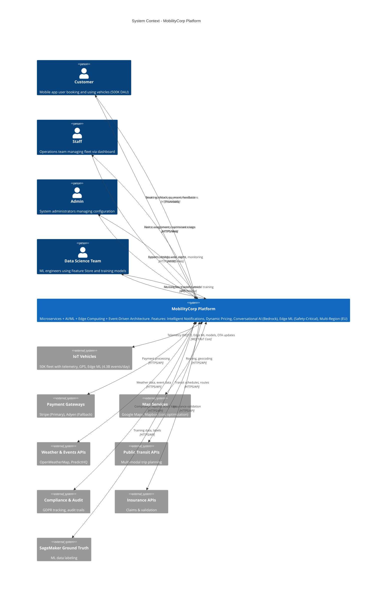

# C1: System Context Diagram

This diagram provides a high-level overview of the MobilityCorp platform and its interactions with external users and systems.

## ASCII Diagram

```
┌────────────────────────────────────────────────────────────────────────────────┐
│                         SYSTEM CONTEXT (C1)                                    │
└────────────────────────────────────────────────────────────────────────────────┘

USERS & ACTORS:
┌─────────────┐  ┌─────────────┐  ┌─────────────┐  ┌──────────────┐
│  Customer   │  │    Staff    │  │    Admin    │  │ Data Science │
│  (Mobile    │  │ (Operations │  │   (System   │  │    Team      │
│   App)      │  │  Dashboard) │  │   Config)   │  │ (Analytics)  │
└──────┬──────┘  └──────┬──────┘  └──────┬──────┘  └──────┬───────┘
       │  ▲             │  ▲             │  ▲             │  ▲
       │  │             │  │             │  │             │  │
       │  │ Booking,    │  │ Task Mgmt,  │  │ System     │  │ Feature
       │  │ Unlock,     │  │ Maintenance │  │ Settings,  │  │ Store,
       │  │ Payment,    │  │ Logs,       │  │ User Mgmt, │  │ Model
       │  │ Feedback    │  │ Incident    │  │ Monitoring │  │ Training
       │  │             │  │ Response    │  │            │  │
       │  └─ Smart      │  └─ Alerts &   │  └─ Reports & │  └─ Insights
       │    Notif,      │    Assignments │    Dashboards │
       │    Recomm.     │                │               │
       ▼                ▼                ▼               ▼
┌──────────────────────────────────────────────────────────────────────┐
│                                                                      │
│                   MobilityCorp Platform                              │
│    (Microservices + AI/ML + Edge Computing + Event-Driven)           │
│                                                                      │
│  ⭐ Intelligent Notification Service                                │
│  ⭐ AI-Driven Dynamic Pricing & Relocation Incentives               │
│  ⭐ Conversational AI Assistant (LangChain + Bedrock)               │
│  ⭐ Edge ML Models (Collision Detection, Geofence, Tamper)          │
│  ⭐ Multi-Region Active-Active Architecture                         │
│                                                                      │
└──────────────────────────────────────────────────────────────────────┘
       │           │            │            │           │
       │           │            │            │           │
┌──────▼─────┐ ┌──▼────────┐ ┌─▼──────────┐ ┌─▼────────┐ ┌─▼───────────┐
│    IoT     │ │  External │ │  Payment   │ │  Map     │ │  Compliance │
│  Vehicles  │ │    APIs   │ │  Gateway   │ │  APIs    │ │  & Audit    │
│(Telemetry, │ │ (Weather, │ │  (Stripe,  │ │ (Google, │ │  Systems    │
│ GPS, NFC,  │ │  Events,  │ │   Adyen)   │ │  Mapbox) │ │  (GDPR)     │
│ Edge ML)   │ │ Holidays, │ │            │ │          │ │             │
│            │ │  Transit) │ │            │ │          │ │             │
└────────────┘ └───────────┘ └────────────┘ └──────────┘ └─────────────┘
       │                                                         │
       │                                                         │
┌──────▼─────────┐                                      ┌────────▼────────┐
│  Ground Truth  │                                      │    Insurance    │
│   Labeling     │                                      │   Provider APIs │
│  (SageMaker)   │                                      │                 │
└────────────────┘                                      └─────────────────┘
```

## Key External Actors:

### Human Users
-   **Customers:** Mobile app users booking and using vehicles (500K+ daily active users)
-   **Staff:** Operations team managing the fleet via web dashboard (task mgmt, maintenance, incidents)
-   **Admin:** System administrators managing platform configuration, user roles, and monitoring
-   **Data Science Team:** ML engineers and analysts using Feature Store and running model training

### External Systems

#### Core Integrations
-   **IoT Vehicles (50K fleet):** Electric scooters, eBikes, cars, and vans with embedded sensors
    - Real-time telemetry (GPS, battery, IMU @ 4.3B events/day)
    - Edge ML models (collision detection, geofence, tamper)
    - Bi-directional communication via AWS IoT Core

-   **Payment Gateways:** Multi-provider strategy with orchestration
    - Primary: Stripe (EU payments, 3DS support)
    - Fallback: Adyen (backup & compliance)
    
-   **Map Services:** Dual-provider for cost optimization & resilience
    - Google Maps Platform (routing, traffic, places)
    - Mapbox (geocoding, static maps - 50% cost savings)

#### Contextual Data Providers
-   **Weather APIs:** OpenWeatherMap (primary), WeatherAPI.com (fallback)
-   **Events APIs:** PredictHQ (concerts, sports, festivals)
-   **Public Holidays:** Calendarific API
-   **Public Transit APIs:** Multi-modal trip planning integration
    
#### Compliance & Operations
-   **Compliance & Audit Systems:** GDPR compliance tracking, audit trails, data retention
-   **Insurance Provider APIs:** Vehicle insurance validation and claims
-   **Ground Truth Labeling (SageMaker):** Continuous ML model improvement via human labeling

## System Responsibilities:

The MobilityCorp Platform handles:
- Vehicle booking, unlock/lock, trip tracking
- AI-driven dynamic pricing and relocation incentives
- Real-time demand forecasting and fleet optimization
- Predictive maintenance and incident management
- Multi-language conversational AI assistant
- Payment processing with multi-provider failover
- Edge computing for safety-critical operations
- Multi-region deployment (EU: Frankfurt, Ireland)
- Event-driven architecture with Kafka event bus
- Data lakehouse (Bronze/Silver/Gold medallion)
- MLOps pipeline (training, deployment, monitoring)

## Mermaid Diagram (C4 Context)



## Key Metrics & Scale:

- **Customers:** 500K daily active users
- **Fleet:** 50,000 vehicles across EU cities
- **Telemetry:** 4.3 billion events/day
- **Bookings:** 500K transactions/day
- **Regions:** 2 active (Frankfurt, Ireland)
- **Availability SLA:** 99.9% uptime
- **AI Models:** 10+ production models
- **Edge Devices:** 50K IoT Greengrass instances

## Related Documents:
- [C2: Container Diagram](C2_Container.md)
- [C3: AI/ML Component Diagram](C3_Component_AIML.md)
- [ADR-01: Microservices Architecture](../ADR/ADR_01_microservices_architecture.md)
- [ADR-09: Multi-Region Deployment](../ADR/ADR_09_MULTI_REGION.md)
- [ADR-19: Edge vs Cloud AI Strategy](../ADR/ADR_19_Edge_Cloud_AI_Strategy.md)
