# C2: Container Diagram (Updated)

This diagram zooms into the MobilityCorp platform, showing the high-level containers (applications, microservices, data stores) that constitute the system. This updated version includes Edge Computing, Orchestrator Layer, Data Lakehouse, and all missing components from the review.

## ASCII Diagram

```
┌──────────────────────────────────────────────────────────────────────────────┐
│                           CONTAINER ARCHITECTURE (C2)                         │
└──────────────────────────────────────────────────────────────────────────────┘

┌──────────────────────────────────────────────────────────────────────────────┐
│                              FRONTEND LAYER                                  │
├──────────────────────────────────────────────────────────────────────────────┤
│  ┌────────────┐    ┌────────────┐    ┌────────────┐                         │
│  │   Mobile   │    │ Operations │    │   Admin    │                         │
│  │    App     │    │ Dashboard  │    │  Portal    │                         │
│  │  (React    │    │  (React)   │    │  (React)   │                         │
│  │  Native)   │    │            │    │  ⭐ NEW    │                         │
│  └─────┬──────┘    └─────┬──────┘    └─────┬──────┘                         │
└────────┼───────────────────┼──────────────────┼────────────────────────────────┘
         │                   │                  │
┌────────▼───────────────────▼──────────────────▼────────────────────────────┐
│                          API GATEWAY LAYER                                 │
├────────────────────────────────────────────────────────────────────────────┤
│  ┌──────────────────────────────────────────────────────┐                  │
│  │  API Gateway (Kong / AWS API Gateway)                │                  │
│  │  • OAuth2/JWT Authentication                         │                  │
│  │  • Rate Limiting & Throttling (10K req/sec)          │                  │
│  │  • Request Routing & Load Balancing                  │                  │
│  │  • CORS & Security Headers                           │                  │
│  └────────────────────────┬─────────────────────────────┘                  │
└───────────────────────────┼────────────────────────────────────────────────┘
                            │
┌───────────────────────────▼────────────────────────────────────────────────┐
│                         CORE SERVICES LAYER                                │
├────────────────────────────────────────────────────────────────────────────┤
│  ┌──────────────┐  ┌──────────────┐  ┌──────────────┐  ┌──────────────┐   │
│  │   Booking    │  │   Payment    │  │     User     │  │     KYC      │   │
│  │   Service    │  │   Service    │  │   Service    │  │   Service    │   │
│  │              │  │              │  │              │  │  ⭐ NEW      │   │
│  └──────────────┘  └──────────────┘  └──────────────┘  └──────────────┘   │
│                                                                            │
│  ┌──────────────┐  ┌──────────────┐  ┌──────────────┐  ┌──────────────┐   │
│  │   Vehicle    │  │  Telemetry   │  │    Fleet     │  │ Notification │   │
│  │  Management  │  │   Service    │  │  Operations  │  │   Service    │   │
│  │              │  │              │  │              │  │              │   │
│  └──────────────┘  └──────────────┘  └──────────────┘  └──────────────┘   │
│                                                                            │
│  ┌──────────────┐  ┌──────────────┐                                        │
│  │  Incentive   │  │   Incident   │                                        │
│  │   Engine     │  │  Management  │                                        │
│  │  ⭐ NEW      │  │  ⭐ NEW      │                                        │
│  └──────────────┘  └──────────────┘                                        │
└────────────────────────────────────────────────────────────────────────────┘
                            │
┌───────────────────────────▼────────────────────────────────────────────────┐
│                      ORCHESTRATOR LAYER ⭐ NEW                             │
├────────────────────────────────────────────────────────────────────────────┤
│  ┌──────────────────────────────────────────────────────────┐              │
│  │  AI/LLM Orchestrator (Lambda + Circuit Breaker)          │              │
│  │  • Bedrock (Claude 3.5) ↔ OpenAI GPT-4o routing         │              │
│  │  • Circuit breaker state in DynamoDB                     │              │
│  └──────────────────────────────────────────────────────────┘              │
│                                                                            │
│  ┌──────────────────────────────────────────────────────────┐              │
│  │  Payment Gateway Orchestrator (Step Functions)           │              │
│  │  • Stripe (Primary) ↔ Adyen (Fallback)                  │              │
│  │  • Failover logic & retry policies                       │              │
│  └──────────────────────────────────────────────────────────┘              │
│                                                                            │
│  ┌──────────────────────────────────────────────────────────┐              │
│  │  Mapping API Orchestrator (Lambda)                       │              │
│  │  • Google Maps ↔ Mapbox routing                         │              │
│  │  • Use case-based routing (cost optimization)            │              │
│  └──────────────────────────────────────────────────────────┘              │
│                                                                            │
│  ┌──────────────────────────────────────────────────────────┐              │
│  │  Weather/Events Orchestrator (Lambda)                    │              │
│  │  • Multi-provider failover & caching                     │              │
│  └──────────────────────────────────────────────────────────┘              │
└────────────────────────────────────────────────────────────────────────────┘
                            │
┌───────────────────────────▼────────────────────────────────────────────────┐
│                         AI/ML SERVICES LAYER                               │
├────────────────────────────────────────────────────────────────────────────┤
│  ┌──────────────────────────────────────────────────────────┐              │
│  │  Demand Forecasting Engine (SageMaker Endpoint)          │              │
│  │  • XGBoost/LSTM models, 15-min zone predictions          │              │
│  └──────────────────────────────────────────────────────────┘              │
│                                                                            │
│  ┌──────────────────────────────────────────────────────────┐              │
│  │  Dynamic Pricing & Incentive Engine (Lambda + SageMaker) │              │
│  │  • Supply-demand multipliers, relocation incentives      │              │
│  └──────────────────────────────────────────────────────────┘              │
│                                                                            │
│  ┌──────────────────────────────────────────────────────────┐              │
│  │  Predictive Maintenance Engine (SageMaker)               │              │
│  │  • Isolation Forest + LSTM, 7-14 day predictions         │              │
│  └──────────────────────────────────────────────────────────┘              │
│                                                                            │
│  ┌──────────────────────────────────────────────────────────┐              │
│  │  Vision AI - Damage Detection (Multi-Model Endpoint)     │              │
│  │  • MobileNetV3 + YOLOv8, edge + cloud processing         │              │
│  └──────────────────────────────────────────────────────────┘              │
│                                                                            │
│  ┌──────────────────────────────────────────────────────────┐              │
│  │  Conversational AI Assistant (ECS Fargate)               │              │
│  │  • LangChain + Bedrock (Claude 3.5 Sonnet)              │              │
│  │  • RAG with OpenSearch, 8 tools integrated               │              │
│  └──────────────────────────────────────────────────────────┘              │
│                                                                            │
│  ┌──────────────────────────────────────────────────────────┐              │
│  │  Feature Store (SageMaker) ⭐ NEW                        │              │
│  │  • Online (DynamoDB): <10ms real-time features           │              │
│  │  • Offline (S3): Historical features for training        │              │
│  └──────────────────────────────────────────────────────────┘              │
│                                                                            │
│  ┌──────────────────────────────────────────────────────────┐              │
│  │  Model Registry (SageMaker) ⭐ NEW                       │              │
│  │  • Model versioning & approval workflow                  │              │
│  │  • Multi-region model sync                               │              │
│  └──────────────────────────────────────────────────────────┘              │
│                                                                            │
│  ┌──────────────────────────────────────────────────────────┐              │
│  │  MLOps Pipelines (SageMaker Pipelines) ⭐ NEW            │              │
│  │  • Automated training, evaluation, deployment            │              │
│  │  • 10+ model pipelines with canary rollouts              │              │
│  └──────────────────────────────────────────────────────────┘              │
└────────────────────────────────────────────────────────────────────────────┘
                            │
┌───────────────────────────▼────────────────────────────────────────────────┐
│                         DATA & EVENT LAYER                                 │
├────────────────────────────────────────────────────────────────────────────┤
│  EVENT BUS:                                                                │
│  ┌──────────────────────────────────────────────────────────┐              │
│  │  Apache Kafka (AWS MSK - 3 brokers, 50 partitions/topic) │              │
│  │  Topics: bookings.*, vehicles.*, predictions.*,          │              │
│  │          photos.*, operations.*, pricing.*               │              │
│  └──────────────────────────────────────────────────────────┘              │
│                                                                            │
│  ┌──────────────────────────────────────────────────────────┐              │
│  │  EventBridge (Scheduled Events) ⭐ NEW                   │              │
│  │  • Pricing updates (every 5 mins)                        │              │
│  │  • ML training triggers (daily/weekly)                   │              │
│  └──────────────────────────────────────────────────────────┘              │
│                                                                            │
│  DATABASES:                                                                │
│  ┌──────────────┐  ┌──────────────┐  ┌──────────────┐                     │
│  │  PostgreSQL  │  │   DynamoDB   │  │    Redis     │                     │
│  │   (Aurora    │  │   (Global    │  │ (ElastiCache │                     │
│  │   Global DB) │  │   Tables)    │  │  ⭐ NEW)     │                     │
│  │              │  │              │  │              │                     │
│  │• Relational  │  │• Vehicle     │  │• Price cache │                     │
│  │  data        │  │  status      │  │• Sessions    │                     │
│  │• Multi-region│  │• Zone pricing│  │• Features    │                     │
│  └──────────────┘  │• Conversation│  └──────────────┘                     │
│                    │  history     │                                        │
│                    │• Circuit     │                                        │
│                    │  breaker state│                                       │
│                    └──────────────┘                                        │
│                                                                            │
│  ┌──────────────┐  ┌──────────────┐  ┌──────────────┐                     │
│  │ TimescaleDB  │  │  OpenSearch  │  │VictoriaMetrics│                    │
│  │ (Time-series)│  │  Serverless  │  │  (Metrics)   │                     │
│  │              │  │  ⭐ NEW       │  │              │                     │
│  │• Telemetry   │  │• Vector DB   │  │• Observability│                    │
│  │  4.3B/day    │  │  for RAG     │  │  metrics     │                     │
│  └──────────────┘  │• Embeddings  │  └──────────────┘                     │
│                    │  1536-dim    │                                        │
│                    └──────────────┘                                        │
│                                                                            │
│  STORAGE:                                                                  │
│  ┌──────────────────────────────────────────────────────────┐              │
│  │  S3 (Object Storage)                                     │              │
│  │  • Images, ML artifacts, logs                            │              │
│  │  • Cross-region replication (CRR)                        │              │
│  └──────────────────────────────────────────────────────────┘              │
│                                                                            │
│  DATA LAKEHOUSE ⭐ NEW:                                                    │
│  ┌──────────────────────────────────────────────────────────┐              │
│  │  Bronze Layer (S3 - Raw Parquet)                         │              │
│  │  • Kafka → Kinesis Firehose → S3                        │              │
│  │  • 90-day retention, Snappy compression                  │              │
│  └──────────────────────────────────────────────────────────┘              │
│  ┌──────────────────────────────────────────────────────────┐              │
│  │  Silver Layer (S3 - Delta Lake)                          │              │
│  │  • Cleaned, validated, deduplicated                      │              │
│  │  • ACID transactions, schema evolution                   │              │
│  │  • 2-year retention                                      │              │
│  └──────────────────────────────────────────────────────────┘              │
│  ┌──────────────────────────────────────────────────────────┐              │
│  │  Gold Layer (S3 Delta + Redshift)                        │              │
│  │  • Aggregated, business-ready tables                     │              │
│  │  • Star schema for BI                                    │              │
│  │  • 5-year retention                                      │              │
│  └──────────────────────────────────────────────────────────┘              │
│                                                                            │
│  ┌──────────────┐  ┌──────────────┐  ┌──────────────┐                     │
│  │  Glue Data   │  │   Athena     │  │  Glue ETL    │                     │
│  │   Catalog    │  │ (SQL Queries)│  │   Jobs       │                     │
│  │  ⭐ NEW      │  │  ⭐ NEW      │  │  ⭐ NEW      │                     │
│  │• Schema reg. │  │• Ad-hoc      │  │• Bronze→     │                     │
│  │• Lineage     │  │  analysis    │  │  Silver→Gold │                     │
│  └──────────────┘  └──────────────┘  └──────────────┘                     │
└────────────────────────────────────────────────────────────────────────────┘
                            │
┌───────────────────────────▼────────────────────────────────────────────────┐
│                       EDGE COMPUTE LAYER ⭐ NEW                            │
├────────────────────────────────────────────────────────────────────────────┤
│  ┌──────────────────────────────────────────────────────────┐              │
│  │  IoT Greengrass v2 (On-vehicle, 50K instances)           │              │
│  │  ────────────────────────────────────────────────        │              │
│  │  Edge ML Models (TensorFlow Lite):                       │              │
│  │  • Collision Detection (<50ms, IMU @ 100Hz)              │              │
│  │  • Geofence Violation (<100ms, GPS @ 1Hz)                │              │
│  │  • Tamper Detection (<200ms, anomaly detection)          │              │
│  │                                                           │              │
│  │  Local Caching (Offline capability):                     │              │
│  │  • Last 100 telemetry records                            │              │
│  │  • Operational zones (GeoJSON ~1MB)                      │              │
│  │  • Vehicle configuration                                 │              │
│  │                                                           │              │
│  │  OTA Update Manager:                                     │              │
│  │  • Staged rollout (1% → 10% → 50% → 100%)               │              │
│  │  • Auto-rollback on health check failure                 │              │
│  │  • Code signing for security                             │              │
│  │                                                           │              │
│  │  Hardware:                                                │              │
│  │  • Scooters/eBikes: Raspberry Pi 4 (4GB) - $65          │              │
│  │  • Cars/Vans: NVIDIA Jetson Nano/Xavier - $149-399      │              │
│  └──────────────────────────────────────────────────────────┘              │
│                              ↕ MQTT (Cellular 4G/5G)                       │
│  ┌──────────────────────────────────────────────────────────┐              │
│  │  AWS IoT Core (Frankfurt)                                │              │
│  │  • Device registry & authentication (X.509 certs)        │              │
│  │  • Message routing (130B messages/month)                 │              │
│  │  • Device Shadow (desired/reported state sync)           │              │
│  └──────────────────────────────────────────────────────────┘              │
└────────────────────────────────────────────────────────────────────────────┘
                            │
┌───────────────────────────▼────────────────────────────────────────────────┐
│                   INFRASTRUCTURE & OBSERVABILITY                           │
├────────────────────────────────────────────────────────────────────────────┤
│  MONITORING:                                                               │
│  ┌──────────────┐  ┌──────────────┐  ┌──────────────┐                     │
│  │OpenTelemetry │  │   Grafana    │  │  PagerDuty   │                     │
│  │   + Victori  │  │              │  │              │                     │
│  │   aMetrics   │  │ (Dashboards) │  │  (Alerts)    │                     │
│  │(Tracing/Logs)│  │              │  │              │                     │
│  └──────────────┘  └──────────────┘  └──────────────┘                     │
│                                                                            │
│  ┌──────────────┐  ┌──────────────┐  ┌──────────────┐                     │
│  │  CloudWatch  │  │  SageMaker   │  │   AWS X-Ray  │                     │
│  │              │  │Model Monitor │  │              │                     │
│  │ (AWS-native) │  │  ⭐ NEW      │  │ (Distributed │                     │
│  │              │  │(Drift detect)│  │   Tracing)   │                     │
│  └──────────────┘  └──────────────┘  └──────────────┘                     │
│                                                                            │
│  ORCHESTRATION:                                                            │
│  ┌──────────────┐  ┌──────────────┐  ┌──────────────┐                     │
│  │   Airflow    │  │   Temporal   │  │     Step     │                     │
│  │    (MWAA)    │  │              │  │  Functions   │                     │
│  │              │  │ (Long-running│  │  ⭐ NEW      │                     │
│  │ (Batch ML    │  │  workflows)  │  │(AWS workflow │                     │
│  │   jobs)      │  │              │  │orchestration)│                     │
│  └──────────────┘  └──────────────┘  └──────────────┘                     │
│                                                                            │
│  MULTI-REGION INFRASTRUCTURE ⭐ NEW:                                       │
│  ┌──────────────────────────────────────────────────────────┐              │
│  │  Route 53 (Geolocation routing, health checks)           │              │
│  │  • eu-central-1 (Frankfurt) - Primary                    │              │
│  │  • eu-west-1 (Ireland) - Secondary                       │              │
│  │  • Failover: <30s RTO                                    │              │
│  └──────────────────────────────────────────────────────────┘              │
│  ┌──────────────────────────────────────────────────────────┐              │
│  │  Aurora Global Database (Cross-region replication)       │              │
│  │  • RPO <1s, RTO <1 min                                   │              │
│  └──────────────────────────────────────────────────────────┘              │
│  ┌──────────────────────────────────────────────────────────┐              │
│  │  DynamoDB Global Tables (Multi-region writes)            │              │
│  │  • Last-writer-wins conflict resolution                  │              │
│  └──────────────────────────────────────────────────────────┘              │
│  ┌──────────────────────────────────────────────────────────┐              │
│  │  S3 Cross-Region Replication (CRR)                       │              │
│  │  • Replication time control (RTC): 99.99% in 15 mins     │              │
│  └──────────────────────────────────────────────────────────┘              │
└────────────────────────────────────────────────────────────────────────────┘
```

## Key Changes from Original:

### ✅ Added Components:

1. **Admin Portal** (Frontend)
2. **KYC Service** (split from User Service)
3. **Incentive Engine** (relocation incentives calculation)
4. **Incident Management Service** (collision alerts, dispatch)
5. **Orchestrator Layer** (AI/LLM, Payment, Map, Weather orchestrators)
6. **Feature Store** (SageMaker - online/offline)
7. **Model Registry** (SageMaker - versioning, approval)
8. **MLOps Pipelines** (SageMaker Pipelines)
9. **OpenSearch Serverless** (Vector DB for RAG)
10. **ElastiCache Redis** (caching layer)
11. **Data Lakehouse** (Bronze/Silver/Gold layers)
12. **Glue Data Catalog, Athena, Glue ETL Jobs**
13. **EventBridge** (scheduled events)
14. **Edge Compute Layer** (IoT Greengrass + Edge ML)
15. **SageMaker Model Monitor** (drift detection)
16. **Step Functions** (workflow orchestration)
17. **Multi-Region Infrastructure** (Route 53, Global DB, Global Tables, S3 CRR)

### 📊 Scale & Performance:

- **API Gateway:** 10K requests/second
- **Kafka:** 50 partitions/topic, 3 brokers
- **Telemetry:** 4.3 billion events/day
- **Edge Devices:** 50K IoT Greengrass instances
- **IoT Core:** 130B MQTT messages/month
- **Multi-Region:** <30s failover RTO

### 💰 Cost Estimate:

- **Edge Hardware:** $68K/month (amortized)
- **MSK (Kafka):** $5K/month
- **SageMaker MLOps:** $28K/month
- **Data Lakehouse:** $2.4K/month
- **Multi-Region Overhead:** $15-20K/month
- **Total:** ~$132K/month

## Mermaid Diagram (C4 Container)

```mermaid
C4Container
    title Container Diagram - MobilityCorp Platform

    Person(customer, "Customer", "Mobile app user")
    Person(staff, "Staff", "Operations team")
    Person(admin, "Admin", "System admin")

    System_Boundary(platform, "MobilityCorp Platform") {
        Container(mobile, "Mobile App", "React Native", "Customer-facing mobile application")
        Container(opsdash, "Operations Dashboard", "React", "Staff operations interface")
        Container(adminportal, "Admin Portal", "React", "System administration interface")
        
        Container(apigw, "API Gateway", "Kong/AWS API Gateway", "OAuth2/JWT, rate limiting, load balancing (10K req/sec)")
        
        Container(booking, "Booking Service", "Node.js", "Handles reservations and trips")
        Container(payment, "Payment Service", "Java", "Processes payments")
        Container(user, "User Service", "Node.js", "User management and auth")
        Container(kyc, "KYC Service", "Java", "Identity verification")
        Container(vehicle, "Vehicle Management", "Go", "Fleet management")
        Container(telemetry, "Telemetry Service", "Go", "Vehicle data ingestion")
        Container(notification, "Notification Service", "Node.js", "Multi-channel notifications")
        Container(incentive, "Incentive Engine", "Python", "Relocation incentives")
        
        Container(aiorchestrator, "AI/LLM Orchestrator", "Python", "Bedrock ↔ OpenAI failover")
        Container(payorchestrator, "Payment Orchestrator", "Java", "Stripe ↔ Adyen failover")
        Container(stepfunc, "Step Functions", "AWS", "Workflow orchestration")
        
        Container(convai, "Conversational AI", "Python/LangChain", "Bedrock + RAG")
        Container(demand, "Demand Forecasting", "SageMaker", "XGBoost/LSTM")
        Container(pricing, "Dynamic Pricing", "Lambda/SageMaker", "Price optimization")
        Container(maintenance, "Predictive Maintenance", "SageMaker", "Anomaly detection")
        Container(featurestore, "Feature Store", "SageMaker", "Online + Offline features")
        Container(modelregistry, "Model Registry", "SageMaker", "Model versioning")
        
        ContainerDb(aurora, "Aurora PostgreSQL", "RDS", "Transactional data")
        ContainerDb(dynamodb, "DynamoDB", "NoSQL", "Vehicle state, pricing")
        ContainerDb(redis, "ElastiCache Redis", "Cache", "Price cache, sessions")
        ContainerDb(timescale, "TimescaleDB", "Time-series", "Telemetry (4.3B/day)")
        ContainerDb(opensearch, "OpenSearch", "Vector DB", "RAG knowledge base")
        
        Container(kafka, "Apache Kafka", "MSK", "Event streaming (3 brokers)")
        Container(s3, "S3 Data Lakehouse", "S3/Delta Lake", "Bronze/Silver/Gold layers")
        Container(glue, "Glue ETL", "AWS Glue", "Data transformations")
    }
    
    System_Ext(iot, "IoT Vehicles", "50K fleet with IoT Greengrass")
    System_Ext(extpayment, "Payment Gateways", "Stripe, Adyen")
    System_Ext(maps, "Map Services", "Google Maps, Mapbox")
    
    Rel(customer, mobile, "Uses", "HTTPS")
    Rel(staff, opsdash, "Uses", "HTTPS")
    Rel(admin, adminportal, "Uses", "HTTPS")
    
    Rel(mobile, apigw, "API calls", "HTTPS")
    Rel(opsdash, apigw, "API calls", "HTTPS")
    Rel(adminportal, apigw, "API calls", "HTTPS")
    
    Rel(apigw, booking, "Routes", "REST/gRPC")
    Rel(apigw, payment, "Routes", "REST/gRPC")
    Rel(apigw, user, "Routes", "REST/gRPC")
    Rel(apigw, vehicle, "Routes", "REST/gRPC")
    Rel(apigw, convai, "Routes", "REST")
    
    Rel(booking, kafka, "Publishes events", "Kafka")
    Rel(payment, payorchestrator, "Payment requests", "gRPC")
    Rel(payorchestrator, extpayment, "Processes", "HTTPS")
    Rel(vehicle, telemetry, "Vehicle data", "gRPC")
    Rel(telemetry, kafka, "Publishes", "Kafka")
    
    Rel(convai, aiorchestrator, "LLM requests", "gRPC")
    Rel(convai, opensearch, "RAG queries", "HTTPS")
    Rel(convai, dynamodb, "Conversation history", "SDK")
    
    Rel(kafka, s3, "Streams to", "Kinesis Firehose")
    Rel(s3, glue, "Processes", "Spark")
    Rel(glue, s3, "Writes", "Delta Lake")
    
    Rel(featurestore, demand, "Features", "SDK")
    Rel(featurestore, pricing, "Features", "SDK")
    Rel(modelregistry, demand, "Models", "SDK")
    
    Rel(booking, aurora, "Reads/Writes", "SQL")
    Rel(user, aurora, "Reads/Writes", "SQL")
    Rel(vehicle, dynamodb, "Reads/Writes", "SDK")
    Rel(pricing, redis, "Cache", "Redis Protocol")
    Rel(telemetry, timescale, "Writes", "SQL")
    
    BiRel(telemetry, iot, "Telemetry/Commands", "MQTT")
    
    UpdateLayoutConfig($c4ShapeInRow="3", $c4BoundaryInRow="1")
```



## Related Documents:

- [C1: System Context](C1_System_Context.md)
- [C3: AI/ML Component Diagram](C3_Component_AIML.md)
- [ADR-05: Orchestrator Pattern](../ADR/ADR_05_Orchestrator.md)
- [ADR-16: MLOps Pipeline](../ADR/ADR_16_MLOps_Pipeline.md)
- [ADR-17: Data Lakehouse Strategy](../ADR/ADR_17_Data_Lakehouse_Strategy.md)
- [ADR-19: Edge vs Cloud AI Strategy](../ADR/ADR_19_Edge_Cloud_AI_Strategy.md)

---
