```mermaid
C4Component
    title Component Diagram - AI/ML Services

    Container_Boundary(aiml, "AI/ML Platform") {
        Component(featurestore, "Feature Store", "SageMaker", "Online/Offline feature storage with 5 feature groups")
        Component(pipeline, "MLOps Pipeline", "SageMaker Pipelines", "Automated training: validation, engineering, tuning, training, evaluation")
        Component(modelreg, "Model Registry", "SageMaker", "Versioning, approval workflow, A/B testing")
        
        ComponentDb(online, "Online Features", "DynamoDB", "Low-latency feature access")
        ComponentDb(offline, "Offline Features", "S3", "Training feature sets")
        
        Component(demand, "Demand Forecasting", "XGBoost/LSTM", "15-min intervals, multi-region")
        Component(pricing, "Dynamic Pricing", "XGBoost", "Real-time surge pricing")
        Component(maintenance, "Predictive Maintenance", "Isolation Forest", "Anomaly detection")
        Component(vision, "Vision AI", "MobileNetV3", "Damage detection")
        Component(convai, "Conversational AI", "LangChain", "Claude 3.5 + RAG")
        Component(relocation, "Relocation Incentive", "Q-Learning", "Rebalancing optimization")
        Component(battery, "Battery Degradation", "Random Forest", "SoH prediction")
        Component(route, "Route Optimization", "GNN + A*", "Path finding")
        Component(churn, "Churn Prediction", "Logistic Regression", "Customer retention")
        Component(sentiment, "Sentiment Analysis", "BERT", "Feedback processing")
        
        Component(edgecollision, "Edge: Collision Detection", "CNN", "<50ms inference on Pi/Jetson")
        Component(edgegeofence, "Edge: Geofence Monitor", "SVM", "<100ms boundary detection")
        Component(edgetamper, "Edge: Tamper Detection", "Isolation Forest", "<200ms anomaly")
        
        Component(monitor, "Model Monitor", "SageMaker", "Drift detection: data, quality, bias, attribution")
        Component(abtest, "A/B Testing", "Custom Framework", "Champion vs Challenger")
        Component(rag, "RAG Knowledge Base", "OpenSearch", "100K docs, 1536-dim embeddings")
        
        ComponentDb(vectordb, "Vector DB", "OpenSearch Serverless", "Semantic search")
        ComponentDb(convhistory, "Conversation History", "DynamoDB", "Chat context")
    }
    
    System_Ext(kafka, "Kafka Event Bus", "Event streaming")
    System_Ext(s3lake, "Data Lakehouse", "Bronze/Silver/Gold")
    System_Ext(iot, "IoT Greengrass", "50K edge devices")
    System_Ext(bedrock, "AWS Bedrock", "Claude 3.5 Sonnet")
    
    Rel(kafka, featurestore, "Streams events", "Kinesis Firehose")
    Rel(s3lake, featurestore, "Batch features", "S3")
    Rel(featurestore, online, "Writes", "SDK")
    Rel(featurestore, offline, "Writes", "S3 API")
    
    Rel(offline, pipeline, "Training data", "S3")
    Rel(pipeline, modelreg, "Registers models", "SDK")
    
    Rel(modelreg, demand, "Deploys", "SageMaker Endpoint")
    Rel(modelreg, pricing, "Deploys", "SageMaker Endpoint")
    Rel(modelreg, maintenance, "Deploys", "SageMaker Endpoint")
    Rel(modelreg, vision, "Deploys", "SageMaker Endpoint")
    Rel(modelreg, relocation, "Deploys", "SageMaker Endpoint")
    Rel(modelreg, battery, "Deploys", "SageMaker Endpoint")
    Rel(modelreg, route, "Deploys", "SageMaker Endpoint")
    Rel(modelreg, churn, "Deploys", "SageMaker Endpoint")
    Rel(modelreg, sentiment, "Deploys", "SageMaker Endpoint")
    
    Rel(modelreg, edgecollision, "OTA deploy", "IoT Greengrass")
    Rel(modelreg, edgegeofence, "OTA deploy", "IoT Greengrass")
    Rel(modelreg, edgetamper, "OTA deploy", "IoT Greengrass")
    
    Rel(edgecollision, iot, "Runs on", "TFLite")
    Rel(edgegeofence, iot, "Runs on", "TFLite")
    Rel(edgetamper, iot, "Runs on", "TFLite")
    
    Rel(convai, bedrock, "LLM inference", "Bedrock API")
    Rel(convai, rag, "Retrieval", "HTTPS")
    Rel(rag, vectordb, "Queries", "OpenSearch API")
    Rel(convai, convhistory, "Stores context", "DynamoDB")
    
    Rel(demand, monitor, "Metrics", "CloudWatch")
    Rel(pricing, monitor, "Metrics", "CloudWatch")
    Rel(maintenance, monitor, "Metrics", "CloudWatch")
    
    Rel(monitor, abtest, "Triggers", "EventBridge")
    Rel(abtest, pipeline, "Retrain", "Step Functions")
    
    UpdateLayoutConfig($c4ShapeInRow="4", $c4BoundaryInRow="1")
```

# C3: AI/ML Component Diagram (Comprehensive Update)

This diagram provides a detailed view of the AI/ML architecture, including all machine learning models, MLOps pipelines, edge computing, and multi-region deployment strategy.

## Component Overview

This C3 diagram has been significantly enhanced to include:

- **10+ ML Models** (was 5): Added relocation incentive, battery degradation, route optimization, customer segmentation, churn prediction, sentiment analysis
- **Edge ML Section**: Collision detection, geofence monitoring, tamper detection on vehicles
- **MLOps Pipeline Details**: Training, monitoring, deployment strategies
- **RAG Knowledge Base**: OpenSearch with embeddings for conversational AI
- **Multi-Region Deployment**: Region-specific models and failover
- **Model Monitoring**: Drift detection, bias monitoring, A/B testing

## ASCII Diagram

```
┌────────────────────────────────────────────────────────────────────────────────┐
│                    AI/ML ARCHITECTURE DETAIL (C3)                              │
└────────────────────────────────────────────────────────────────────────────────┘

┌────────────────────────────────────────────────────────────────────────────────┐
│                    DATA INGESTION & PREPARATION                                │
├────────────────────────────────────────────────────────────────────────────────┤
│                                                                                │
│  STREAMING DATA:                                                               │
│  Kafka Topics ────► Kinesis Firehose ────► S3 Bronze Layer                    │
│  • bookings.*       • 128MB buffer         • Parquet format                    │
│  • vehicles.*       • 60s interval         • Snappy compression                │
│  • weather.data                            • Partitioned by date/hour          │
│  • events.data                                                                 │
│                                                                                │
│  BATCH DATA:                                                                   │
│  S3 Data Lakehouse (Bronze → Silver → Gold)                                   │
│  • Historical bookings (180 days)                                              │
│  • Telemetry archives (4.3B events/day)                                        │
│  • Customer behavior (anonymized, GDPR-compliant)                              │
│                                                                                │
│  FEATURE STORE (SageMaker): ⭐ COMPREHENSIVE                                   │
│  ┌──────────────────────────────────────────────────────────────┐              │
│  │  Online Store (DynamoDB): Real-time features <10ms P99        │              │
│  │  ─────────────────────────────────────────────────────        │              │
│  │  Feature Groups:                                              │              │
│  │  • user_features (profile, history, preferences, segment)     │              │
│  │  • vehicle_features (specs, telemetry, maintenance_score)     │              │
│  │  • zone_features (demand, pricing, availability, events)      │              │
│  │  • weather_features (temp, rain, wind, forecast)              │              │
│  │  • event_features (concerts, sports, holidays, impact_score)  │              │
│  │                                                                │              │
│  │  Offline Store (S3): Historical features for training         │              │
│  │  • Point-in-time correct queries (avoid data leakage)         │              │
│  │  • Parquet format for efficient batch reads                   │              │
│  │  • Schema evolution with backward compatibility               │              │
│  │  • Feature versioning and lineage tracking                    │              │
│  └──────────────────────────────────────────────────────────────┘              │
└────────────────────────────────────────────────────────────────────────────────┘

┌────────────────────────────────────────────────────────────────────────────────┐
│                    MODEL TRAINING PIPELINES (MLOps)                            │
├────────────────────────────────────────────────────────────────────────────────┤
│                                                                                │
│  SAGEMAKER PIPELINES (Orchestration):                                          │
│  ┌──────────────────────────────────────────────────────────────┐              │
│  │  Pipeline Steps:                                              │              │
│  │  1. Data Validation (Great Expectations)                     │              │
│  │     • Schema checks, range validation, null detection        │              │
│  │  2. Feature Engineering                                       │              │
│  │     • Time features, rolling averages, lag features          │              │
│  │  3. Train/Validation Split (80/20, time-based)               │              │
│  │  4. Hyperparameter Tuning (Bayesian Optimization) ⭐          │              │
│  │     • 50 trials max, early stopping enabled                  │              │
│  │  5. Model Training (Spot Instances for 70% cost savings)     │              │
│  │  6. Model Evaluation (Metrics threshold gates)               │              │
│  │  7. Bias Detection (SageMaker Clarify) ⭐                     │              │
│  │     • Demographic parity, equal opportunity checks           │              │
│  │  8. Model Registration (with approval workflow)              │              │
│  │     • Pending → Approved → Production stages                 │              │
│  │  9. Conditional Deployment (if metrics pass thresholds)      │              │
│  └──────────────────────────────────────────────────────────────┘              │
│                                                                                │
│  TRAINING SCHEDULES:                                                           │
│  ┌──────────────────────────────────────────────────────────────┐              │
│  │  Model                      | Frequency  | Compute            │              │
│  │  ─────────────────────────────────────────────────────────   │              │
│  │  Demand Forecasting         | Daily      | ml.p3.2xlarge      │              │
│  │  Dynamic Pricing            | Hourly     | ml.m5.xlarge       │              │
│  │  Predictive Maintenance     | Weekly     | ml.p3.2xlarge      │              │
│  │  Battery Degradation ⭐     | Weekly     | ml.m5.2xlarge      │              │
│  │  Damage Detection           | Monthly    | ml.p3.8xlarge      │              │
│  │  Customer Segmentation ⭐   | Monthly    | ml.m5.xlarge       │              │
│  │  Churn Prediction ⭐        | Weekly     | ml.m5.2xlarge      │              │
│  │  Sentiment Analysis ⭐      | Bi-weekly  | ml.p3.2xlarge      │              │
│  │  Route Optimization ⭐      | Weekly     | ml.p3.2xlarge      │              │
│  │  Relocation Incentive ⭐    | Daily      | ml.m5.xlarge       │              │
│  └──────────────────────────────────────────────────────────────┘              │
│                                                                                │
│  TRAINING INFRASTRUCTURE:                                                      │
│  • SageMaker Training Jobs (Spot Instances: 70% cost reduction)               │
│  • Distributed training for large models (data parallelism)                    │
│  • Custom training containers (Docker on ECR)                                  │
│  • Experiment tracking (MLflow + SageMaker Experiments)                        │
└────────────────────────────────────────────────────────────────────────────────┘

┌────────────────────────────────────────────────────────────────────────────────┐
│                    MODEL REGISTRY & DEPLOYMENT ⭐ ENHANCED                     │
├────────────────────────────────────────────────────────────────────────────────┤
│                                                                                │
│  MODEL REGISTRY (SageMaker):                                                   │
│  • Versioned models per region (eu-central-1, eu-west-1)                       │
│  • Model metadata: metrics, hyperparameters, training data version             │
│  • Approval workflow: Pending → Approved → Production → Archived               │
│  • Rollback capability: Instant revert to previous version                     │
│  • Model lineage: Full tracking from data → training → deployment              │
│                                                                                │
│  DEPLOYMENT STRATEGIES:                                                        │
│  ┌──────────────────────────────────────────────────────────────┐              │
│  │  • Canary Rollouts: 5% → 25% → 50% → 100%                   │              │
│  │    Monitor for 1 hour at each stage before progression       │              │
│  │                                                               │              │
│  │  • Blue-Green Deployments (zero downtime)                    │              │
│  │    New version runs alongside old, instant swap              │              │
│  │                                                               │              │
│  │  • A/B Testing (champion vs challenger)                      │              │
│  │    Traffic split 90/10 or 50/50, statistical testing         │              │
│  │                                                               │              │
│  │  • Shadow Deployments (validation before production)         │              │
│  │    New model processes traffic but doesn't serve results     │              │
│  │                                                               │              │
│  │  • Multi-Model Endpoints (cost optimization)                 │              │
│  │    Host 4+ models on single ml.m5.xlarge instance            │              │
│  └──────────────────────────────────────────────────────────────┘              │
│                                                                                │
│  DEPLOYMENT TARGETS:                                                           │
│  • SageMaker Real-time Endpoints (cloud inference)                             │
│  • AWS Lambda (serverless batch inference)                                     │
│  • IoT Greengrass (edge devices) ⭐                                            │
│                                                                                │
│  EDGE MODEL OPTIMIZATION: ⭐ NEW                                               │
│  ┌──────────────────────────────────────────────────────────────┐              │
│  │  SageMaker Neo Compilation Pipeline:                         │              │
│  │  • Target: ARM64 (Raspberry Pi) / GPU (Jetson)               │              │
│  │  • Quantization: FP32 → INT8 (4x compression, 3x speedup)   │              │
│  │  • Pruning: 30% weight reduction (minimal accuracy loss)     │              │
│  │  • Result: 50MB cloud model → 5MB edge model                │              │
│  │  • Formats: TensorFlow Lite, ONNX                            │              │
│  └──────────────────────────────────────────────────────────────┘              │
└────────────────────────────────────────────────────────────────────────────────┘

┌────────────────────────────────────────────────────────────────────────────────┐
│                    CLOUD INFERENCE SERVICES (Runtime)                          │
├────────────────────────────────────────────────────────────────────────────────┤
│                                                                                │
│  EXISTING MODELS (Enhanced Details):                                           │
│  ┌──────────────────────────────────────────────────────────────┐              │
│  │  ✓ Demand Forecasting (XGBoost/LSTM)                         │              │
│  │    • Input: Time, weather, events, historical bookings       │              │
│  │    • Output: 15-min demand by zone, 4-hour forecast          │              │
│  │    • Latency: <200ms | MAPE target: <15%                     │              │
│  │    • Endpoint: ml.m5.xlarge × 2 (HA)                         │              │
│  └──────────────────────────────────────────────────────────────┘              │
│                                                                                │
│  ┌──────────────────────────────────────────────────────────────┐              │
│  │  ✓ Dynamic Pricing Engine (Rule-based + XGBoost)             │              │
│  │    • Input: Demand forecast, supply, time, zone              │              │
│  │    • Output: Optimal price per vehicle type                  │              │
│  │    • Latency: <100ms | Updates: Every 5 mins                 │              │
│  │    • Logic: Base × demand_mult × supply_mult                 │              │
│  └──────────────────────────────────────────────────────────────┘              │
│                                                                                │
│  ┌──────────────────────────────────────────────────────────────┐              │
│  │  ✓ Predictive Maintenance (Isolation Forest + LSTM)          │              │
│  │    • Input: Battery voltage curves, vibration, temp          │              │
│  │    • Output: 7-14 day failure probability, RUL               │              │
│  │    • Frequency: Streaming (near real-time)                   │              │
│  │    • Alerts: Kafka topic predictions.maintenance_alert       │              │
│  └──────────────────────────────────────────────────────────────┘              │
│                                                                                │
│  ┌──────────────────────────────────────────────────────────────┐              │
│  │  ✓ Vision AI - Damage Detection (MobileNetV3 + YOLOv8-nano) │              │
│  │    • Input: Pickup/dropoff photos (user-submitted)           │              │
│  │    • Processing: Edge (privacy) + Cloud (backup)             │              │
│  │    • Output: Damage classification + bounding boxes          │              │
│  │    • Latency: <2s | Accuracy target: >95%                    │              │
│  │    • Multi-model endpoint (4 versions for A/B test)          │              │
│  └──────────────────────────────────────────────────────────────┘              │
│                                                                                │
│  ┌──────────────────────────────────────────────────────────────┐              │
│  │  ✓ Conversational AI (LangChain + Bedrock Claude 3.5)        │              │
│  │    • See detailed section below ↓                            │              │
│  └──────────────────────────────────────────────────────────────┘              │
│                                                                                │
│  NEW MODELS TO ADD: ⭐                                                         │
│  ┌──────────────────────────────────────────────────────────────┐              │
│  │  ⭐ Relocation Incentive Engine (Reinforcement Learning)     │              │
│  │    • Input: Supply/demand delta, distance, urgency, user     │              │
│  │    • Model: Q-Learning with replay buffer                    │              │
│  │    • Output: Optimal incentive amount (€ or % discount)      │              │
│  │    • Latency: <200ms | Cost: Balance incentive vs relocation │              │
│  │    • A/B Test: Against rule-based baseline                   │              │
│  └──────────────────────────────────────────────────────────────┘              │
│                                                                                │
│  ┌──────────────────────────────────────────────────────────────┐              │
│  │  ⭐ Battery Degradation Prediction (Random Forest)           │              │
│  │    • Input: Voltage curves, charge cycles, temperature       │              │
│  │    • Output: Remaining Useful Life (RUL) in days             │              │
│  │    • Frequency: Batch (weekly) for entire fleet              │              │
│  │    • Use Case: Proactive battery replacement scheduling      │              │
│  └──────────────────────────────────────────────────────────────┘              │
│                                                                                │
│  ┌──────────────────────────────────────────────────────────────┐              │
│  │  ⭐ Route Optimization (Graph Neural Network + A*)           │              │
│  │    • Input: Fleet locations, demand forecast, traffic        │              │
│  │    • Model: GNN for node embeddings + A* for routing         │              │
│  │    • Output: Optimal multi-stop routes for rebalancing       │              │
│  │    • Latency: <1s for 50 waypoints                           │              │
│  │    • Integration: Staff Operations Dashboard                 │              │
│  └──────────────────────────────────────────────────────────────┘              │
│                                                                                │
│  ┌──────────────────────────────────────────────────────────────┐              │
│  │  ⭐ Customer Segmentation (K-Means Clustering)               │              │
│  │    • Input: Booking history, preferences, behavior           │              │
│  │    • Model: K-Means (K=5-10 segments)                        │              │
│  │    • Output: User cluster assignment (Commuter, Tourist...)  │              │
│  │    • Frequency: Batch (monthly), incremental updates         │              │
│  │    • Use Case: Personalized pricing, recommendations         │              │
│  └──────────────────────────────────────────────────────────────┘              │
│                                                                                │
│  ┌──────────────────────────────────────────────────────────────┐              │
│  │  ⭐ Churn Prediction (Logistic Regression + Features)        │              │
│  │    • Input: Usage patterns, last booking, support tickets    │              │
│  │    • Output: Churn probability [0-1], top risk factors       │              │
│  │    • Frequency: Batch (weekly)                               │              │
│  │    • Threshold: >0.7 triggers retention campaign             │              │
│  │    • Integration: CRM + Notification Service                 │              │
│  └──────────────────────────────────────────────────────────────┘              │
│                                                                                │
│  ┌──────────────────────────────────────────────────────────────┐              │
│  │  ⭐ Sentiment Analysis (BERT Fine-tuned)                     │              │
│  │    • Input: User feedback text (reviews, support chat)       │              │
│  │    • Model: BERT base fine-tuned on mobility reviews         │              │
│  │    • Output: Sentiment (positive/neutral/negative) + score   │              │
│  │    • Latency: <500ms                                         │              │
│  │    • Use Case: Real-time feedback monitoring, alerts         │              │
│  └──────────────────────────────────────────────────────────────┘              │
└────────────────────────────────────────────────────────────────────────────────┘

┌────────────────────────────────────────────────────────────────────────────────┐
│                    EDGE INFERENCE SERVICES ⭐ NEW SECTION                      │
├────────────────────────────────────────────────────────────────────────────────┤
│                                                                                │
│  ON-VEHICLE ML MODELS (IoT Greengrass v2):                                     │
│  ┌──────────────────────────────────────────────────────────────┐              │
│  │  1. Collision Detection (TensorFlow Lite CNN)                │              │
│  │     • Input: IMU data @ 100Hz (accelerometer, gyroscope)     │              │
│  │     • Model: Quantized CNN (INT8, 3MB)                       │              │
│  │     • Output: Collision probability [0-1]                    │              │
│  │     • Latency: <50ms (safety-critical requirement)           │              │
│  │     • Action: If >0.8 → Trigger alert + notify cloud         │              │
│  │     • Offline: Works without internet connection             │              │
│  └──────────────────────────────────────────────────────────────┘              │
│                                                                                │
│  ┌──────────────────────────────────────────────────────────────┐              │
│  │  2. Geofence Violation Detection (ML Classifier)             │              │
│  │     • Input: GPS coordinates @ 1Hz + Zone polygons (GeoJSON) │              │
│  │     • Model: Point-in-polygon + SVM classifier               │              │
│  │     • Output: In/Out of zone + violation type                │              │
│  │     • Latency: <100ms                                        │              │
│  │     • Action: Alert user via app + notify operations         │              │
│  │     • Local Cache: Operational zones (~1MB)                  │              │
│  └──────────────────────────────────────────────────────────────┘              │
│                                                                                │
│  ┌──────────────────────────────────────────────────────────────┐              │
│  │  3. Tamper Detection (Anomaly Detection)                     │              │
│  │     • Input: Voltage, door sensors, GPS delta, lock status   │              │
│  │     • Model: Isolation Forest (scikit-learn, 2MB)            │              │
│  │     • Output: Anomaly score [0-1]                            │              │
│  │     • Latency: <200ms                                        │              │
│  │     • Action: If >0.9 → Lock vehicle + alert + log           │              │
│  │     • Learning: Periodic model updates from cloud patterns   │              │
│  └──────────────────────────────────────────────────────────────┘              │
│                                                                                │
│  EDGE HARDWARE SPECIFICATIONS:                                                 │
│  ┌──────────────────────────────────────────────────────────────┐              │
│  │  Scooters/eBikes (40K units):                                │              │
│  │  • Compute: Raspberry Pi 4 Model B (4GB RAM)                 │              │
│  │  • CPU: ARM Cortex-A72 Quad-core @ 1.5GHz                    │              │
│  │  • Storage: 32GB microSD (industrial-grade)                  │              │
│  │  • Power: 3W typical (vehicle battery powered)               │              │
│  │  • Cost: $65 per unit                                        │              │
│  │                                                               │              │
│  │  Cars/Vans (10K units):                                      │              │
│  │  • Compute: NVIDIA Jetson Nano/Xavier NX                     │              │
│  │  • GPU: 128-core Maxwell / 384-core Volta                    │              │
│  │  • RAM: 4-8GB                                                │              │
│  │  • Storage: 64GB eMMC + 128GB SSD                            │              │
│  │  • Power: 5-15W (12V vehicle system)                         │              │
│  │  • Cost: $149-399 per unit                                   │              │
│  │  • Extra: Camera support for advanced vision AI              │              │
│  └──────────────────────────────────────────────────────────────┘              │
│                                                                                │
│  OTA MODEL UPDATE WORKFLOW: ⭐                                                 │
│  ┌──────────────────────────────────────────────────────────────┐              │
│  │  Week 1: Test Fleet (1% - 500 vehicles)                     │              │
│  │  • Deploy new model version via Greengrass                   │              │
│  │  • Monitor: Accuracy, latency, crashes, battery impact       │              │
│  │  • Auto-rollback if error rate >1%                           │              │
│  │                                                               │              │
│  │  Week 2: Canary Rollout (10% - 5,000 vehicles)              │              │
│  │  • Gradual deployment with health checks                     │              │
│  │                                                               │              │
│  │  Week 3: Staged Rollout (50% - 25,000 vehicles)             │              │
│  │  • Performance comparison vs old model                       │              │
│  │                                                               │              │
│  │  Week 4: Full Rollout (100% - All vehicles)                 │              │
│  │  • Complete fleet updated, old model archived                │              │
│  │                                                               │              │
│  │  Features:                                                    │              │
│  │  • Delta updates (only changed files, not full model)        │              │
│  │  • Code signing & verification (security)                    │              │
│  │  • Bandwidth optimization (WiFi preferred, 4G fallback)      │              │
│  │  • Health check inference test before activation             │              │
│  └──────────────────────────────────────────────────────────────┘              │
└────────────────────────────────────────────────────────────────────────────────┘

┌────────────────────────────────────────────────────────────────────────────────┐
│                    CONVERSATIONAL AI (Enhanced Detail) ⭐                      │
├────────────────────────────────────────────────────────────────────────────────┤
│                                                                                │
│  ORCHESTRATION LAYER:                                                          │
│  • LangChain Agent (ReAct pattern: Reasoning + Acting)                         │
│  • Conversation Memory (DynamoDB conversation-history table)                   │
│  • Session Management (30-min timeout, persistent across app restarts)         │
│  • Multi-turn context retention (last 10 exchanges)                            │
│                                                                                │
│  LLM LAYER:                                                                    │
│  ┌──────────────────────────────────────────────────────────────┐              │
│  │  Primary: AWS Bedrock (Claude 3.5 Sonnet)                   │              │
│  │  • 200K context window                                       │              │
│  │  • Native tool/function calling                              │              │
│  │  • Cost: $3/$15 per 1M tokens (input/output)                 │              │
│  │  • Data residency: EU (Frankfurt region)                     │              │
│  │                                                               │              │
│  │  Fallback: OpenAI GPT-4o (via orchestrator)                 │              │
│  │  • Triggered if Bedrock unavailable or throttled             │              │
│  │  • Requires explicit user consent (data leaves EU)           │              │
│  │                                                               │              │
│  │  Bedrock Guardrails (Content Filtering):                    │              │
│  │  • Hate speech, violence, sexual content blocking            │              │
│  │  • PII redaction (emails, phone numbers, addresses)          │              │
│  │  • Topic blocking (politics, religion - off-topic)           │              │
│  │  • Prompt injection protection                               │              │
│  └──────────────────────────────────────────────────────────────┘              │
│                                                                                │
│  TOOLS & INTEGRATIONS (8 LangChain Tools):                                     │
│  1. get_vehicle_availability(zone_id, vehicle_type) → Fleet Service API        │
│  2. calculate_route(origin, destination, mode) → Mapbox API                    │
│  3. get_weather_forecast(location, time) → Weather API                         │
│  4. search_knowledge_base(query) → RAG (OpenSearch)                            │
│  5. get_demand_forecast(zone, time) → Demand Forecasting Service               │
│  6. calculate_dynamic_price(params) → Pricing Engine                           │
│  7. book_vehicle(vehicle_id, user_id, duration) → Booking Service              │
│  8. get_user_history(user_id) → User Service (Aurora)                          │
│                                                                                │
│  RAG KNOWLEDGE BASE: ⭐                                                        │
│  ┌──────────────────────────────────────────────────────────────┐              │
│  │  Vector Store: Amazon OpenSearch Serverless                  │              │
│  │  • Auto-scaling, no cluster management                       │              │
│  │  • Cost: $0.24/OCU-hour                                      │              │
│  │                                                               │              │
│  │  Embeddings: AWS Bedrock Titan Embeddings                    │              │
│  │  • 1,536 dimensions                                          │              │
│  │  • Cost: $0.10 per 1M tokens                                 │              │
│  │  • Cosine similarity for semantic search                     │              │
│  │                                                               │              │
│  │  Document Corpus (~100K documents):                          │              │
│  │  • FAQs (How to unlock, pricing, operational areas)          │              │
│  │  • Vehicle manuals (specifications, features per model)      │              │
│  │  • Policies (cancellation, fines, insurance, data privacy)   │              │
│  │  • City guides (parking rules, traffic regulations, zones)   │              │
│  │  • Troubleshooting (common issues, error codes)              │              │
│  │                                                               │              │
│  │  Indexing Pipeline:                                          │              │
│  │  • S3 (raw docs) → Lambda (chunking) → Bedrock (embed)       │              │
│  │  • OpenSearch (index) → Weekly refresh via Glue ETL          │              │
│  │  • Chunk size: 512 tokens with 50-token overlap              │              │
│  │                                                               │              │
│  │  Query Process:                                               │              │
│  │  • User question → Bedrock Titan embedding                   │              │
│  │  • OpenSearch kNN search (k=3-5 most relevant chunks)        │              │
│  │  • Context injection into Claude prompt                      │              │
│  │  • Claude generates response with citations                  │              │
│  └──────────────────────────────────────────────────────────────┘              │
│                                                                                │
│  PROMPT MANAGEMENT: ⭐                                                         │
│  • Versioned prompts stored in S3 (prompt-templates/ folder)                   │
│  • A/B testing framework (50/50 split for new prompt versions)                 │
│  • Region-specific prompts (language, local traffic rules)                     │
│  • Prompt templates:                                                           │
│    - System prompt (role definition, behavior guidelines)                      │
│    - Tool usage prompt (when/how to call tools)                                │
│    - Response format prompt (structured vs conversational)                     │
│                                                                                │
│  MULTI-MODAL SUPPORT:                                                          │
│  • Input: Text (keyboard) + Voice (AWS Transcribe, 5 languages)                │
│  • Output: Text (chat) + Voice (AWS Polly, neural voices)                      │
│  • Translation: AWS Translate (EN, DE, FR, IT, ES)                             │
│  • Latency: <3s end-to-end (voice → response → voice)                          │
└────────────────────────────────────────────────────────────────────────────────┘

┌────────────────────────────────────────────────────────────────────────────────┐
│                    MONITORING & IMPROVEMENT ⭐ ENHANCED                        │
├────────────────────────────────────────────────────────────────────────────────┤
│                                                                                │
│  SAGEMAKER MODEL MONITOR (Automated Drift Detection):                          │
│  ┌──────────────────────────────────────────────────────────────┐              │
│  │  Data Quality Monitoring (Hourly):                           │              │
│  │  • Feature distribution drift (KL divergence, Chi-square)    │              │
│  │  • Missing values & schema violations                        │              │
│  │  • Data type changes                                         │              │
│  │  • Statistical outliers (>3 std deviations)                  │              │
│  │  • Alert: Slack if drift >10%                                │              │
│  └──────────────────────────────────────────────────────────────┘              │
│                                                                                │
│  ┌──────────────────────────────────────────────────────────────┐              │
│  │  Model Quality Monitoring (Daily):                           │              │
│  │  • Accuracy vs ground truth (labeled data from users)        │              │
│  │  • MAPE, RMSE, F1 score tracking over time                   │              │
│  │  • Confusion matrix updates (for classification models)      │              │
│  │  • Precision/Recall curves                                   │              │
│  │  • Alert: PagerDuty if MAPE >20% for 3 consecutive days      │              │
│  └──────────────────────────────────────────────────────────────┘              │
│                                                                                │
│  ┌──────────────────────────────────────────────────────────────┐              │
│  │  Bias Drift Detection (Weekly):                              │              │
│  │  • Demographic parity (fairness across user segments)        │              │
│  │  • Equal opportunity (true positive rate parity)             │              │
│  │  • Emerging biases in predictions                            │              │
│  │  • SageMaker Clarify integration                             │              │
│  │  • Alert: Email if bias metric degrades >5%                  │              │
│  └──────────────────────────────────────────────────────────────┘              │
│                                                                                │
│  ┌──────────────────────────────────────────────────────────────┐              │
│  │  Feature Attribution Drift (Weekly):                         │              │
│  │  • SHAP value changes over time                              │              │
│  │  • Feature importance shifts                                 │              │
│  │  • New correlations or feature interactions                  │              │
│  │  • Detect if model relies on proxy variables                 │              │
│  └──────────────────────────────────────────────────────────────┘              │
│                                                                                │
│  CLOUDWATCH METRICS (Real-time):                                               │
│  • Endpoint latency (P50, P95, P99 percentiles)                                │
│  • Invocation count per minute                                                 │
│  • Error rate (4xx client errors, 5xx server errors)                           │
│  • Model loading time (cold start)                                             │
│  • Cost per 1,000 invocations                                                  │
│  • CPU/Memory utilization per endpoint                                         │
│                                                                                │
│  ALERTING STRATEGY (Tiered):                                                   │
│  ┌──────────────────────────────────────────────────────────────┐              │
│  │  Critical (PagerDuty page on-call):                          │              │
│  │  • MAPE >20% for any model                                   │              │
│  │  • Endpoint error rate >5%                                   │              │
│  │  • Latency P99 >5s                                           │              │
│  │  • All models unavailable                                    │              │
│  │                                                               │              │
│  │  High (Slack alert #ml-alerts):                              │              │
│  │  • Data drift detected (>10% distribution change)            │              │
│  │  • Model accuracy degradation >5%                            │              │
│  │  • Bias metric worsening                                     │              │
│  │                                                               │              │
│  │  Medium (Email to ML team):                                  │              │
│  │  • Latency P95 >1s                                           │              │
│  │  • Feature importance shift >20%                             │              │
│  │  • Cost spike >30% week-over-week                            │              │
│  │                                                               │              │
│  │  Low (Slack #ml-notifications):                              │              │
│  │  • Training job failed (automatic retry)                     │              │
│  │  • Model registration pending approval                       │              │
│  │  • Scheduled model refresh completed                         │              │
│  └──────────────────────────────────────────────────────────────┘              │
│                                                                                │
│  FEEDBACK LOOP (Continuous Improvement):                                       │
│  ┌──────────────────────────────────────────────────────────────┐              │
│  │  1. User Feedback:                                            │              │
│  │     • Thumbs up/down on predictions (in-app)                 │              │
│  │     • Explicit "this is wrong" reports                       │              │
│  │     • Stored in Aurora feedback table                        │              │
│  │                                                               │              │
│  │  2. Ground Truth Labeling (SageMaker Ground Truth):          │              │
│  │     • Human labeling for low-confidence predictions          │              │
│  │     • Active learning: Sample uncertain examples             │              │
│  │     • Batch labeling jobs (weekly)                           │              │
│  │     • Cost: ~$0.08 per label (mechanical turk + validation)  │              │
│  │                                                               │              │
│  │  3. Model Retraining Triggers:                               │              │
│  │     • Scheduled: Daily/weekly/monthly per model              │              │
│  │     • Drift-based: >10% distribution change                  │              │
│  │     • Performance-based: MAPE >20% for 3 days                │              │
│  │     • Manual: New feature added or data source changed       │              │
│  │     • Data volume: Every 10K new labeled examples            │              │
│  │                                                               │              │
│  │  4. Automated Retraining Pipeline:                           │              │
│  │     • EventBridge rule triggers SageMaker Pipeline           │              │
│  │     • New model trained & evaluated                          │              │
│  │     • If metrics improve: Auto-register for approval         │              │
│  │     • If metrics worse: Alert ML team for investigation      │              │
│  └──────────────────────────────────────────────────────────────┘              │
│                                                                                │
│  A/B TESTING FRAMEWORK: ⭐                                                     │
│  ┌──────────────────────────────────────────────────────────────┐              │
│  │  Champion vs Challenger Model Comparison:                    │              │
│  │  • Traffic splitting: 90/10, 75/25, or 50/50                 │              │
│  │  • Minimum sample size: 10K predictions per variant          │              │
│  │  • Test duration: 7-14 days                                  │              │
│  │  • Statistical significance: p-value <0.05, power >0.8       │              │
│  │  • Metrics compared:                                         │              │
│  │    - Accuracy, MAPE, F1 score (primary)                      │              │
│  │    - Latency, cost (secondary)                               │              │
│  │    - User satisfaction (thumbs up rate)                      │              │
│  │  • Automated winner promotion if:                            │              │
│  │    - Challenger statistically better on primary metric       │              │
│  │    - No degradation on secondary metrics                     │              │
│  │    - No increase in bias metrics                             │              │
│  │  • Rollback if challenger worse than baseline                │              │
│  └──────────────────────────────────────────────────────────────┘              │
└────────────────────────────────────────────────────────────────────────────────┘

┌────────────────────────────────────────────────────────────────────────────────┐
│                    MULTI-REGION AI DEPLOYMENT ⭐ NEW SECTION                   │
├────────────────────────────────────────────────────────────────────────────────┤
│                                                                                │
│  REGIONAL MODEL REGISTRIES:                                                    │
│  • eu-central-1 (Frankfurt): Primary EU region for Germany, Central Europe     │
│  • eu-west-1 (Ireland): Secondary EU region for UK, Western Europe             │
│  • Each region maintains independent model registry with own versions          │
│                                                                                │
│  MODEL SYNCHRONIZATION PIPELINE:                                               │
│  ┌──────────────────────────────────────────────────────────────┐              │
│  │  AWS CodePipeline (Cross-Region Deployment):                 │              │
│  │  1. Source: Model approved in Frankfurt registry             │              │
│  │  2. Build: Package model artifacts + metadata                │              │
│  │  3. Test: Deploy to staging endpoint in Ireland              │              │
│  │  4. Approve: Manual approval gate (ML team review)           │              │
│  │  5. Deploy: Canary rollout in Ireland (10% → 50% → 100%)    │              │
│  │                                                               │              │
│  │  Independent Rollout Schedules:                              │              │
│  │  • Frankfurt can be on model v1.2.5                          │              │
│  │  • Ireland can be on model v1.2.3 (staged rollout)           │              │
│  │  • Allows region-specific A/B testing and validation         │              │
│  └──────────────────────────────────────────────────────────────┘              │
│                                                                                │
│  PROVIDER SELECTION BY REGION (Compliance-Aware):                              │
│  ┌──────────────────────────────────────────────────────────────┐              │
│  │  EU Regions (Frankfurt, Ireland):                            │              │
│  │  • Primary: AWS Bedrock (Claude 3.5 Sonnet)                  │              │
│  │    - Data residency: All inference in EU                     │              │
│  │    - GDPR compliant by design                                │              │
│  │  • Fallback: OpenAI GPT-4o                                   │              │
│  │    - Only with explicit user consent                         │              │
│  │    - Compliance logging for audit trail                      │              │
│  │                                                               │              │
│  │  Future US Region (if expanded):                             │              │
│  │  • Primary: OpenAI GPT-4o (lower latency in US)              │              │
│  │  • Fallback: AWS Bedrock                                     │              │
│  └──────────────────────────────────────────────────────────────┘              │
│                                                                                │
│  ROUTING & FAILOVER:                                                           │
│  • Route 53 geolocation routing to nearest region                              │
│  • Health checks every 30s (endpoint availability + latency <500ms)            │
│  • Automatic failover to secondary region: <30s RTO                            │
│  • Cross-region inference (emergency only):                                    │
│    - Compliance logging (user data crossed region boundary)                    │
│    - Notification to compliance officer                                        │
│    - Temporary measure until primary region recovers                           │
│                                                                                │
│  REGIONAL MODEL VERSIONING:                                                    │
│  • Model naming: {region}/{model_name}:{version}                               │
│    Example: eu-central-1/demand-forecast:v1.2.5                                │
│  • Metadata includes region-specific training data sources                     │
│  • Independent metric tracking per region (demand patterns differ)             │
└────────────────────────────────────────────────────────────────────────────────┘
---



---

## Related Documents:
- [C1: System Context](C1_System_Context.md)
- [C2: Container Diagram](C2_Container_UPDATED.md)
- [C4 Diagrams Collection (Mermaid)](C4_DIAGRAMS_MERMAID.md)
- [ADR-16: MLOps Pipeline](../ADR/ADR_16_MLOps_Pipeline.md)
- [ADR-17: Data Lakehouse Strategy](../ADR/ADR_17_Data_Lakehouse_Strategy.md)
- [ADR-18: Agentic AI Framework](../ADR/ADR_18_Agentic_AI_Framework.md)
- [ADR-19: Edge vs Cloud AI Strategy](../ADR/ADR_19_Edge_Cloud_AI_Strategy.md)

---
