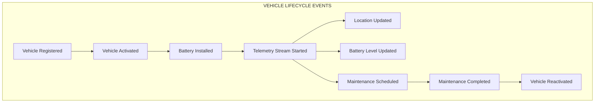
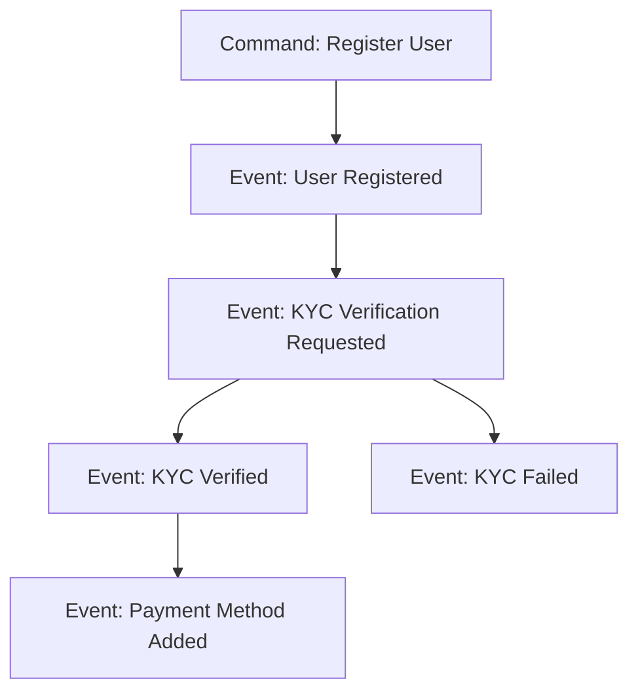
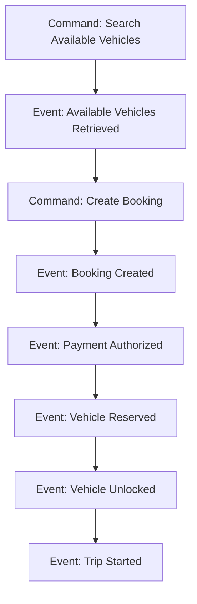
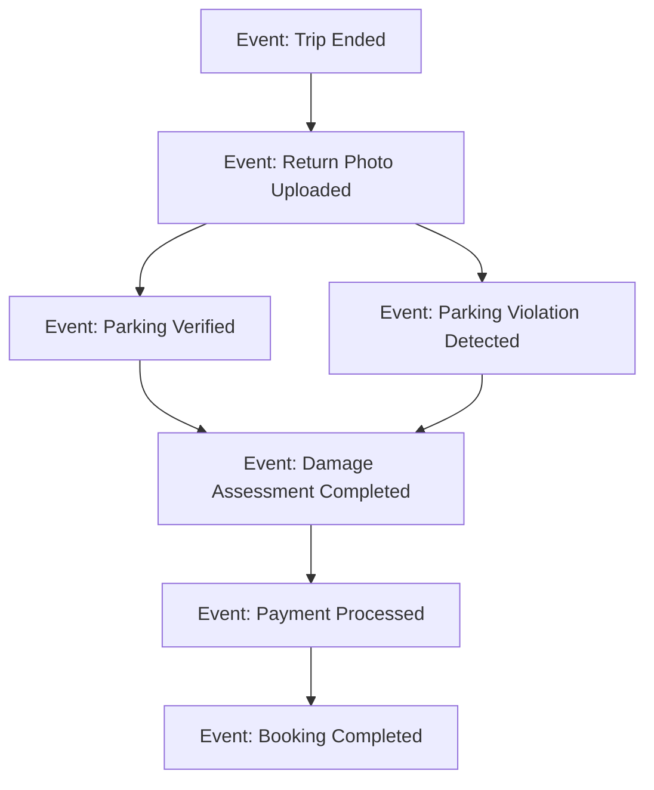
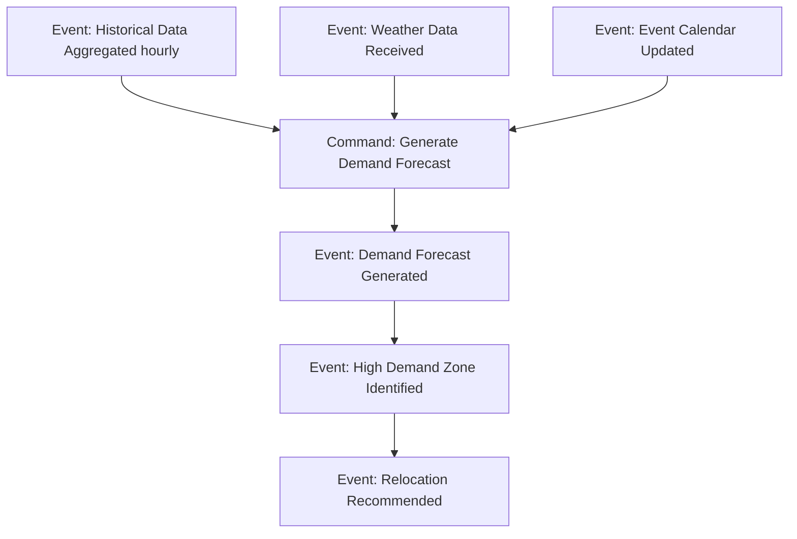
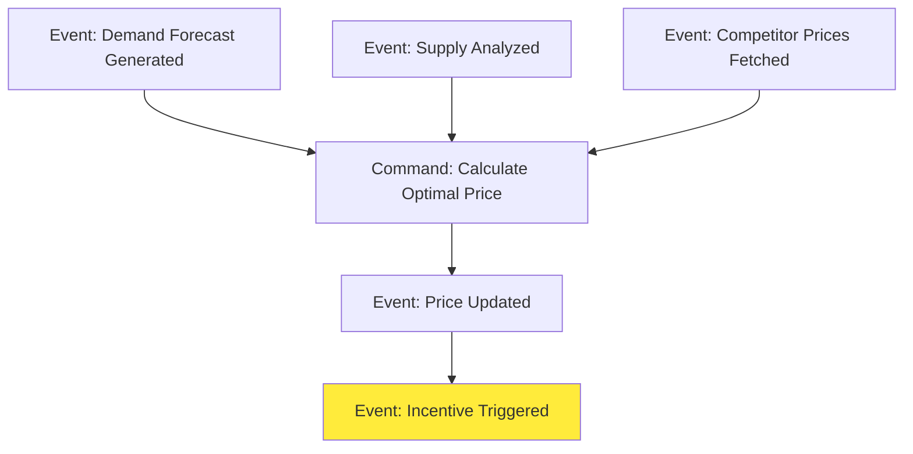
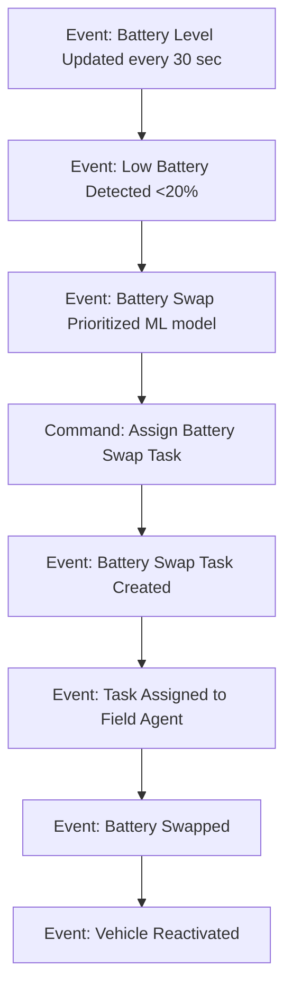
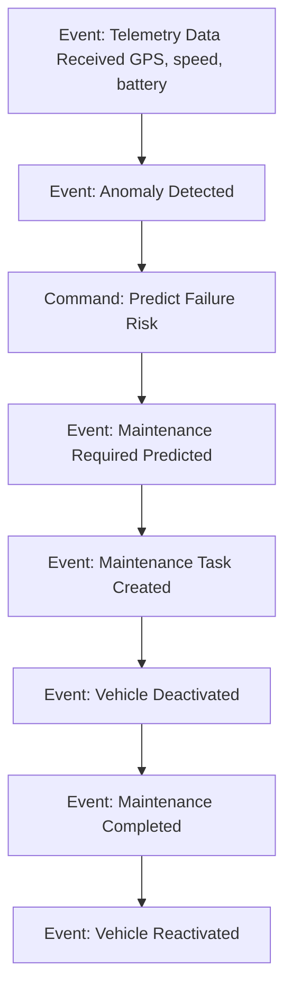
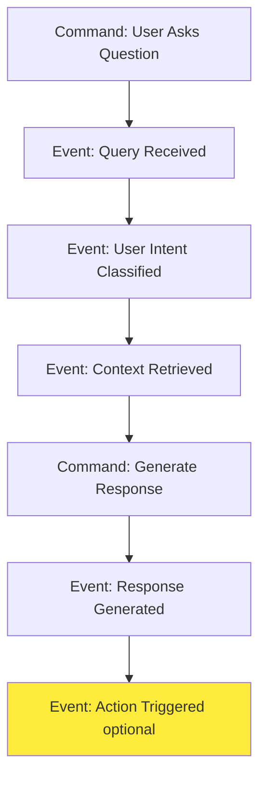
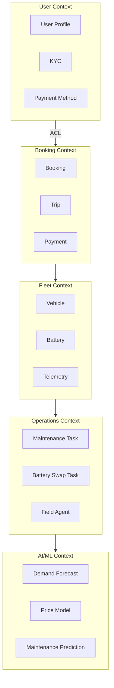

# Event Storming - MobilityCorp Domain Events

Event Storming is a collaborative workshop technique that helps us discover domain events, commands, aggregates, and bounded contexts. This document captures the results of our event storming sessions.

## 📊 Domain Events Timeline

Events are ordered chronologically as they occur in the system lifecycle:

---

## 🔵 Core Domain Events

### 1. User & Booking Domain

#### **User Registration Flow**

**Actors:** Alex (Tourist), Emma (Commuter)  
**Trigger:** User downloads app and creates account  
**Business Rule:** KYC required for bookings over €50 or car/van rentals

---

#### **Booking Flow**

**Actors:** Emma (Commuter), Lisa (Family User)  
**Trigger:** User needs transportation  
**Business Rule:** Cannot book vehicle if balance < estimated trip cost

---

#### **Trip Completion Flow**

**Actors:** Alex (Tourist), automated Vision AI  
**Trigger:** User ends trip and submits return photo  
**Business Rule:** Fine applied if parking/charging violations detected

---

### 2. Fleet Operations Domain

#### **Demand Forecasting Flow**

**Actors:** ML Model, Marcus (VP Fleet Operations)  
**Trigger:** Hourly batch job  
**Business Impact:** Reduces vehicle unavailability from 25% to 5%

---

#### **Dynamic Pricing Flow**

**Actors:** Pricing ML Model, Sarah (CPO)  
**Trigger:** Demand forecast change or supply shift  
**Business Impact:** +15% revenue through price optimization

---

#### **Battery Management Flow**

**Actors:** IoT Telemetry, Marcus (VP Fleet Operations), ML Model  
**Trigger:** Battery threshold or demand-based prioritization  
**Business Impact:** -40% operational costs through intelligent routing

---

### 3. Predictive Maintenance Domain

#### **Maintenance Prediction Flow**

**Actors:** IoT Sensors, ML Model, Operations Team  
**Trigger:** Continuous telemetry analysis  
**Business Impact:** -50% unplanned downtime

---

### 4. Conversational AI Domain

#### **AI Assistant Interaction Flow**

**Actors:** Alex (Tourist), Emma (Commuter), LLM (Claude/GPT)  
**Trigger:** User voice/text input  
**Business Impact:** +30% user satisfaction (NPS)

**Why LLM, Not Gen AI for Other Tasks?**
- ✅ **LLM for Conversation:** Non-deterministic responses acceptable (natural dialogue)
- ❌ **Not for Pricing/Forecasting:** Requires deterministic, auditable ML models
- ❌ **Not for Maintenance:** Needs explainable predictions, not probabilistic text generation

---

## 🟠 Hot Spots (Complexities & Risks)

### 1. **Event: Demand Forecast Generated**
**Complexity:** High  
**Risk:** Forecast inaccuracy leads to poor vehicle distribution  
**Mitigation:** 
- Multi-model ensemble (LSTM, Prophet, XGBoost)
- Real-time recalibration based on actual bookings
- Human-in-the-loop for major events (festivals, strikes)

**ADRs:** ADR-02 (AI-Driven Relocation), ADR-16 (MLOps Pipeline)

---

### 2. **Event: Payment Processed**
**Complexity:** High  
**Risk:** Payment failures, fraud, PCI-DSS compliance  
**Mitigation:**
- Use Stripe for PCI-DSS compliance (Build vs Buy: Buy)
- Implement retry logic with exponential backoff
- Fraud detection via anomaly detection

**ADRs:** ADR-01 (Microservices), ADR-14 (Data Compliance)

---

### 3. **Event: Parking Verified**
**Complexity:** Medium  
**Risk:** False positives/negatives in CV model  
**Mitigation:**
- Human review for disputed cases (Nina's team)
- Model accuracy >95% before production
- A/B testing with manual verification fallback

**ADRs:** ADR-13 (Conversational UX), Vision AI implementation

---

## 🟢 Aggregates & Bounded Contexts

### Bounded Context Map

---

## 🔴 Commands & Actors

| Command | Actor | Triggered By | Result Event |
|---------|-------|--------------|--------------|
| Register User | Alex, Emma | Mobile app | User Registered |
| Create Booking | Emma | Search results | Booking Created |
| End Trip | Lisa | Mobile app | Trip Ended |
| Generate Demand Forecast | ML Model | Scheduled job | Demand Forecast Generated |
| Calculate Optimal Price | Pricing Service | Demand change | Price Updated |
| Assign Battery Swap Task | Operations Service | Low battery | Task Assigned |
| Predict Maintenance | ML Model | Telemetry anomaly | Maintenance Required |
| Ask AI Assistant | Alex | Voice/text input | Response Generated |

---

## 🟡 Policies (Business Rules)

### Policy: Automatic Relocation Incentive
**When:** High demand zone identified AND supply deficit detected  
**Then:** Trigger relocation incentive (€2-€5 credit)  
**Owner:** Sarah (CPO), Marcus (VP Fleet Operations)  
**ADR:** ADR-02 (AI-Driven Relocation Incentives)

---

### Policy: Battery Swap Prioritization
**When:** Battery <20% AND high demand forecast for location  
**Then:** Prioritize swap over other low-demand vehicles  
**Owner:** Marcus (VP Fleet Operations)  
**ADR:** ADR-03 (Vehicle Telemetry)

---

### Policy: Parking Violation Fine
**When:** Vision AI detects incorrect parking (confidence >90%)  
**Then:** Apply €10 fine, notify user, allow dispute  
**Owner:** Nina (Customer Support)  
**ADR:** ADR-13 (Conversational UX & AI Assistant)

---

### Policy: Predictive Maintenance Trigger
**When:** Failure probability >70% within 7 days  
**Then:** Deactivate vehicle, create maintenance task  
**Owner:** Operations Team  
**ADR:** ADR-16 (MLOps Pipeline)

---

## 📈 Event Volume Estimates (50K Vehicles)

| Event | Frequency | Daily Volume | Monthly Volume |
|-------|-----------|--------------|----------------|
| Location Updated | 1/min per vehicle | 72M | 2.16B |
| Battery Level Updated | 1/30sec per vehicle | 144M | 4.32B |
| Booking Created | 20 per vehicle/month | 33K | 1M |
| Trip Started | Same as bookings | 33K | 1M |
| Trip Ended | Same as bookings | 33K | 1M |
| Demand Forecast Generated | Hourly per zone (100 zones) | 2.4K | 72K |
| Price Updated | Per forecast + supply change | 5K | 150K |
| Battery Swap Task Created | 10% vehicles/day | 5K | 150K |
| Maintenance Predicted | 2% vehicles/month | 33 | 1K |

**Peak Load:** Monday 8-9 AM, Friday 5-6 PM (3x avg)

---

## 🚀 Event Sourcing vs Event-Driven

### Event-Driven Architecture (Chosen)
**Use Case:** Inter-service communication  
**Pattern:** Publish-Subscribe (Kafka)  
**Retention:** 7 days (replay capability)  
**ADR:** ADR-06 (Event-Driven Architecture)

### Event Sourcing (Not Chosen)
**Why Not?**
- Adds complexity without clear ROI for our use case
- Most services need current state, not full history
- Audit trail achieved via logging + database snapshots

**Exception:** Booking domain uses event sourcing for audit compliance (fraud detection, dispute resolution)

---

## 🔗 Integration with Architecture

| Event | Microservice Owner | Storage | Consumers |
|-------|-------------------|---------|-----------|
| Booking Created | Booking Service | PostgreSQL | Payment, Fleet, Analytics |
| Demand Forecast Generated | AI/ML Service | S3 + DynamoDB | Pricing, Operations |
| Battery Level Updated | Telemetry Service | TimescaleDB | Fleet, Operations, ML |
| Price Updated | Pricing Service | Redis Cache | Booking, Analytics |
| Maintenance Predicted | ML Service | PostgreSQL | Operations, Fleet |

---

## 📚 References

- **ADR-01:** Microservices Architecture
- **ADR-02:** AI-Driven Relocation Incentives
- **ADR-06:** Event-Driven Architecture
- **ADR-16:** MLOps Pipeline

**Event Storming Workshops:**
- Session 1: User & Booking flows
- Session 2: Fleet operations & AI/ML flows
- Session 3: Maintenance & conversational AI

**Next Steps:**
- Quarterly event storming sessions to evolve domain understanding
- Capture new events as features are added
- Update bounded context map with new contexts
