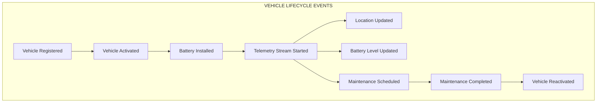
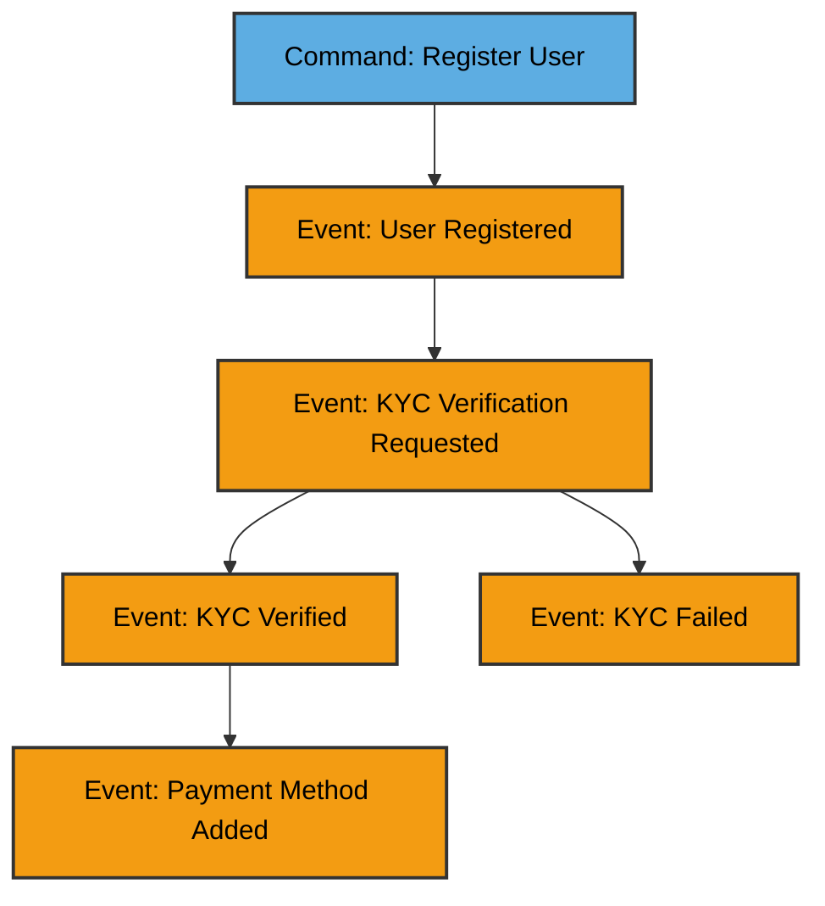
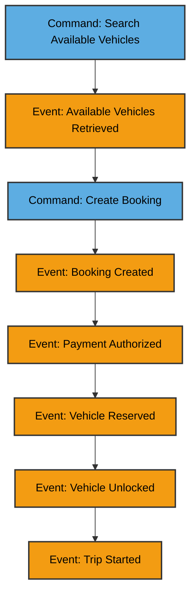
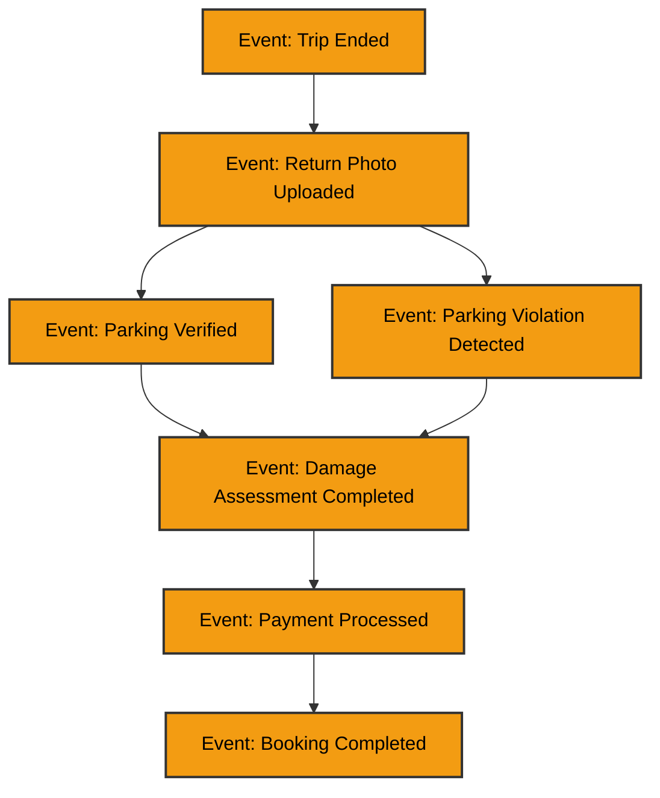
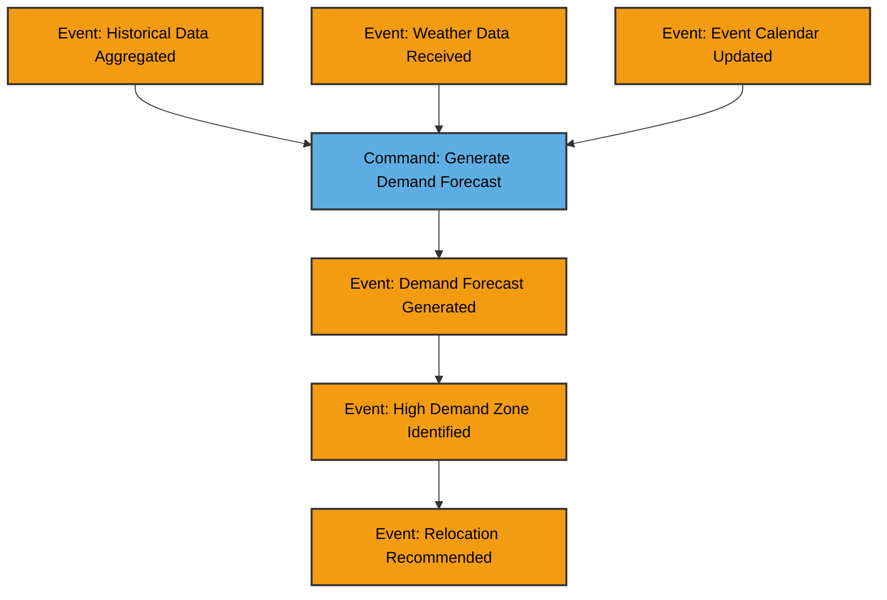
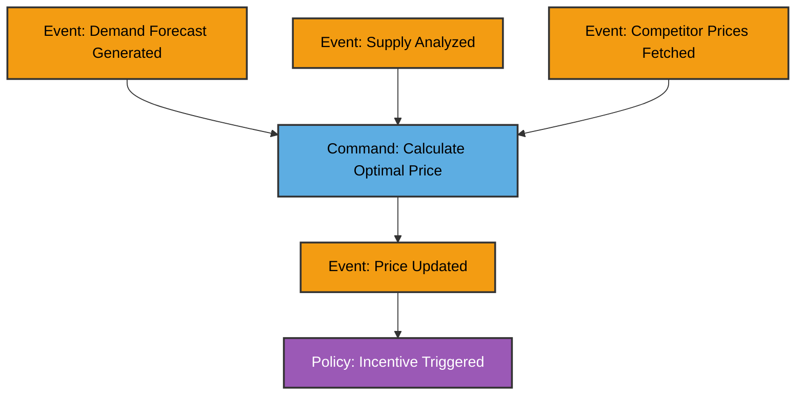
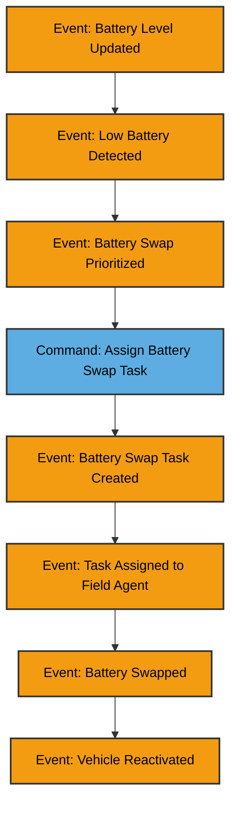
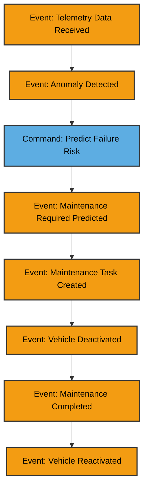
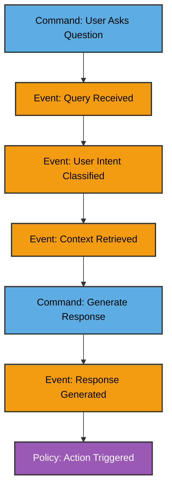
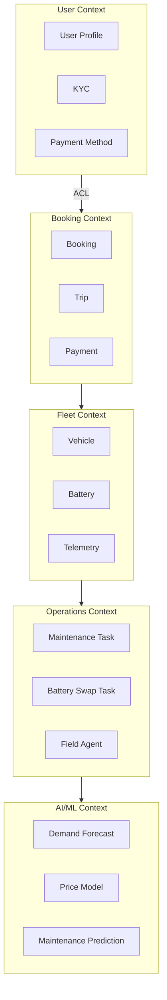

# Event Storming - MobilityCorp Domain Events

Event Storming is a collaborative workshop technique that helps us discover domain events, commands, aggregates, and bounded contexts. This document captures the results of our event storming sessions.

## 🎨 Event Storming Color Legend

Following the standard Event Storming notation:

| Color | Element | Description | Example |
|-------|---------|-------------|---------|
| 🟧 **Orange** | **Domain Event** | Something that happened in the domain (past tense) | User Registered, Booking Created |
| 🟦 **Blue** | **Command** | An action/intention from user or system | Register User, Create Booking |
| 🟨 **Yellow** | **Actor/Role** | Person or system initiating command | Emma (Commuter), ML Model |
| 🟪 **Purple** | **Policy/Rule** | Automated business rule triggered by events | When battery <20%, trigger swap |
| 🟩 **Green** | **Read Model/View** | Query/information shown to users | Available Vehicles List |
| 🟥 **Red** | **Hot Spot** | Problem/complexity/question needing discussion | Payment fraud detection |
| 📋 **Pink** | **Aggregate** | Cluster of domain objects treated as unit | Booking, Vehicle, User |
| 🔗 **Lilac** | **External System** | Third-party integration | Payment Gateway, Weather API |

**Why Use Colors?**
- **Visual Communication:** Quickly identify element types without reading labels
- **Workshop Facilitation:** Participants use physical sticky notes of different colors
- **Pattern Recognition:** Spot missing commands, unhandled events, or gaps in flows
- **Standardization:** Industry-standard notation for DDD practitioners

## 📊 Domain Events Timeline

Events are ordered chronologically as they occur in the system lifecycle:

---

## 🔵 Core Domain Events

### Standard Event Storming Notation Applied

**Color Coding in Diagrams:**
- 🟦 **Blue (#5DADE2)** = Commands (actions/intentions)
- 🟧 **Orange (#F39C12)** = Domain Events (things that happened)
- 🟪 **Purple (#9B59B6)** = Policies/Business Rules (automated reactions)

This follows the industry-standard Event Storming methodology created by Alberto Brandolini.

---

### 1. User & Booking Domain

#### **User Registration Flow**

**Actors:** 🟨 Alex (Tourist), Emma (Commuter)  
**Trigger:** User downloads app and creates account  
**Business Rule:** KYC required for bookings above threshold or premium vehicle rentals

---

#### **Booking Flow**

**Actors:** 🟨 Emma (Commuter), Lisa (Family User)  
**Trigger:** User needs transportation  
**Business Rule:** Cannot book vehicle if balance < estimated trip cost

---

#### **Trip Completion Flow**

**Actors:** 🟨 Alex (Tourist), 🔗 Vision AI System  
**Trigger:** User ends trip and submits return photo  
**Business Rule:** 🟪 Fine applied if parking/charging violations detected

---

### 2. Fleet Operations Domain

#### **Demand Forecasting Flow**

**Actors:** 🟨 ML Model, Marcus (VP Fleet Operations)  
**Trigger:** Hourly batch job  
**Business Impact:** Reduces vehicle unavailability significantly  
**ADRs:** [ADR-02](./ADR/ADR_02_AI_DRIVEN_RELOCATION_INCENTIVES.md), [ADR-15](./ADR/ADR_14_MLOps_Pipeline.md)

---

#### **Dynamic Pricing Flow**

**Actors:** 🟨 Pricing ML Model, Sarah (CPO)  
**Trigger:** Demand forecast change or supply shift  
**Business Impact:** Significant revenue increase through price optimization

---

#### **Battery Management Flow**

**Actors:** 🟨 IoT Telemetry, Marcus (VP Fleet Operations), ML Model  
**Trigger:** Battery threshold or demand-based prioritization  
**Business Impact:** Significant operational cost reduction through intelligent routing

---

### 3. Predictive Maintenance Domain

#### **Maintenance Prediction Flow**

**Actors:** 🟨 IoT Sensors, ML Model, Operations Team  
**Trigger:** Continuous telemetry analysis  
**Business Impact:** Significant reduction in unplanned downtime

---

### 4. Conversational AI Domain

#### **AI Assistant Interaction Flow**

**Actors:** 🟨 Alex (Tourist), Emma (Commuter), 🔗 LLM (Claude/GPT)  
**Trigger:** User voice/text input  
**Business Impact:** Significant improvement in user satisfaction (NPS)

**Why LLM, Not Gen AI for Other Tasks?**
- ✅ **LLM for Conversation:** Non-deterministic responses acceptable (natural dialogue)
- ❌ **Not for Pricing/Forecasting:** Requires deterministic, auditable ML models
- ❌ **Not for Maintenance:** Needs explainable predictions, not probabilistic text generation

---

## � Hot Spots (Complexities & Risks)

### 1. **🟥 Hot Spot: Demand Forecast Generated**
**Complexity:** High  
**Risk:** Forecast inaccuracy leads to poor vehicle distribution  
**Mitigation:** 
- Multi-model ensemble (LSTM, Prophet, XGBoost)
- Real-time recalibration based on actual bookings
- Human-in-the-loop for major events (festivals, strikes)

**ADRs:** [ADR-02](./ADR/ADR_02_AI_DRIVEN_RELOCATION_INCENTIVES.md), [ADR-15](./ADR/ADR_14_MLOps_Pipeline.md)

---

### 2. **🟥 Hot Spot: Payment Processed**
**Complexity:** High  
**Risk:** Payment failures, fraud, PCI-DSS compliance  
**Mitigation:**
- Use third-party payment provider for PCI-DSS compliance (Build vs Buy: Buy)
- Implement retry logic with exponential backoff
- Fraud detection via anomaly detection

**ADRs:** [ADR-01](./ADR/ADR_01_microservices_architecture.md), [ADR-14](./ADR/ADR_14_DATA_COMPLIANT.md)

---

### 3. **🟥 Hot Spot: Parking Verified**
**Complexity:** Medium  
**Risk:** False positives/negatives in CV model  
**Mitigation:**
- Human review for disputed cases (Nina's team)
- High model accuracy threshold before production
- A/B testing with manual verification fallback

**ADRs:** [ADR-13](./ADR/ADR_12_CONVERSATIONAL_UX_AND_AI_ASSISTANT.md), Vision AI implementation

---

## 🟢 Aggregates & Bounded Contexts

### Bounded Context Map

---

## 🔴 Commands & Actors

| Command | Actor | Triggered By | Result Event |
|---------|-------|--------------|--------------|
| Register User | Alex, Emma | Mobile app | User Registered |
| Create Booking | Emma | Search results | Booking Created |
| End Trip | Lisa | Mobile app | Trip Ended |
| Generate Demand Forecast | ML Model | Scheduled job | Demand Forecast Generated |
| Calculate Optimal Price | Pricing Service | Demand change | Price Updated |
| Assign Battery Swap Task | Operations Service | Low battery | Task Assigned |
| Predict Maintenance | ML Model | Telemetry anomaly | Maintenance Required |
| Ask AI Assistant | Alex | Voice/text input | Response Generated |

---

## � Policies (Business Rules)

### 🟪 Policy: Automatic Relocation Incentive
**When:** High demand zone identified AND supply deficit detected  
**Then:** Trigger relocation incentive (variable credit amount)  
**Owner:** Sarah (CPO), Marcus (VP Fleet Operations)  
**ADR:** [ADR-02](./ADR/ADR_02_AI_DRIVEN_RELOCATION_INCENTIVES.md)

---

### 🟪 Policy: Battery Swap Prioritization
**When:** Battery below threshold AND high demand forecast for location  
**Then:** Prioritize swap over other low-demand vehicles  
**Owner:** Marcus (VP Fleet Operations)  
**ADR:** [ADR-03](./ADR/ADR_03_Vehicle_Telemetry.md)

---

### 🟪 Policy: Parking Violation Fine
**When:** Vision AI detects incorrect parking (confidence >90%)  
**Then:** Apply fine, notify user, allow dispute  
**Owner:** Nina (Customer Support)  
**ADR:** [ADR-13](./ADR/ADR_12_CONVERSATIONAL_UX_AND_AI_ASSISTANT.md)

---

### 🟪 Policy: Predictive Maintenance Trigger
**When:** Failure probability exceeds threshold within defined timeframe  
**Then:** Deactivate vehicle, create maintenance task  
**Owner:** Operations Team  
**ADR:** [ADR-15](./ADR/ADR_14_MLOps_Pipeline.md)

---

## 🚀 Event Sourcing vs Event-Driven

### Event-Driven Architecture (Chosen)
**Use Case:** Inter-service communication  
**Pattern:** Publish-Subscribe (Kafka)  
**Retention:** 7 days (replay capability)  
**ADR:** [ADR-06](./ADR/ADR_06_EVENT_DRIVEN_ARCHITECTURE.md)

### Event Sourcing (Not Chosen)
**Why Not?**
- Adds complexity without clear ROI for our use case
- Most services need current state, not full history
- Audit trail achieved via logging + database snapshots

**Exception:** Booking domain uses event sourcing for audit compliance (fraud detection, dispute resolution)

---

## 🔗 Integration with Architecture

| Event | Microservice Owner | Storage | Consumers |
|-------|-------------------|---------|-----------|
| Booking Created | Booking Service | PostgreSQL | Payment, Fleet, Analytics |
| Demand Forecast Generated | AI/ML Service | S3 + DynamoDB | Pricing, Operations |
| Battery Level Updated | Telemetry Service | TimescaleDB | Fleet, Operations, ML |
| Price Updated | Pricing Service | Redis Cache | Booking, Analytics |
| Maintenance Predicted | ML Service | PostgreSQL | Operations, Fleet |

---

## 📚 References

### Architecture Decision Records
- **[ADR-01: Microservices Architecture](./ADR/ADR_01_microservices_architecture.md)**
- **[ADR-02: AI-Driven Relocation Incentives](./ADR/ADR_02_AI_DRIVEN_RELOCATION_INCENTIVES.md)**
- **[ADR-03: Vehicle Telemetry](./ADR/ADR_03_Vehicle_Telemetry.md)**
- **[ADR-06: Event-Driven Architecture](./ADR/ADR_06_EVENT_DRIVEN_ARCHITECTURE.md)**
- **[ADR-13: Conversational UX & AI Assistant](./ADR/ADR_12_CONVERSATIONAL_UX_AND_AI_ASSISTANT.md)**
- **[ADR-14: Data Compliance](./ADR/ADR_14_DATA_COMPLIANT.md)**
- **[ADR-16: MLOps Pipeline](./ADR/ADR_16_MLOps_Pipeline.md)**

### Related Documents
- **[Functional Requirements](./FUNCTIONAL_REQUIREMENTS/FUNCTIONAL_REQUIREMENTS.md)**
- **[Non-Functional Requirements](./NON_FUNCTIONAL_REQUIREMENTS/NON_FUNCTIONAL_REQUIREMENTS.md)**
- **[Personas](./PERSONAS.md)**
- **[Glossary](./GLOSSARY.md)**
- **[Cost Analysis](./COST_ANALYSIS.md)**
- **[Phased Implementation](./PHASED_IMPLEMENTATION.md)**
- **[Problem Statement](./PROBLEM_STATEMENTS/PROBLEM_STATEMENT.md)**
- **[Customer Workflows](./WORKFLOWS/CUSTOMER_WORKFLOWS.md)**
- **[Staff Workflows](./WORKFLOWS/STAFF_WORKFLOWS.md)**

**Event Storming Workshops:**
- Session 1: User & Booking flows
- Session 2: Fleet operations & AI/ML flows
- Session 3: Maintenance & conversational AI

**Next Steps:**
- Quarterly event storming sessions to evolve domain understanding
- Capture new events as features are added
- Update bounded context map with new contexts
