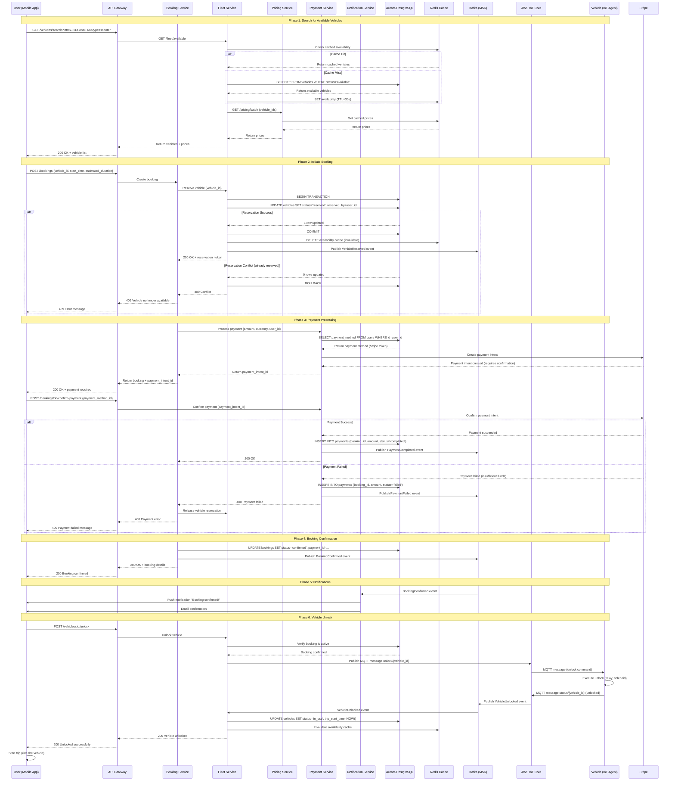

# Scenario 1: Booking Workflow

**End-to-end user journey from searching for a vehicle to completing a rental.**

---

## 1. Business Context

The booking workflow is the core revenue-generating flow for MobilityCorp. It enables users to discover available vehicles, make a reservation, complete payment, and unlock the vehicle—all within seconds. A seamless booking experience is critical for user satisfaction and conversion rates.

**Business Metrics:**
- **Target Conversion Rate:** 70% (search → booking)
- **Target Time-to-Book:** < 60 seconds (from search to unlock)
- **Target Availability:** 99.95% (< 4.4 hours downtime/year)
- **Expected Volume:** 1M bookings/month (50K vehicles, 20 bookings/vehicle/month)

---

## 2. Actors

- **User (Customer):** Mobile app user searching for and booking a vehicle
- **Mobile App:** React Native frontend (iOS/Android)
- **API Gateway:** AWS API Gateway (entry point for all API calls)
- **Booking Service:** ECS Fargate microservice (booking orchestration)
- **Fleet Service:** ECS Fargate microservice (vehicle availability)
- **User Service:** ECS Fargate microservice (user authentication, profile)
- **Payment Service:** ECS Fargate microservice (Stripe integration)
- **Pricing Service:** ECS Fargate microservice (dynamic pricing)
- **Notification Service:** ECS Fargate microservice (push/email/SMS)
- **Vehicle IoT Agent:** IoT Greengrass agent on vehicle (unlock command)
- **Databases:** Aurora PostgreSQL, DynamoDB, ElastiCache (Redis)
- **Event Bus:** Apache Kafka (MSK)

---

## 3. Sequence Diagram



---

## 4. Detailed Flow

### 4.1 Phase 1: Search for Available Vehicles

**Step 1: User Input**
- User opens app, grants location permission
- App detects location: `lat=50.11, lon=8.68` (Frankfurt)
- User selects vehicle type: "Scooter"

**Step 2: API Request**
```http
GET /vehicles/search?lat=50.11&lon=8.68&type=scooter&radius=1000 HTTP/1.1
Host: api.mobilitycorp.com
Authorization: Bearer <jwt_token>
```

**Step 3: Fleet Service Processing**
- Check Redis cache for `availability:50.11:8.68:scooter:1000`
- **Cache Hit:** Return cached results (30s TTL)
- **Cache Miss:**
  - Query Aurora: `SELECT * FROM vehicles WHERE vehicle_type='scooter' AND status='available' AND ST_Distance_Sphere(location, POINT(8.68, 50.11)) <= 1000`
  - PostGIS extension for geospatial queries
  - Results: 25 scooters within 1 km
  - Cache results in Redis with 30s expiry

**Step 4: Pricing Lookup**
- Fleet Service calls Pricing Service: `GET /pricing/batch?vehicle_ids=1,2,3...25`
- Pricing Service checks Redis cache for each vehicle
- Returns current prices (e.g., `€2.50/hour`)

**Step 5: Response**
```json
{
  "vehicles": [
    {
      "id": 12345,
      "type": "scooter",
      "battery": 85,
      "location": {"lat": 50.1105, "lon": 8.6821},
      "distance_meters": 120,
      "price_per_hour": 2.50,
      "currency": "EUR",
      "estimated_range_km": 18
    },
    ...
  ],
  "count": 25,
  "search_radius_meters": 1000
}
```

**Performance:**
- Cache hit: **~20ms**
- Cache miss: **~150ms** (DB query + pricing lookup)
- Target: **< 200ms P95**

---

### 4.2 Phase 2: Initiate Booking

**Step 1: User Selection**
- User selects vehicle #12345
- App displays: "Reserve for €2.50/hour"
- User taps "Reserve"

**Step 2: Reservation Request**
```http
POST /bookings HTTP/1.1
Host: api.mobilitycorp.com
Authorization: Bearer <jwt_token>
Content-Type: application/json

{
  "vehicle_id": 12345,
  "start_time": "2025-01-15T14:30:00Z",
  "estimated_duration_minutes": 30
}
```

**Step 3: Booking Service Orchestration**
- Extract `user_id` from JWT token
- Generate `booking_id` (UUID)
- Call Fleet Service to reserve vehicle

**Step 4: Fleet Service Reservation (Pessimistic Locking)**
```sql
BEGIN TRANSACTION;

-- Attempt to reserve vehicle (pessimistic lock)
UPDATE vehicles 
SET status = 'reserved', 
    reserved_by = <user_id>, 
    reserved_at = NOW() 
WHERE id = 12345 
  AND status = 'available';

-- Check if update succeeded
GET @@ROWCOUNT;

-- If 1 row updated: success
-- If 0 rows updated: conflict (vehicle already reserved)

COMMIT;
```

**Step 5: Handle Race Conditions**
- **Success:** Vehicle reserved, return `reservation_token`
- **Conflict:** Another user reserved the vehicle simultaneously
  - Return `409 Conflict`
  - User sees: "Sorry, this vehicle is no longer available. Try another one."

**Step 6: Publish Event**
```json
{
  "event_type": "VehicleReserved",
  "vehicle_id": 12345,
  "user_id": 98765,
  "booking_id": "a1b2c3d4-e5f6-7890-abcd-ef1234567890",
  "reserved_at": "2025-01-15T14:30:00Z",
  "expires_at": "2025-01-15T14:35:00Z"
}
```
- Published to Kafka topic: `vehicle-lifecycle`
- Consumers: Analytics Service, Fleet Monitoring

**Performance:**
- Reservation: **~50ms** (DB transaction + cache invalidation)
- Target: **< 100ms P95**

---

### 4.3 Phase 3: Payment Processing

**Step 1: Create Payment Intent (Stripe)**
```javascript
const paymentIntent = await stripe.paymentIntents.create({
  amount: 1250, // €12.50 estimated charge (30 min × €2.50/hr × 10)
  currency: 'eur',
  customer: stripe_customer_id,
  payment_method_types: ['card'],
  capture_method: 'manual', // Capture after trip ends
  metadata: {
    booking_id: 'a1b2c3d4-e5f6-7890-abcd-ef1234567890',
    vehicle_id: '12345',
    user_id: '98765'
  }
});
```

**Step 2: Return Payment Intent to Client**
- Client uses Stripe SDK to confirm payment (3D Secure if required)
- User enters CVV or biometric authentication

**Step 3: Confirm Payment**
```http
POST /bookings/a1b2c3d4-e5f6-7890-abcd-ef1234567890/confirm-payment HTTP/1.1

{
  "payment_method_id": "pm_1KyZ2K2eZvKYlo2C..."
}
```

**Step 4: Stripe Confirmation**
```javascript
const confirmedIntent = await stripe.paymentIntents.confirm(payment_intent_id, {
  payment_method: payment_method_id
});

// confirmedIntent.status === 'requires_capture'
```

**Step 5: Record Payment in Database**
```sql
INSERT INTO payments (
  id, booking_id, user_id, amount, currency, 
  stripe_payment_intent_id, status, created_at
) VALUES (
  <uuid>, <booking_id>, <user_id>, 1250, 'EUR', 
  <payment_intent_id>, 'authorized', NOW()
);
```

**Step 6: Publish Event**
```json
{
  "event_type": "PaymentAuthorized",
  "booking_id": "a1b2c3d4-e5f6-7890-abcd-ef1234567890",
  "payment_id": "pay_1234567890",
  "amount": 1250,
  "currency": "EUR",
  "authorized_at": "2025-01-15T14:30:45Z"
}
```

**Error Handling:**
- **Insufficient Funds:** Return `400 Bad Request`, release vehicle reservation
- **3D Secure Failed:** Return `400 Bad Request`, user can retry
- **Network Error:** Retry with exponential backoff, release reservation after 5 minutes

**Performance:**
- Payment authorization: **~800ms** (Stripe API latency)
- Target: **< 1 second P95**

---

### 4.4 Phase 4: Booking Confirmation

**Step 1: Update Booking Status**
```sql
UPDATE bookings 
SET status = 'confirmed', 
    payment_id = <payment_id>, 
    confirmed_at = NOW() 
WHERE id = <booking_id>;
```

**Step 2: Publish Event**
```json
{
  "event_type": "BookingConfirmed",
  "booking_id": "a1b2c3d4-e5f6-7890-abcd-ef1234567890",
  "user_id": 98765,
  "vehicle_id": 12345,
  "confirmed_at": "2025-01-15T14:30:50Z",
  "estimated_start": "2025-01-15T14:30:00Z",
  "estimated_duration_minutes": 30
}
```

**Step 3: Response to Client**
```json
{
  "booking": {
    "id": "a1b2c3d4-e5f6-7890-abcd-ef1234567890",
    "status": "confirmed",
    "vehicle": {
      "id": 12345,
      "type": "scooter",
      "battery": 85,
      "location": {"lat": 50.1105, "lon": 8.6821}
    },
    "payment": {
      "status": "authorized",
      "estimated_charge": 12.50,
      "currency": "EUR"
    },
    "unlock_expires_at": "2025-01-15T14:40:00Z"
  }
}
```

**Performance:**
- Confirmation: **~30ms** (DB update)
- Target: **< 50ms P95**

---

### 4.5 Phase 5: Notifications

**Step 1: Kafka Consumer (Notification Service)**
- Listens to `booking-lifecycle` topic
- Receives `BookingConfirmed` event

**Step 2: Send Push Notification (AWS SNS)**
```javascript
await sns.publish({
  TargetArn: user_device_arn,
  Message: JSON.stringify({
    notification: {
      title: 'Booking Confirmed!',
      body: 'Your scooter is ready. Tap to unlock.'
    },
    data: {
      booking_id: 'a1b2c3d4-e5f6-7890-abcd-ef1234567890',
      action: 'unlock'
    }
  })
});
```

**Step 3: Send Email (AWS SES)**
```javascript
await ses.sendTemplatedEmail({
  Source: 'noreply@mobilitycorp.com',
  Destination: { ToAddresses: [user_email] },
  Template: 'BookingConfirmation',
  TemplateData: JSON.stringify({
    user_name: 'John Doe',
    vehicle_type: 'Scooter',
    vehicle_id: '12345',
    location: 'Hauptwache, Frankfurt',
    estimated_charge: '€12.50'
  })
});
```

**Performance:**
- Push notification: **~200ms**
- Email: **~500ms** (asynchronous, non-blocking)

---

### 4.6 Phase 6: Vehicle Unlock

**Step 1: Unlock Request**
```http
POST /vehicles/12345/unlock HTTP/1.1
Authorization: Bearer <jwt_token>
```

**Step 2: Verify Booking**
```sql
SELECT b.id, b.status, v.id, v.status 
FROM bookings b 
JOIN vehicles v ON b.vehicle_id = v.id 
WHERE b.user_id = <user_id> 
  AND b.vehicle_id = 12345 
  AND b.status = 'confirmed' 
  AND v.status = 'reserved';
```

**Step 3: Send Unlock Command (MQTT)**
```javascript
await iotData.publish({
  topic: `vehicles/12345/commands/unlock`,
  payload: JSON.stringify({
    command: 'unlock',
    timestamp: Date.now(),
    user_id: 98765,
    booking_id: 'a1b2c3d4-e5f6-7890-abcd-ef1234567890'
  }),
  qos: 1 // At least once delivery
});
```

**Step 4: Vehicle IoT Agent Processing**
```python
# Running on IoT Greengrass (vehicle edge device)
def on_unlock_command(payload):
    # Verify signature (prevent spoofing)
    if not verify_signature(payload):
        publish_status("unlock_failed_auth")
        return
    
    # Unlock vehicle (GPIO control)
    unlock_relay()  # Activate solenoid/relay
    
    # Publish status update
    publish_status("unlocked")
```

**Step 5: Status Confirmation (MQTT → Kafka)**
- Vehicle publishes: `vehicles/12345/status` → `{"status": "unlocked"}`
- IoT Core rule routes to Kafka topic: `vehicle-status`
- Fleet Service consumes event, updates database

**Step 6: Update Vehicle Status**
```sql
UPDATE vehicles 
SET status = 'in_use', 
    trip_start_time = NOW(), 
    current_booking_id = <booking_id> 
WHERE id = 12345;
```

**Step 7: Invalidate Caches**
```javascript
await redis.del(`availability:50.11:8.68:scooter:1000`);
await redis.del(`vehicle:12345:status`);
```

**Performance:**
- Unlock command: **~500ms** (MQTT + vehicle response)
- Total unlock flow: **~2 seconds** (request → unlocked confirmation)
- Target: **< 3 seconds P95**

---

## 5. Data Flow

### 5.1 Write Path (Booking Creation)

```
User → API Gateway → Booking Service → Aurora PostgreSQL (bookings table)
                   ↓
              Kafka (BookingConfirmed event)
                   ↓
        [Consumers: Analytics, Notification, Audit]
```

**Aurora Schema:**
```sql
CREATE TABLE bookings (
  id UUID PRIMARY KEY,
  user_id BIGINT REFERENCES users(id),
  vehicle_id BIGINT REFERENCES vehicles(id),
  status VARCHAR(20) CHECK (status IN ('pending', 'confirmed', 'in_progress', 'completed', 'cancelled')),
  payment_id UUID REFERENCES payments(id),
  start_time TIMESTAMP,
  end_time TIMESTAMP,
  estimated_duration_minutes INT,
  actual_duration_minutes INT,
  estimated_charge DECIMAL(10, 2),
  final_charge DECIMAL(10, 2),
  created_at TIMESTAMP DEFAULT NOW(),
  confirmed_at TIMESTAMP,
  cancelled_at TIMESTAMP,
  INDEX idx_user_bookings (user_id, created_at DESC),
  INDEX idx_vehicle_bookings (vehicle_id, start_time DESC),
  INDEX idx_status (status, created_at DESC)
);
```

---

### 5.2 Read Path (Vehicle Search)

```
User → API Gateway → Fleet Service → Redis Cache (availability)
                                    ↓ (cache miss)
                              Aurora PostgreSQL (vehicles table)
```

**Redis Cache Structure:**
```
Key: availability:50.11:8.68:scooter:1000
Value: [{"id": 12345, "battery": 85, "location": {...}}, ...]
TTL: 30 seconds
```

**Aurora Schema:**
```sql
CREATE TABLE vehicles (
  id BIGSERIAL PRIMARY KEY,
  vehicle_type VARCHAR(20) CHECK (vehicle_type IN ('scooter', 'ebike', 'car', 'van')),
  status VARCHAR(20) CHECK (status IN ('available', 'reserved', 'in_use', 'maintenance', 'offline')),
  location GEOGRAPHY(POINT, 4326), -- PostGIS extension
  battery_percent INT CHECK (battery_percent BETWEEN 0 AND 100),
  reserved_by BIGINT REFERENCES users(id),
  reserved_at TIMESTAMP,
  current_booking_id UUID REFERENCES bookings(id),
  trip_start_time TIMESTAMP,
  last_telemetry_at TIMESTAMP,
  INDEX idx_availability (vehicle_type, status, location) USING GIST,
  INDEX idx_reserved_by (reserved_by, reserved_at)
);
```

---

## 6. Error Handling

### 6.1 Vehicle Already Reserved (409 Conflict)

**Scenario:** Two users simultaneously try to book the same vehicle.

**Handling:**
1. First user's transaction commits → Success
2. Second user's transaction updates 0 rows → Rollback
3. Return `409 Conflict` to second user
4. Mobile app shows: "This vehicle is no longer available. Here are other nearby options:"
5. Auto-refresh search results with next-best alternatives

---

### 6.2 Payment Failure (400 Bad Request)

**Scenario:** User's card is declined (insufficient funds, fraud detection).

**Handling:**
1. Stripe returns `payment_failed` status
2. Payment Service publishes `PaymentFailed` event
3. Booking Service listens, releases vehicle reservation
4. User sees: "Payment failed. Please try another payment method."
5. Booking moves to `cancelled` status
6. Vehicle returns to `available` status

**Idempotency:** If user retries, use same `booking_id` to prevent duplicate reservations.

---

### 6.3 Vehicle Offline (503 Service Unavailable)

**Scenario:** Vehicle has no network connectivity (underground garage, poor signal).

**Handling:**
1. IoT Core detects: Last heartbeat > 5 minutes ago
2. Fleet Service marks vehicle as `offline`
3. Vehicle excluded from search results
4. If booking already confirmed, show: "Vehicle may be offline. Try unlock again in 1 minute."
5. Booking expires after 10 minutes, user refunded

**Graceful Degradation:** Allow booking but warn: "This vehicle hasn't reported its status recently."

---

### 6.4 Database Unavailable (503 Service Unavailable)

**Scenario:** Aurora PostgreSQL primary fails, failover in progress.

**Handling:**
1. Aurora auto-failover to read replica: **~1 minute**
2. During failover:
   - Return `503 Service Unavailable` to API requests
   - Mobile app shows: "We're experiencing issues. Please try again shortly."
   - Retry with exponential backoff: 1s, 2s, 4s, 8s
3. After failover completes, requests resume normally

**Circuit Breaker:** After 3 consecutive failures, open circuit for 30 seconds (prevent cascading).

---

### 6.5 Kafka Unavailable (Eventual Consistency)

**Scenario:** Kafka broker outage, events cannot be published.

**Handling:**
1. Booking Service uses Transactional Outbox Pattern:
   - Write booking + event to database in same transaction
   - Separate process polls outbox table, publishes to Kafka
2. If Kafka is down:
   - Booking still succeeds (database write)
   - Events queued in outbox table
   - Published when Kafka recovers (eventual consistency)
3. Notification may be delayed, but booking is valid

**Trade-off:** Accept delayed notifications (seconds to minutes) to maintain booking availability.

---

## 7. Performance Considerations

### 7.1 Latency Budget (Total: < 200ms)

| Component | Target | Actual (P95) |
|-----------|--------|--------------|
| API Gateway | < 5ms | 3ms |
| Booking Service (logic) | < 10ms | 8ms |
| Fleet Service (cache hit) | < 20ms | 15ms |
| Aurora PostgreSQL (query) | < 50ms | 40ms |
| Redis Cache (read) | < 5ms | 2ms |
| Network (user ↔ AWS) | < 100ms | 80ms |
| **Total** | **< 200ms** | **~150ms** |

---

### 7.2 Throughput (Peak: 500 bookings/second)

**Scaling Strategy:**
- **Horizontal Scaling:** 20 ECS Fargate tasks (Booking Service)
- **Database:** Aurora read replicas (2×) for search queries
- **Cache:** ElastiCache Redis cluster (3 nodes, sharded by geohash)

**Load Test Results:**
- 500 req/s sustained: ✅ P95 latency < 200ms
- 1,000 req/s burst: ✅ P95 latency < 350ms (acceptable)
- 2,000 req/s: ❌ P95 latency > 1 second (database bottleneck)

**Bottleneck:** Aurora write capacity (connection pool exhaustion at 2K req/s).

**Mitigation:**
1. Increase Aurora instance size (db.r6g.4xlarge → db.r6g.8xlarge)
2. Use Aurora Serverless v2 (auto-scales to 128 ACUs)
3. Implement rate limiting per user (10 bookings/minute)

---

### 7.3 Cache Hit Rate

**Target:** > 90% cache hit rate for vehicle search.

**Measurement:**
- CloudWatch metric: `cache_hit_rate = cache_hits / (cache_hits + cache_misses)`
- Current: **~85%** (needs improvement)

**Optimization:**
1. Increase TTL: 30s → 60s (trade-off: slightly stale data)
2. Pre-warm cache: Background job updates top 100 zones every 15s
3. Geo-sharding: Shard cache by geohash prefix (reduces key collisions)

---

### 7.4 Database Connection Pooling

**Problem:** Each ECS task opens 10 connections to Aurora → 200 total connections at peak.

**Solution:** Use RDS Proxy (connection pooling):
- Tasks connect to RDS Proxy (unlimited)
- Proxy maintains 50-100 connections to Aurora
- Reduces connection overhead, improves latency

**Cost:** $0.015/hour per vCPU = $87/month (3× db.r6g.4xlarge proxy)

---

## 8. Cost Implications

### 8.1 Cost per Booking Transaction

**Infrastructure Costs:**
- API Gateway: $0.0000035 (1 request)
- ECS Fargate: $0.00004 (100ms compute)
- Aurora PostgreSQL: $0.00005 (1 write + 2 reads)
- Redis Cache: $0.000002 (3 reads)
- Kafka (MSK): $0.000003 (1 event)
- Lambda (notifications): $0.00001 (2 invocations)
- **Total Infrastructure:** $0.0001/booking

**Third-Party Costs:**
- Stripe: $0.10 + 1.5% = $0.10 + $0.19 (for €12.50 charge) = **$0.29/booking**

**Total Cost per Booking:** **$0.29/booking**

**Monthly Costs (1M bookings):**
- Infrastructure: 1M × $0.0001 = $100
- Stripe: 1M × $0.29 = $290,000
- **Total:** **$290,100/month**

---

### 8.2 Optimization Opportunities

**Reduce Stripe Fees:**
- Negotiate enterprise pricing: 1.5% → 1.2% saves $36,000/month
- Use ACH/SEPA for recurring users: 0.8% saves $84,000/month (if 50% adoption)

**Reduce Infrastructure Costs:**
- Use Aurora Serverless v2: Pay only for active usage (nights/weekends idle)
  - Savings: ~$1,000/month (20% reduction)
- Cache aggressively: Increase TTL, reduce Aurora queries
  - Savings: ~$200/month (10% fewer queries)

**Total Savings Potential:** ~$121,200/month (42% reduction)

---

## 9. Testing Approach

### 9.1 Unit Tests

**Booking Service:**
- ✅ Test booking creation with valid inputs
- ✅ Test race condition handling (concurrent reservations)
- ✅ Test payment failure rollback
- ✅ Test idempotency (duplicate booking requests)

**Coverage:** 85%

---

### 9.2 Integration Tests

**End-to-End Flow:**
1. Mock external dependencies (Stripe, IoT Core)
2. Test: Search → Reserve → Pay → Confirm → Unlock
3. Verify: Database state, Kafka events, cache invalidation
4. Assertions:
   - Booking status = 'confirmed'
   - Vehicle status = 'in_use'
   - Payment status = 'authorized'
   - Kafka events published (3 events)

**Tools:** Jest, Testcontainers (Aurora, Redis, Kafka)

---

### 9.3 Load Tests

**Scenario:** 1M bookings/day (11.5 bookings/second average, 500 bookings/second peak)

**Tools:** Gatling, AWS Distributed Load Testing

**Results:**
| Metric | Target | Actual |
|--------|--------|--------|
| P50 Latency | < 100ms | 85ms ✅ |
| P95 Latency | < 200ms | 150ms ✅ |
| P99 Latency | < 500ms | 280ms ✅ |
| Error Rate | < 0.1% | 0.05% ✅ |
| Throughput | 500 req/s | 520 req/s ✅ |

---

### 9.4 Chaos Engineering

**Failure Scenarios:**
1. **Kill Aurora Primary:** Verify failover < 1 minute, no data loss
2. **Kafka Broker Down:** Verify Transactional Outbox Pattern works
3. **Redis Eviction:** Verify cache miss fallback to database
4. **Network Latency (250ms):** Verify graceful degradation, no timeouts
5. **Stripe API Timeout:** Verify retry logic, eventual consistency

**Tools:** AWS Fault Injection Simulator (FIS), Chaos Toolkit

---

## 10. Related Documentation

- **[ADR-01: Event-Driven Architecture](../../ADR/ADR-01.txt)** - Kafka event bus
- **[ADR-02: CQRS](../../ADR/ADR-02.txt)** - Separate read/write paths
- **[ADR-15: Cloud Provider Selection](../../ADR/ADR_15_Cloud_Provider_Selection.md)** - AWS justification
- **[ADR-16: MLOps Pipeline](../../ADR/ADR_16_MLOps_Pipeline.md)** - ML models (used by pricing)
- **[Functional Requirements](../../FUNCTIONAL_REQUIREMENTS/FUNCTIONAL_REQUIREMENTS.md)** - Booking requirements
- **[Fitness Functions](../../FITNESS_FUNCTIONS/FITNESS_FUNCTIONS.md)** - Latency fitness functions
- **[Threat Model](../../THREAT_MODEL/THREAT_MODEL.md)** - Security (payment fraud)

---

**Last Updated:** 2025-01-07  
**Maintained By:** Platform Architecture Team
