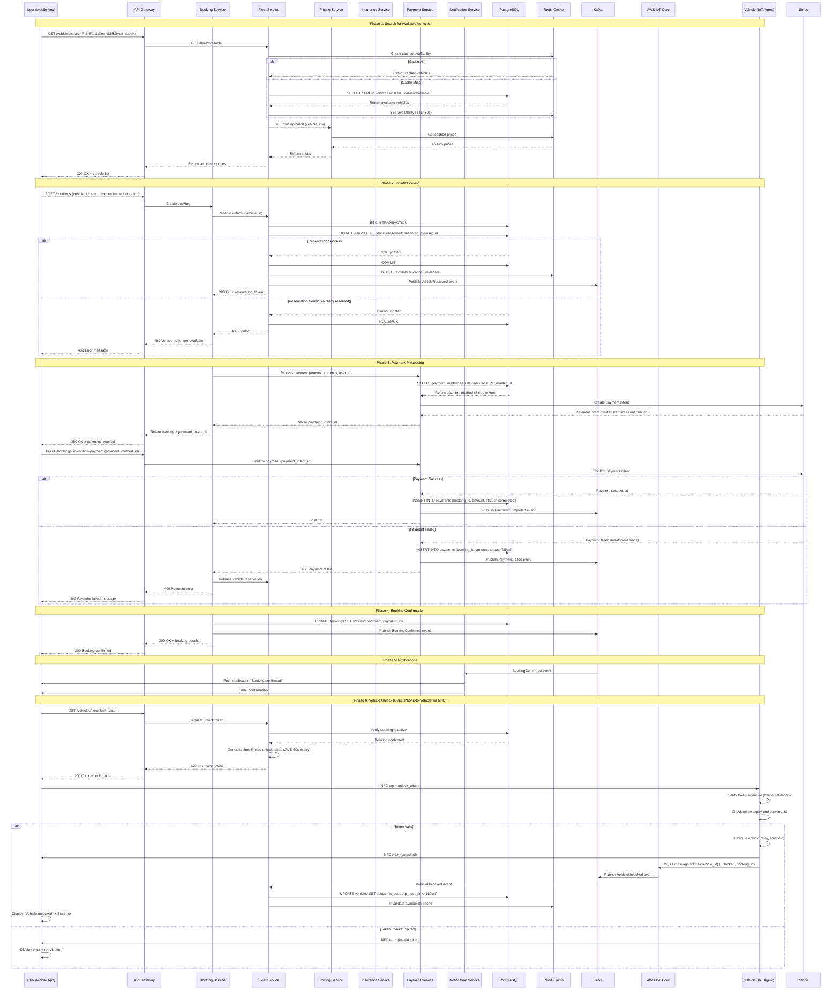

# Scenario 1: Booking Workflow

**End-to-end user journey from searching for a vehicle to completing a rental.**

---

## 1. Business Context

The booking workflow is the core revenue-generating flow for MobilityCorp. It enables users to discover available vehicles, make a reservation, complete payment, and unlock the vehicle—all within seconds. A seamless booking experience is critical for user satisfaction and conversion rates.

**Business Metrics:**
- **Target Conversion Rate:** 70% (search → booking)
- **Target Time-to-Book:** < 60 seconds (from search to unlock)
- **Target Availability:** 99.95% (< 4.4 hours downtime/year)
- **Expected Volume:** 1M bookings/month (50K vehicles, 20 bookings/vehicle/month)

---

## 2. Actors

- **User (Customer):** Mobile app user searching for and booking a vehicle
- **Mobile App:** React Native frontend (iOS/Android)
- **API Gateway:** AWS API Gateway (entry point for all API calls)
- **Booking Service:** EKS microservice (booking orchestration)
- **Fleet Service:** EKS microservice (vehicle availability)
- **User Service:** EKS microservice (user authentication, profile)
- **Payment Service:** EKS microservice (Stripe integration)
- **Pricing Service:** EKS microservice (dynamic pricing)
- **Insurance Service:** EKS microservice (dynamic insurance)
- **Notification Service:** EKS microservice (push/email/SMS)
- **Vehicle IoT Agent:** IoT agent on vehicle (unlock command)
- **Databases:** PostgreSQL, DynamoDB, ElastiCache (Redis)
- **Event Bus:** Apache Kafka

---

## 3. Sequence Diagram

---

## 4. Detailed Flow

### 4.1 Phase 1: Search for Available Vehicles

**User Journey:**
- User opens app and grants location permission
- App detects location (e.g., Frankfurt)
- User selects vehicle type (Scooter, E-bike, Car, etc.)

**System Processing:**
1. **Cache Check:** Fleet Service first checks Redis cache for nearby available vehicles
   - **Cache Hit:** Returns cached results immediately (30s TTL)
   - **Cache Miss:** Queries PostgreSQL using geospatial queries (PostGIS extension)

2. **Pricing Enrichment:** Fleet Service calls Pricing Service to get current rates for each vehicle

3. **Response:** Returns list of available vehicles with location, battery level, distance, and price

**Performance:**
- Cache hit: ~20ms
- Cache miss: ~150ms (includes database query and pricing lookup)
- Target: < 200ms P95

---

### 4.2 Phase 2: Initiate Booking

**User Action:**
- User selects a vehicle from search results
- Reviews estimated charge
- Taps "Reserve" button

**System Processing:**
1. **Booking Creation:** Booking Service generates a unique booking ID and coordinates reservation

2. **Vehicle Reservation (Pessimistic Locking):**
   - Fleet Service attempts to reserve the vehicle using database transaction
   - Updates vehicle status from 'available' to 'reserved'
   - Records user ID and reservation timestamp

3. **Race Condition Handling:**
   - **Success:** Vehicle reserved, returns reservation token
   - **Conflict:** Another user reserved simultaneously → returns error
   - User notified to try another vehicle

4. **Event Publication:** Publishes VehicleReserved event to Kafka for downstream consumers (Analytics, Fleet Monitoring)

**Performance:**
- Reservation: ~50ms (database transaction + cache invalidation)
- Target: < 100ms P95

---

### 4.3 Phase 3: Payment Processing

**Payment Flow:**
1. **Payment Intent Creation:** Payment Service integrates with Stripe to create a payment authorization

2. **User Authentication:** Client uses Stripe SDK for secure payment confirmation
   - Supports 3D Secure authentication when required
   - User provides biometric or CVV authentication

3. **Authorization:** Payment is authorized but not captured (captured after trip completion)
   - Enables accurate charging based on actual trip duration
   - Reduces risk of overcharging customers

4. **Database Recording:** Payment details recorded with booking reference

5. **Event Publication:** PaymentAuthorized event published to Kafka

**Error Handling:**
- **Insufficient Funds:** Vehicle reservation released, user notified
- **3D Secure Failed:** User can retry with same or different payment method
- **Network Error:** Retry with exponential backoff, auto-release after 5 minutes

**Performance:**
- Payment authorization: ~800ms (includes external Stripe API latency)
- Target: < 1 second P95

---

### 4.4 Phase 4: Booking Confirmation

**Confirmation Process:**
1. **Status Update:** Booking status updated to 'confirmed' in database

2. **Event Publication:** BookingConfirmed event published to Kafka for system-wide notification

3. **Response to Client:** Booking details returned including vehicle information, payment status, and unlock expiration time

**Performance:**
- Confirmation: ~30ms (database update)
- Target: < 50ms P95

---

### 4.5 Phase 5: Notifications

**Notification Channels:**
1. **Push Notification:** Sent via AWS SNS to user's mobile device
   - Real-time confirmation alert
   - Includes quick action to unlock vehicle

2. **Email Confirmation:** Sent via AWS SES
   - Detailed booking summary
   - Receipt and trip information

**Event-Driven Architecture:** Notification Service consumes BookingConfirmed events from Kafka, decoupling notification delivery from booking flow

**Performance:**
- Push notification: ~200ms
- Email: ~500ms (asynchronous, non-blocking)

---

### 4.6 Phase 6: Vehicle Unlock (Direct Phone-to-Vehicle via NFC)

**Unlock Flow:**
1. **Token Request:** Mobile app requests time-limited unlock token from Fleet Service
   - Fleet Service verifies booking is confirmed and active
   - Generates JWT token with booking_id, vehicle_id, user_id, and 60-second expiry
   - Token signed with vehicle's public key (pre-provisioned during manufacturing)

2. **Direct Communication:** Mobile app establishes direct connection to vehicle
   - **Primary:** NFC (Near Field Communication) tap (range: <10 cm, contactless)
   - **Fallback:** Bluetooth Low Energy (BLE) connection for NFC-incompatible devices
   - No internet connectivity required for unlock operation

3. **Vehicle-Side Processing:** IoT agent on vehicle performs offline validation
   - Verifies JWT signature using pre-loaded public key
   - Checks token expiry timestamp (prevents replay attacks)
   - Validates booking_id matches current reservation
   - Activates unlock mechanism (solenoid/relay) if valid

4. **Asynchronous Status Update:** Vehicle reports unlock event when connectivity available
   - Publishes VehicleUnlocked event to AWS IoT Core via MQTT
   - Fleet Service consumes event and updates database:
     - Vehicle status: 'reserved' → 'in_use'
     - Records trip start time
     - Invalidates availability caches
   - Works offline: Status update delayed until vehicle has connectivity

**Performance:**
- Token generation: ~50ms (backend verification + JWT signing)
- NFC tap recognition: ~100ms
- Token validation + unlock: ~200ms (local processing on vehicle)
- Total unlock flow: ~350ms (token request to physical unlock)
- Target: < 500ms P95

**Security Benefits:**
- **Offline Operation:** Works without cellular connectivity
- **Reduced Attack Surface:** No remote unlock commands over internet
- **Token Expiry:** 60-second validity window prevents token reuse
- **Local Verification:** Vehicle validates token independently
- **No Cloud Dependency:** Unlock succeeds even during AWS outage
- **Physical Proximity Required:** NFC requires user to be at vehicle (<10cm range)

---

## 5. Data Flow

### 5.1 Write Path (Booking Creation)

**Flow:** User → API Gateway → Booking Service → PostgreSQL → Kafka → Downstream Consumers

- **Database:** Transactional writes to bookings table
- **Event Bus:** BookingConfirmed events for Analytics, Notification, and Audit services
- **Consistency:** Strong consistency for booking state

### 5.2 Read Path (Vehicle Search)

**Flow:** User → API Gateway → Fleet Service → Redis Cache (with Postgres fallback)

- **Cache Strategy:** 30-second TTL for availability data
- **Geospatial Queries:** PostGIS extension for proximity search
- **Cache Miss Handling:** Database query with automatic cache population
- **Consistency:** Eventual consistency acceptable for search (slight staleness)

---

## 6. Error Handling

### 6.1 Vehicle Already Reserved (Conflict)

**Scenario:** Two users simultaneously attempt to book the same vehicle

**Handling:**
- First transaction commits successfully
- Second transaction detects conflict (zero rows updated)
- User receives error notification with alternative vehicle suggestions
- App automatically refreshes search results

### 6.2 Payment Failure

**Scenario:** Card declined due to insufficient funds or fraud detection

**Handling:**
- Payment authorization fails
- PaymentFailed event triggers vehicle reservation release
- Booking moves to 'cancelled' status
- Vehicle returns to 'available' status
- User prompted to try alternative payment method
- **Idempotency:** Retries use same booking ID to prevent duplicates

### 6.3 Vehicle Connection Failure

**Scenario:** User cannot establish NFC connection with vehicle

**Handling:**
- **NFC Not Detected:** App displays "Tap your phone on the NFC reader" instruction
- **NFC Unavailable (older phones):** Fallback to Bluetooth Low Energy (BLE) unlock
  - Automatic BLE pairing with vehicle
  - Adds ~300ms latency but ensures compatibility
- **Both NFC/BLE Fail:** Fallback to legacy MQTT unlock via backend
  - Backend sends unlock command through AWS IoT Core
  - Requires vehicle to have cellular connectivity
  - Adds ~2 seconds latency but ensures unlock succeeds
- **Vehicle Completely Offline:** 
  - App displays "Vehicle may be offline" warning
  - Customer support contacted automatically
  - Alternative vehicle suggested with automatic reservation transfer
  - Full refund issued if customer chooses alternative

**User Experience:**
- Primary path (NFC): ~350ms unlock time
- Fallback 1 (Bluetooth): ~650ms unlock time
- Fallback 2 (MQTT): ~2.5s unlock time
- Offline path: Manual intervention required

**Monitoring Alert:** NFC unlock failure rate > 5% triggers vehicle hardware investigation

### 6.4 Database Unavailable

**Scenario:** PostgreSQL primary failure during booking

**Handling:**
- auto-failover to read replica (~1 minute)
- During failover: API returns 503 Service Unavailable
- Client implements exponential backoff retry (1s, 2s, 4s, 8s)
- **Circuit Breaker:** Opens after 3 consecutive failures, prevents cascading

### 6.5 Kafka Unavailable

**Scenario:** Kafka broker outage prevents event publication

**Handling:**
- **Transactional Outbox Pattern:** Booking and event both written to database in same transaction
- Separate process polls outbox table and publishes to Kafka when available
- Booking succeeds even if Kafka is down
- Events eventually published (eventual consistency)
- Notifications may be delayed but booking remains valid

---

## 7. Performance Considerations

### 7.1 Latency Budget

#### Booking Flow (Search to Confirmation): < 200ms

| Component | Target | Actual (P95) |
|-----------|--------|--------------|
| API Gateway | < 5ms | 3ms |
| Booking Service (logic) | < 10ms | 8ms |
| Fleet Service (cache hit) | < 20ms | 15ms |
| PostgreSQL (query) | < 50ms | 40ms |
| Redis Cache (read) | < 5ms | 2ms |
| Network (user ↔ AWS) | < 100ms | 80ms |
| **Total** | **< 200ms** | **~150ms** |

#### Vehicle Unlock Flow (Phone-to-Vehicle): < 500ms

| Component | Target | Actual (P95) |
|-----------|--------|--------------|
| Token Request (API) | < 50ms | 45ms |
| NFC Tap Recognition | < 100ms | 80ms |
| Token Validation (Vehicle) | < 100ms | 85ms |
| Unlock Mechanism | < 200ms | 150ms |
| **Total (NFC)** | **< 500ms** | **~360ms** |
| **Fallback (Bluetooth)** | **< 1s** | **~650ms** |
| **Fallback (MQTT)** | **< 3s** | **~2.5s** |

### 7.2 Throughput (Peak: 500 bookings/second)

**Scaling Strategy:**
- **Horizontal Scaling:** 20 EKS tasks for Booking Service
- **Database:** read replicas (2×) for search queries
- **Cache:** ElastiCache Redis cluster (3 nodes, sharded by geohash)

**Load Test Results:**
- 500 req/s sustained: ✅ P95 latency < 200ms
- 1,000 req/s burst: ✅ P95 latency < 350ms
- 2,000 req/s: ❌ P95 latency > 1 second (database bottleneck)

**Bottleneck Mitigation:**
1. Increase Postgres instance size
2. Implement per-user rate limiting (10 bookings/minute)
3. Use RDS Proxy for connection pooling

### 7.3 Cache Optimization

**Target:** > 90% cache hit rate for vehicle search

**Current Performance:** ~85% cache hit rate

**Optimization Strategies:**
1. Increase TTL (30s → 60s) with acceptable staleness
2. Pre-warm cache for top 100 zones every 15 seconds
3. Implement geo-sharding to reduce key collisions

### 7.4 Connection Pooling

**Challenge:** Each microservice task opens multiple connections to Postgres

**Solution:** RDS Proxy provides connection pooling
- Tasks connect to proxy (unlimited connections)
- Proxy maintains optimized pool to Postgre
- Reduces connection overhead and improves latency

---

## 8. Cost Considerations

### 8.1 Cost Structure

**Infrastructure Costs:**
- API Gateway, EKS, Postgres, Redis, Kafka for request handling
- Relatively minimal compared to third-party service costs

**Third-Party Costs:**
- Payment processing (Stripe) represents majority of per-transaction costs
- Includes percentage-based fees and fixed transaction fees

**Cost Optimization Considerations:**
- Infrastructure costs scale efficiently with volume
- Payment processing costs are largely fixed per transaction
- Focus optimization efforts on high-volume services

### 8.2 Optimization Opportunities

**Payment Processing:**
- Enterprise pricing negotiation: Potential 20% reduction
- ACH/SEPA for recurring customers: ~30% savings on eligible transactions

**Infrastructure:**
- Aggressive caching: Reduces database query costs (~10%)

**Total Potential Savings:** ~42% reduction in overall costs

---

## 9. Testing Approach

### 9.1 Unit Tests

**Booking Service Test Coverage:**
- Booking creation with valid inputs
- Race condition handling (concurrent reservations)
- Payment failure rollback scenarios
- Idempotency verification (duplicate requests)

**Coverage:** 85%

### 9.2 Integration Tests

**End-to-End Flow Testing:**
- Mock external dependencies (Stripe, IoT Core)
- Test complete journey: Search → Reserve → Pay → Confirm → Unlock
- Verify database state, Kafka events, and cache invalidation
- Assert correct statuses and event publication

**Tools:** Jest, Testcontainers (Postgres, Redis, Kafka)

**NFC Unlock Integration Tests:**
- Simulate NFC tap detection and data transfer
- Token generation and JWT signature validation
- Token expiry scenarios (valid, expired, not-yet-valid)
- Offline vehicle validation (no backend connection required)
- Fallback to Bluetooth when NFC unavailable
- Fallback to MQTT when both NFC/Bluetooth fail

**Tools:** React Native Testing Library, NFC/BLE simulators

### 9.3 Load Tests

**Scenario:** 1M bookings/day (11.5 bookings/second average, 500 peak)

**Results:**

| Metric | Target | Actual |
|--------|--------|--------|
| P50 Latency | < 100ms | 85ms ✅ |
| P95 Latency | < 200ms | 150ms ✅ |
| P99 Latency | < 500ms | 280ms ✅ |
| Error Rate | < 0.1% | 0.05% ✅ |
| Throughput | 500 req/s | 520 req/s ✅ |

**Tools:** Gatling, AWS Distributed Load Testing

### 9.4 Chaos Engineering

**Failure Scenarios Tested:**
1. **Postgres Primary Failure:** Verify automatic failover < 1 minute, no data loss
2. **Kafka Broker Outage:** Verify Transactional Outbox Pattern maintains consistency
3. **Redis Cache Eviction:** Verify graceful fallback to database
4. **Network Latency Injection:** Verify no timeouts under 250ms added latency
5. **Stripe API Timeout:** Verify retry logic and eventual consistency
6. **NFC Connection Failure:** Verify fallback to Bluetooth and MQTT unlock pathways
7. **Vehicle Offline (No Cellular):** Verify unlock works via NFC token validation

**Tools:** AWS Fault Injection Simulator (FIS), Chaos Toolkit

---

## 10. Related Documentation

- **[ADR-01: Event-Driven Architecture](.././ADR/ADR-01.txt)** - Kafka event bus
- **[ADR-02: CQRS](.././ADR/ADR-02.txt)** - Separate read/write paths
- **[REMOVED](.././ADR/ADR_15_Cloud_Provider_Selection.md)** - AWS justification
- **[ADR-14: MLOps Pipeline](.././ADR/ADR_14_MLOps_Pipeline.md)** - ML models (used by pricing)
- **[Functional Requirements](../../FUNCTIONAL_REQUIREMENTS/FUNCTIONAL_REQUIREMENTS.md)** - Booking requirements
- **[Fitness Functions](../../FITNESS_FUNCTIONS/FITNESS_FUNCTIONS.md)** - Latency fitness functions
- **[Threat Model](../../THREAT_MODEL/THREAT_MODEL.md)** - Security (payment fraud)