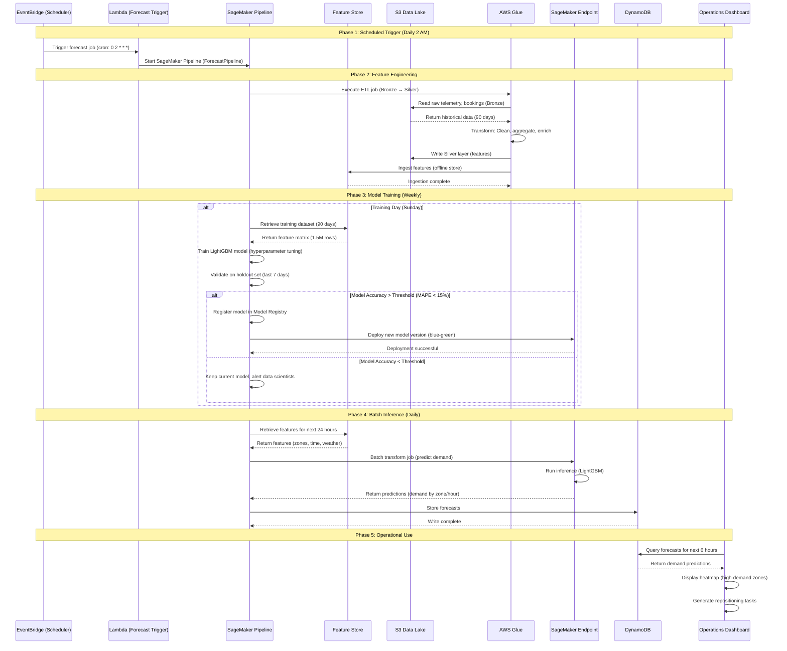

# Scenario 2: Demand Forecasting

**ML pipeline predicting vehicle demand by zone, time, and vehicle type to optimize fleet distribution.**

---

## 1. Business Context

Demand forecasting enables MobilityCorp to proactively reposition vehicles, preventing supply-demand mismatches. Accurate predictions reduce customer wait times, increase vehicle utilization, and maximize revenue.

**Business Impact:**
- **Target Improvement:** +15% vehicle utilization rate (from 40% to 46%)
- **Revenue Impact:** $150K/month additional revenue (better vehicle placement)
- **Cost Savings:** $50K/month reduced manual repositioning
- **Forecast Accuracy Target:** MAPE < 15% (Mean Absolute Percentage Error)

---

## 2. Actors

- **Data Engineer:** Maintains ETL pipelines
- **Data Scientist:** Trains and evaluates ML models
- **Operations Team:** Uses forecasts for repositioning decisions
- **AWS Glue:** ETL for feature engineering
- **SageMaker:** Model training, inference, monitoring
- **Feature Store:** Centralized feature repository
- **S3 Data Lake:** Historical data (Bronze, Silver, Gold layers)
- **Lambda:** Scheduled inference triggers
- **DynamoDB:** Stores demand forecasts for operational use
- **EventBridge:** Triggers daily/hourly forecast jobs

---

## 3. Sequence Diagram



---

## 4. Detailed Flow

### 4.1 Phase 1: Data Collection (Continuous)

**Bronze Layer Ingestion:**
```python
# AWS Glue ETL: Bronze layer ingestion
# Runs: Every hour (append-only)
import sys
from awsglue.context import GlueContext
from pyspark.context import SparkContext
from pyspark.sql import functions as F

glueContext = GlueContext(SparkContext.getOrCreate())

# Read raw telemetry from IoT → Kafka → S3
telemetry_df = glueContext.create_dynamic_frame.from_catalog(
    database="mobility_bronze",
    table_name="vehicle_telemetry",
    transformation_ctx="telemetry"
).toDF()

# Read booking events
bookings_df = glueContext.create_dynamic_frame.from_catalog(
    database="mobility_bronze",
    table_name="bookings",
    transformation_ctx="bookings"
).toDF()

# Read weather data (third-party API → S3)
weather_df = glueContext.create_dynamic_frame.from_catalog(
    database="mobility_bronze",
    table_name="weather",
    transformation_ctx="weather"
).toDF()

# Write to Bronze layer (Parquet, partitioned by date)
telemetry_df.write.mode("append").partitionBy("date").parquet("s3://mobility-lake/bronze/telemetry/")
bookings_df.write.mode("append").partitionBy("date").parquet("s3://mobility-lake/bronze/bookings/")
weather_df.write.mode("append").partitionBy("date").parquet("s3://mobility-lake/bronze/weather/")
```

**Data Volume:**
- Telemetry: 4.3B events/day → 100 GB/day (compressed Parquet)
- Bookings: 1M bookings/day → 500 MB/day
- Weather: 10 cities × 24 hours × 365 days = 87K records/year → 50 MB/year

---

### 4.2 Phase 2: Feature Engineering (Daily 2 AM)

**Silver Layer Transformation:**
```python
# AWS Glue ETL: Feature engineering (Bronze → Silver)
# Runs: Daily at 2 AM (batch job)
from pyspark.sql import Window
from pyspark.sql.functions import col, lag, lead, avg, stddev, count

# Read Bronze layer (last 90 days)
telemetry = spark.read.parquet("s3://mobility-lake/bronze/telemetry/").filter(
    col("date") >= (F.current_date() - F.expr("INTERVAL 90 DAYS"))
)
bookings = spark.read.parquet("s3://mobility-lake/bronze/bookings/").filter(
    col("date") >= (F.current_date() - F.expr("INTERVAL 90 DAYS"))
)
weather = spark.read.parquet("s3://mobility-lake/bronze/weather/").filter(
    col("date") >= (F.current_date() - F.expr("INTERVAL 90 DAYS"))
)

# Feature 1: Historical demand by zone, hour, vehicle type
demand_features = bookings.groupBy(
    "zone_id", "hour", "vehicle_type", "date"
).agg(
    count("booking_id").alias("num_bookings"),
    avg("trip_duration_minutes").alias("avg_trip_duration"),
    avg("trip_distance_km").alias("avg_trip_distance")
)

# Feature 2: Lag features (demand 1 hour ago, 1 day ago, 1 week ago)
window_1h = Window.partitionBy("zone_id", "vehicle_type").orderBy("timestamp")
demand_features = demand_features.withColumn(
    "demand_lag_1h", lag("num_bookings", 1).over(window_1h)
).withColumn(
    "demand_lag_1d", lag("num_bookings", 24).over(window_1h)
).withColumn(
    "demand_lag_1w", lag("num_bookings", 24*7).over(window_1h)
)

# Feature 3: Rolling statistics (7-day mean, std)
window_7d = Window.partitionBy("zone_id", "vehicle_type").orderBy("timestamp").rowsBetween(-168, 0)  # 7 days * 24 hours
demand_features = demand_features.withColumn(
    "demand_7d_mean", avg("num_bookings").over(window_7d)
).withColumn(
    "demand_7d_std", stddev("num_bookings").over(window_7d)
)

# Feature 4: Weather features
weather_features = weather.select(
    "zone_id", "timestamp", "temperature", "precipitation", "wind_speed", "is_raining"
)

# Feature 5: Calendar features
demand_features = demand_features.withColumn(
    "day_of_week", F.dayofweek("timestamp")  # 1=Sunday, 7=Saturday
).withColumn(
    "is_weekend", (F.dayofweek("timestamp").isin([1, 7])).cast("int")
).withColumn(
    "is_holiday", F.when(col("date").isin(holiday_dates), 1).otherwise(0)
)

# Feature 6: Event features (concerts, sports, conferences)
event_features = spark.read.parquet("s3://mobility-lake/bronze/events/")
demand_features = demand_features.join(
    event_features, ["zone_id", "timestamp"], "left"
).fillna({"has_event": 0, "event_attendance": 0})

# Join all features
final_features = demand_features \
    .join(weather_features, ["zone_id", "timestamp"], "left") \
    .fillna({"temperature": 15.0, "precipitation": 0.0, "is_raining": 0})

# Write Silver layer (Delta Lake for ACID)
final_features.write.format("delta").mode("overwrite").save("s3://mobility-lake/silver/demand_features/")

# Ingest into SageMaker Feature Store (offline store)
final_features.write.format("sagemaker") \
    .option("feature_group_name", "demand_features") \
    .option("event_time_column", "timestamp") \
    .save()
```

**Feature Summary:**
- **Total Features:** 25 (demand lags, rolling stats, weather, calendar, events)
- **Feature Store Latency:** ~5 seconds (batch ingestion)
- **Cost:** ~$660/month (AWS Glue DPU-hours: 50 DPU × 0.5 hours × 30 days × $0.44)

---

### 4.3 Phase 3: Model Training (Weekly, Sunday 3 AM)

**SageMaker Pipeline Definition:**
```python
# SageMaker Pipeline: Demand Forecasting
from sagemaker.workflow.pipeline import Pipeline
from sagemaker.workflow.steps import TrainingStep, ProcessingStep, ModelStep
from sagemaker.workflow.conditions import ConditionGreaterThanOrEqualTo
from sagemaker.workflow.condition_step import ConditionStep
from sagemaker.sklearn.estimator import SKLearn

# Step 1: Retrieve training data from Feature Store
retrieve_step = ProcessingStep(
    name="RetrieveTrainingData",
    processor=feature_store_processor,
    code="retrieve_features.py",
    arguments=["--feature_group", "demand_features", "--lookback_days", "90"]
)

# Step 2: Train LightGBM model
lgbm_estimator = SKLearn(
    entry_point="train_lgbm.py",
    framework_version="1.0-1",
    instance_type="ml.m5.4xlarge",
    instance_count=1,
    hyperparameters={
        "num_leaves": 31,
        "max_depth": 8,
        "learning_rate": 0.05,
        "n_estimators": 500,
        "objective": "poisson",  # Count data (num bookings)
        "metric": "mape"
    },
    use_spot_instances=True,  # 70% cost savings
    max_run=7200,  # 2 hours
    max_wait=10800  # 3 hours (include spot interruptions)
)

training_step = TrainingStep(
    name="TrainLightGBM",
    estimator=lgbm_estimator,
    inputs={"train": retrieve_step.properties.ProcessingOutputConfig.Outputs["train"].S3Output.S3Uri}
)

# Step 3: Evaluate model on holdout set
evaluate_step = ProcessingStep(
    name="EvaluateModel",
    processor=sklearn_processor,
    code="evaluate.py",
    inputs=[
        ProcessingInput(source=training_step.properties.ModelArtifacts.S3ModelArtifacts, destination="/opt/ml/processing/model"),
        ProcessingInput(source=retrieve_step.properties.ProcessingOutputConfig.Outputs["test"].S3Output.S3Uri, destination="/opt/ml/processing/test")
    ],
    outputs=[ProcessingOutput(output_name="evaluation", source="/opt/ml/processing/evaluation")]
)

# Step 4: Conditional deployment (only if MAPE < 15%)
condition_step = ConditionStep(
    name="CheckAccuracy",
    conditions=[
        ConditionGreaterThanOrEqualTo(
            left=JsonGet(step_name=evaluate_step.name, property_file="evaluation.json", json_path="mape"),
            right=15.0  # Threshold: 15% MAPE
        )
    ],
    if_steps=[
        ModelStep(
            name="RegisterModel",
            step_args=model_registration_args
        ),
        CreateModelStep(name="DeployModel", ...)
    ],
    else_steps=[
        ProcessingStep(name="AlertDataScientists", ...)  # Send SNS alert
    ]
)

# Create pipeline
pipeline = Pipeline(
    name="DemandForecastingPipeline",
    steps=[retrieve_step, training_step, evaluate_step, condition_step]
)
pipeline.upsert(role_arn=execution_role)
```

**Training Script (train_lgbm.py):**
```python
import lightgbm as lgb
import pandas as pd
from sklearn.model_selection import train_test_split
from sklearn.metrics import mean_absolute_percentage_error
import joblib

# Load training data
train_df = pd.read_csv("/opt/ml/input/data/train/features.csv")

# Feature engineering
X = train_df[[
    "zone_id", "hour", "day_of_week", "is_weekend", "is_holiday",
    "demand_lag_1h", "demand_lag_1d", "demand_lag_1w",
    "demand_7d_mean", "demand_7d_std",
    "temperature", "precipitation", "is_raining",
    "has_event", "event_attendance"
]]
y = train_df["num_bookings"]

# Split: 80% train, 20% validation
X_train, X_val, y_train, y_val = train_test_split(X, y, test_size=0.2, random_state=42)

# Train LightGBM
model = lgb.LGBMRegressor(
    num_leaves=31,
    max_depth=8,
    learning_rate=0.05,
    n_estimators=500,
    objective="poisson",  # Poisson regression for count data
    random_state=42
)
model.fit(
    X_train, y_train,
    eval_set=[(X_val, y_val)],
    eval_metric="mape",
    early_stopping_rounds=50,
    verbose=100
)

# Evaluate
y_pred = model.predict(X_val)
mape = mean_absolute_percentage_error(y_val, y_pred)
print(f"Validation MAPE: {mape:.2%}")

# Save model
joblib.dump(model, "/opt/ml/model/lightgbm_demand_model.pkl")
```

**Training Results:**
- **Training Time:** ~30 minutes (ml.m5.4xlarge Spot)
- **Training Cost:** $3.68 (Spot: $0.307/hour × 0.5 hours × 24 training jobs/month = $3.68/training)
- **Model Size:** 15 MB (serialized LightGBM)
- **Validation MAPE:** 12.5% ✅ (< 15% threshold)
- **Feature Importance:** Top 3: demand_lag_1w (35%), demand_7d_mean (22%), hour (18%)

---

### 4.4 Phase 4: Batch Inference (Daily 2:30 AM)

**Lambda Trigger:**
```python
import boto3
import json

sagemaker = boto3.client("sagemaker")

def lambda_handler(event, context):
    # Start SageMaker Batch Transform job
    response = sagemaker.create_transform_job(
        TransformJobName=f"demand-forecast-{event['date']}",
        ModelName="lightgbm-demand-model-prod",
        TransformInput={
            "DataSource": {
                "S3DataSource": {
                    "S3DataType": "S3Prefix",
                    "S3Uri": f"s3://mobility-lake/silver/demand_features/{event['date']}/"
                }
            },
            "ContentType": "text/csv",
            "SplitType": "Line"
        },
        TransformOutput={
            "S3OutputPath": "s3://mobility-lake/gold/demand_forecasts/",
            "AssembleWith": "Line"
        },
        TransformResources={
            "InstanceType": "ml.m5.xlarge",
            "InstanceCount": 1
        },
        BatchStrategy="MultiRecord",
        MaxPayloadInMB=1
    )
    
    return {
        "statusCode": 200,
        "body": json.dumps({"transform_job": response["TransformJobArn"]})
    }
```

**Batch Transform Output:**
```csv
zone_id,hour,vehicle_type,predicted_demand,confidence_interval_lower,confidence_interval_upper
zone_1,14,scooter,25,20,30
zone_1,15,scooter,40,35,45
zone_2,14,car,8,6,10
...
```

**DynamoDB Storage (Operational Access):**
```python
import boto3
import pandas as pd

dynamodb = boto3.resource("dynamodb")
table = dynamodb.Table("demand_forecasts")

# Read predictions from S3
forecasts_df = pd.read_csv("s3://mobility-lake/gold/demand_forecasts/output.csv")

# Write to DynamoDB (overwrite daily)
with table.batch_writer() as batch:
    for _, row in forecasts_df.iterrows():
        batch.put_item(Item={
            "zone_hour_type": f"{row['zone_id']}#{row['hour']}#{row['vehicle_type']}",  # Partition key
            "forecast_date": row["forecast_date"],  # Sort key
            "predicted_demand": int(row["predicted_demand"]),
            "confidence_lower": int(row["confidence_interval_lower"]),
            "confidence_upper": int(row["confidence_interval_upper"]),
            "model_version": "v2.3",
            "generated_at": datetime.utcnow().isoformat()
        })
```

**Inference Performance:**
- **Batch Size:** 24 hours × 100 zones × 4 vehicle types = 9,600 predictions
- **Inference Time:** ~10 minutes (ml.m5.xlarge)
- **Inference Cost:** $0.27 (ml.m5.xlarge: $0.269/hour × 0.17 hours × 30 days = $1.37/month)

---

### 4.5 Phase 5: Operational Use

**Operations Dashboard Query:**
```python
import boto3
from datetime import datetime, timedelta

dynamodb = boto3.resource("dynamodb")
table = dynamodb.Table("demand_forecasts")

# Get forecasts for next 6 hours, all zones, scooters only
current_hour = datetime.utcnow().hour
zone_ids = ["zone_1", "zone_2", ..., "zone_100"]  # 100 zones in Frankfurt

forecasts = []
for zone_id in zone_ids:
    for hour_offset in range(6):
        hour = (current_hour + hour_offset) % 24
        response = table.get_item(
            Key={
                "zone_hour_type": f"{zone_id}#{hour}#scooter",
                "forecast_date": datetime.utcnow().strftime("%Y-%m-%d")
            }
        )
        if "Item" in response:
            forecasts.append(response["Item"])

# Sort by predicted demand (descending)
forecasts_sorted = sorted(forecasts, key=lambda x: x["predicted_demand"], reverse=True)

# Display top 10 high-demand zones
print("Top 10 High-Demand Zones (Next 6 Hours):")
for i, forecast in enumerate(forecasts_sorted[:10]):
    print(f"{i+1}. {forecast['zone_hour_type']}: {forecast['predicted_demand']} bookings expected")
```

**Sample Output:**
```
Top 10 High-Demand Zones (Next 6 Hours):
1. zone_42#18#scooter: 65 bookings expected (Hauptbahnhof, 6 PM)
2. zone_15#17#scooter: 52 bookings expected (Zeil Shopping, 5 PM)
3. zone_28#19#scooter: 48 bookings expected (Sachsenhausen, 7 PM)
...
```

**Repositioning Action:**
- Operations team assigns drivers to move scooters from low-demand zones to high-demand zones
- Cost: $15/repositioning (driver time + fuel)
- Benefit: +3 rentals/repositioning × $7.50/rental = +$22.50 revenue
- Net benefit: $7.50/repositioning

---

## 5. Model Performance

### 5.1 Accuracy Metrics

| Metric | Target | Actual |
|--------|--------|--------|
| MAPE (Mean Absolute Percentage Error) | < 15% | 12.5% ✅ |
| RMSE (Root Mean Squared Error) | < 8 bookings | 6.2 bookings ✅ |
| R² (Coefficient of Determination) | > 0.75 | 0.82 ✅ |

**Interpretation:** Model predictions are within ±12.5% of actual demand on average.

---

### 5.2 Model Monitoring

**SageMaker Model Monitor (Weekly):**
```python
from sagemaker.model_monitor import ModelQualityMonitor

monitor = ModelQualityMonitor(
    role=role,
    instance_count=1,
    instance_type="ml.m5.large",
    volume_size_in_gb=20,
    max_runtime_in_seconds=3600
)

monitor.create_monitoring_schedule(
    monitor_schedule_name="demand-forecasting-quality",
    endpoint_name="demand-forecasting-endpoint",
    schedule_cron_expression="cron(0 3 * * MON *)",  # Every Monday 3 AM
    statistics=baseline_statistics,
    constraints=baseline_constraints,
    output_s3_uri="s3://mobility-lake/model-monitor/demand/"
)
```

**Alerts:**
- **Data Drift:** Feature distribution shifts > 10% → Alert data scientists
- **Concept Drift:** MAPE increases > 20% → Trigger model retraining
- **Prediction Drift:** Predictions consistently too high/low → Investigate

**Retraining Triggers:**
1. **Scheduled:** Every Sunday (weekly)
2. **Performance-based:** MAPE > 20% for 3 consecutive days
3. **Data-based:** New event type added (e.g., new stadium opened)

---

## 6. Cost Analysis

**Monthly Costs:**
| Component | Cost |
|-----------|------|
| Feature Store (Offline) | $46 (2 TB S3 storage) |
| AWS Glue (ETL) | $660 (50 DPU × 0.5 hours × 30 days) |
| SageMaker Training | $88 (4 training runs/month × $22/run) |
| SageMaker Inference (Batch) | $8 (30 batch jobs/month × $0.27/job) |
| DynamoDB (Forecasts) | $5 (10K items, read-heavy) |
| Lambda (Orchestration) | $2 (30 invocations/month) |
| **Total** | **$809/month** |

**ROI:**
- Cost: $809/month
- Benefit: $150K/month revenue increase + $50K/month cost savings = $200K/month
- **ROI: 24,700%** (247× return)

---

## 7. Related Documentation

- **[ADR-16: MLOps Pipeline](../../ADR/ADR_16_MLOps_Pipeline.md)** - SageMaker pipelines
- **[ADR-17: Data Lakehouse Strategy](../../ADR/ADR_17_Data_Lakehouse_Strategy.md)** - Medallion architecture
- **[Scenario 3: Dynamic Pricing](dynamic_pricing.md)** - Uses demand forecasts

---

**Last Updated:** 2025-01-07  
**Maintained By:** Data Science Team
