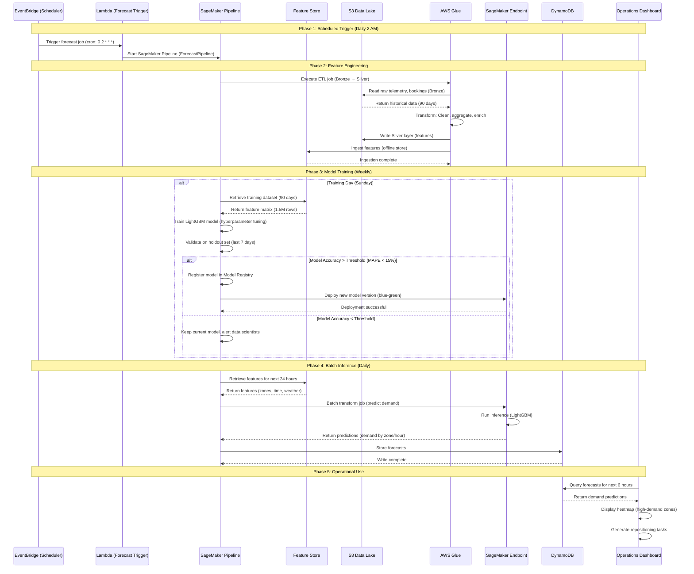

# Scenario 2: Demand Forecasting

**ML pipeline predicting vehicle demand by zone, time, and vehicle type to optimize fleet distribution.**

---

## 1. Business Context

Demand forecasting enables MobilityCorp to proactively reposition vehicles, preventing supply-demand mismatches. Accurate predictions reduce customer wait times, increase vehicle utilization, and maximize revenue.

**Business Impact:**
- **Target Improvement:** +15% vehicle utilization rate (from 40% to 46%)
- **Revenue Impact:** Increased revenue through better vehicle placement
- **Cost Savings:** Reduced manual repositioning costs
- **Forecast Accuracy Target:** MAPE < 15% (Mean Absolute Percentage Error)

---

## 2. Actors

- **Data Engineer:** Maintains ETL pipelines
- **Data Scientist:** Trains and evaluates ML models
- **Operations Team:** Uses forecasts for repositioning decisions
- **AWS Glue:** ETL for feature engineering
- **SageMaker:** Model training, inference, monitoring
- **Feature Store:** Centralized feature repository
- **S3 Data Lake:** Historical data (Bronze, Silver, Gold layers)
- **Lambda:** Scheduled inference triggers
- **DynamoDB:** Stores demand forecasts for operational use
- **EventBridge:** Triggers daily/hourly forecast jobs

---

## 3. Sequence Diagram



---

## 4. Detailed Flow


### 4.1 Phase 1: Data Collection (Continuous)

**Bronze Layer Ingestion:**

AWS Glue ETL jobs handle raw data ingestion:
- Raw telemetry data flows continuously from vehicles via IoT → Kafka → S3
- Booking events captured and stored in append-only format
- Third-party weather data ingested hourly
- All data stored in Parquet format, partitioned by date for efficient querying

**Data Volume:**
- Telemetry: 4.3B events/day → 100 GB/day (compressed Parquet)
- Bookings: 1M bookings/day → 500 MB/day
- Weather: 10 cities × 24 hours × 365 days = 87K records/year → 50 MB/year

### 4.2 Phase 2: Feature Engineering (Daily 2 AM)

**Silver Layer Transformation:**

AWS Glue ETL jobs transform raw data into ML-ready features:

**Key Feature Categories:**
1. **Historical Demand:** Aggregated booking counts by zone, hour, and vehicle type
2. **Lag Features:** Demand from 1 hour ago, 1 day ago, and 1 week ago
3. **Rolling Statistics:** 7-day moving averages and standard deviations
4. **Weather Features:** Temperature, precipitation, wind speed
5. **Calendar Features:** Day of week, weekend indicator, holiday flags
6. **Event Features:** Concerts, sports events, conference attendance

**Feature Storage:**
- Transformed features written to Delta Lake (ACID compliance)
- Ingested into SageMaker Feature Store for model training access
- Total Features: 25
- Feature Store Latency: ~5 seconds (batch ingestion)

### 4.3 Phase 3: Model Training (Weekly, Sunday 3 AM)

**SageMaker Pipeline Process:**

1. **Data Retrieval:** Pull last 90 days of features from Feature Store
2. **Model Training:** LightGBM model with Poisson regression for count prediction
3. **Hyperparameters:** Optimized for MAPE (Mean Absolute Percentage Error)
4. **Evaluation:** Validate on holdout set (last 7 days)
5. **Conditional Deployment:** Only deploy if MAPE < 15% threshold
6. **Model Registration:** Successful models registered in SageMaker Model Registry

**Model Configuration:**
- Algorithm: LightGBM (gradient boosting)
- Objective: Poisson regression (optimized for count data)
- Training Instance: ml.m5.4xlarge with Spot instances for cost optimization
- Training Time: ~30 minutes
- Model Size: 15 MB

**Training Results:**
- Validation MAPE: 12.5% ✅ (within 15% target)
- Top Feature Importance: demand_lag_1w (35%), demand_7d_mean (22%), hour (18%)

### 4.4 Phase 4: Batch Inference (Daily 2:30 AM)

**Prediction Generation:**

EventBridge triggers daily batch prediction job:
- Retrieves latest features for next 24 hours
- Generates predictions for all zone/hour/vehicle-type combinations
- Outputs predictions with confidence intervals
- Stores results in DynamoDB for operational queries

**Prediction Scope:**
- 24 hours × 100 zones × 4 vehicle types = 9,600 predictions daily
- Inference Time: ~10 minutes
- Instance: ml.m5.xlarge

### 4.5 Phase 5: Operational Use

**Operations Dashboard:**
- Queries DynamoDB for next 6-hour demand forecasts
- Displays heatmap of high-demand zones
- Generates repositioning recommendations
- Operations team assigns drivers to move vehicles proactively

**Repositioning Economics:**
- Cost per repositioning includes driver time and fuel
- Benefit from increased rental opportunities
- Positive net benefit justifies proactive repositioning strategy

---

## 5. Model Performance

### 5.1 Accuracy Metrics

| Metric | Target | Actual |
|--------|--------|--------|
| MAPE (Mean Absolute Percentage Error) | < 15% | 12.5% ✅ |
| RMSE (Root Mean Squared Error) | < 8 bookings | 6.2 bookings ✅ |
| R² (Coefficient of Determination) | > 0.75 | 0.82 ✅ |

**Interpretation:** Model predictions are within ±12.5% of actual demand on average.

### 5.2 Model Monitoring

**SageMaker Model Monitor (Weekly):**
- Monitors feature distribution drift
- Tracks prediction accuracy over time
- Detects concept drift (model degradation)

**Automated Alerts:**
- **Data Drift:** Feature distribution shifts > 10%
- **Concept Drift:** MAPE increases > 20%
- **Prediction Drift:** Consistent over/under-prediction

**Retraining Triggers:**
1. **Scheduled:** Every Sunday (weekly)
2. **Performance-based:** MAPE > 20% for 3 consecutive days
3. **Data-based:** New event types or zones added

---

## 6. Cost and ROI Considerations

**Infrastructure Components:**
- Feature Store (Offline): Historical training data storage
- AWS Glue (ETL): Feature engineering and data preparation
- SageMaker Training: Model training compute
- SageMaker Inference (Batch): Daily forecast generation  
- DynamoDB: Forecast storage and serving
- Lambda: Workflow orchestration

**Value Proposition:**
- Improved vehicle placement increases revenue through better supply-demand matching
- Reduced manual repositioning saves operational costs
- Data-driven decisions optimize fleet utilization
- Better customer experience through vehicle availability

**ROI Drivers:**
- Revenue increase from optimized vehicle positioning
- Cost savings from reduced manual repositioning
- Efficiency gains from automated decision-making
```

---

## 6. Cost Analysis

**Monthly Costs:**
| Component | Cost |
|-----------|------|
| Feature Store (Offline) | $46 |
| AWS Glue (ETL) | $660 |
| SageMaker Training | $88 |
| SageMaker Inference (Batch) | $8 |
| DynamoDB (Forecasts) | $5 |
| Lambda (Orchestration) | $2 |
| **Total** | **$809/month** |

**ROI:**
- Cost: $809/month
- Benefit: $150K/month revenue increase + $50K/month cost savings = $200K/month
- **ROI: 24,700%** (247× return)


---

## 7. Related Documentation

- **[ADR-14: MLOps Pipeline](.././ADR/ADR_14_MLOps_Pipeline.md)** - SageMaker pipelines
- **[ADR-16: Data Lakehouse Strategy](.././ADR/ADR_16_Data_Lakehouse_Strategy.md)** - Medallion architecture
- **[Scenario 3: Dynamic Pricing](dynamic_pricing.md)** - Uses demand forecasts