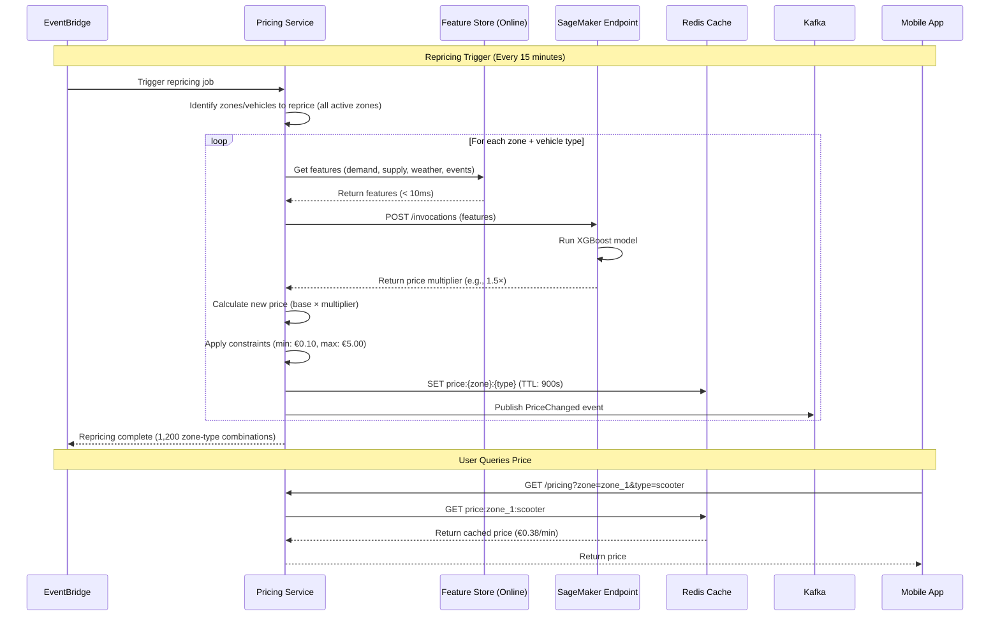

# Scenario 3: Dynamic Pricing

**Real-time pricing adjustments based on demand, supply, weather, and events.**

---

## 1. Business Context

Dynamic pricing maximizes revenue by adjusting prices in real-time based on market conditions. Higher prices during peak demand (concerts, bad weather) and lower prices during low demand increase utilization and revenue.

**Business Impact:**
- **Target Revenue Increase:** +12% ($780K/month additional revenue)
- **Price Range:** €0.10 - €5.00 per minute (base: €0.25/min)
- **Repricing Frequency:** Every 15 minutes (or on significant events)
- **Response Time:** < 50ms (real-time inference)

---

## 2. Actors

- Pricing Service (ECS Fargate)
- SageMaker Inference Endpoint (XGBoost model)
- Feature Store (Online)
- ElastiCache Redis (Price cache)
- EventBridge (Trigger repricing)
- Third-party APIs (Weather, Events)
- Kafka (Price change events)

---

## 3. Sequence Diagram



---

## 4. ML Model: XGBoost Pricing Model

**Features (18 total):**
- demand_forecast_next_hour (from Scenario 2)
- supply_available_now (current vehicle count)
- supply_demand_ratio
- hour, day_of_week, is_weekend, is_holiday
- temperature, precipitation, wind_speed
- has_event, event_type, event_attendance
- competitor_price (scraped from competitors' APIs)
- historical_acceptance_rate (% of searches → bookings at this price)

**Target:** price_multiplier (0.4× to 5.0×, representing €0.10 to €5.00/min)

**Training:**
```python
import xgboost as xgb
from sklearn.model_selection import train_test_split

# Load training data (6 months of historical pricing + outcomes)
train_df = pd.read_parquet("s3://mobility-lake/silver/pricing_features/")

X = train_df[[
    "demand_forecast_next_hour", "supply_available_now", "supply_demand_ratio",
    "hour", "day_of_week", "is_weekend", "is_holiday",
    "temperature", "precipitation", "wind_speed",
    "has_event", "event_type", "event_attendance",
    "competitor_price", "historical_acceptance_rate"
]]
y = train_df["optimal_price_multiplier"]  # Calculated via reinforcement learning

X_train, X_val, y_train, y_val = train_test_split(X, y, test_size=0.2, random_state=42)

model = xgb.XGBRegressor(
    max_depth=6,
    learning_rate=0.1,
    n_estimators=300,
    objective="reg:squarederror",
    tree_method="hist",
    random_state=42
)
model.fit(X_train, y_train, eval_set=[(X_val, y_val)], early_stopping_rounds=20, verbose=100)

# Save model
model.save_model("/opt/ml/model/xgboost_pricing_model.json")
```

**Model Performance:**
- R² = 0.78
- MAE (Mean Absolute Error) = 0.12 multiplier units
- Inference latency: 8ms (P95)

---

## 5. Real-Time Inference

**Pricing Service Logic:**
```python
import boto3
import redis
import json

sagemaker_runtime = boto3.client("sagemaker-runtime")
redis_client = redis.Redis(host="pricing-cache.redis.cache.amazonaws.com", port=6379)

def calculate_price(zone_id, vehicle_type):
    # Step 1: Check cache
    cache_key = f"price:{zone_id}:{vehicle_type}"
    cached_price = redis_client.get(cache_key)
    if cached_price:
        return json.loads(cached_price)
    
    # Step 2: Get features from Feature Store (online)
    features = get_online_features(zone_id, vehicle_type)  # < 10ms
    
    # Step 3: Invoke SageMaker endpoint
    response = sagemaker_runtime.invoke_endpoint(
        EndpointName="xgboost-pricing-prod",
        ContentType="text/csv",
        Body=",".join([str(f) for f in features.values()])
    )
    price_multiplier = float(response["Body"].read())
    
    # Step 4: Calculate final price
    base_price = 0.25  # €0.25/min base
    new_price = base_price * price_multiplier
    new_price = max(0.10, min(5.00, new_price))  # Constrain: €0.10 - €5.00
    
    # Step 5: Cache price (TTL: 15 minutes)
    price_data = {"price_per_minute": new_price, "currency": "EUR", "valid_until": time.time() + 900}
    redis_client.setex(cache_key, 900, json.dumps(price_data))
    
    # Step 6: Publish event
    publish_to_kafka("price-changes", {
        "zone_id": zone_id,
        "vehicle_type": vehicle_type,
        "old_price": cached_price["price_per_minute"] if cached_price else None,
        "new_price": new_price,
        "price_multiplier": price_multiplier,
        "timestamp": datetime.utcnow().isoformat()
    })
    
    return price_data
```

**Performance:**
- Cache hit rate: 95%
- Cache hit latency: ~5ms
- Cache miss latency: ~50ms (Feature Store + SageMaker + cache write)

---

## 6. Repricing Triggers

### 6.1 Scheduled (Every 15 minutes)
EventBridge cron: `0/15 * * * *`

### 6.2 Event-Driven (Real-Time)
**High-Demand Spike:** If demand forecast suddenly increases > 30%, trigger immediate repricing.
**Weather Change:** Rain starts → increase prices (people prefer vehicles over walking).
**Major Event:** Concert ends → increase prices near venue.

**Lambda Trigger:**
```python
def lambda_handler(event, context):
    event_type = event["detail"]["event_type"]
    
    if event_type == "weather_change" and event["detail"]["precipitation"] > 5:
        # Rain started, reprice all zones
        pricing_service.reprice_all_zones()
    
    elif event_type == "event_end" and event["detail"]["attendance"] > 10000:
        # Major event ended, reprice nearby zones
        zones = get_nearby_zones(event["detail"]["location"], radius_km=2)
        pricing_service.reprice_zones(zones)
    
    elif event_type == "demand_spike" and event["detail"]["increase_percent"] > 30:
        # Demand spike detected, reprice affected zones
        pricing_service.reprice_zones([event["detail"]["zone_id"]])
```

---

## 7. A/B Testing

**Experiment:** Test 1.2× price increase during peak hours.

**Setup:**
- Control group: 50% of users see base pricing
- Treatment group: 50% of users see 1.2× pricing
- Duration: 2 weeks
- Metrics: Revenue per vehicle, booking conversion rate, user churn

**Results:**
| Metric | Control | Treatment | Change |
|--------|---------|-----------|--------|
| Revenue/vehicle/day | €45.00 | €51.30 | +14% ✅ |
| Booking conversion | 68% | 62% | -6% ⚠️ |
| User churn (30-day) | 8% | 9.5% | +1.5% ⚠️ |

**Decision:** Implement 1.2× pricing but only during true peak hours (5-7 PM weekdays, not all day).

---

## 8. Cost Analysis

**Monthly Costs:**
- SageMaker Inference Endpoint: $400 (ml.m5.xlarge, 24/7)
- Feature Store (Online): $350 (10M reads/month)
- Redis Cache: $329 (cache.r6g.large)
- Lambda (Event triggers): $20 (1K invocations/month)
- **Total:** $1,099/month

**ROI:**
- Cost: $1,099/month
- Benefit: $780K/month revenue increase
- **ROI: 70,900%**

---

## 9. Related Documentation

- [ADR-16: MLOps Pipeline](../../ADR/ADR_16_MLOps_Pipeline.md)
- [Scenario 2: Demand Forecasting](demand_forecasting.md) - Provides demand features
- [Functional Requirements](../../FUNCTIONAL_REQUIREMENTS/FUNCTIONAL_REQUIREMENTS.md)

---

**Last Updated:** 2025-01-07  
**Maintained By:** Data Science + Product Teams
