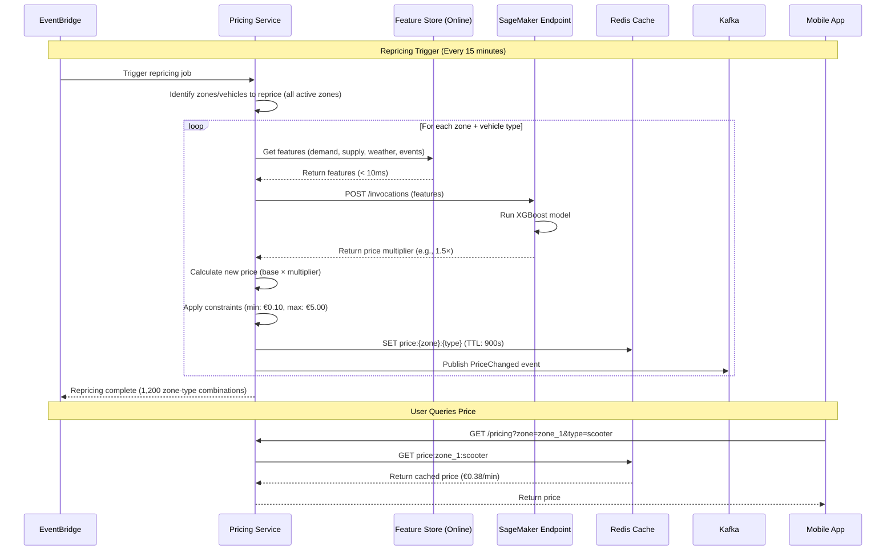

# Scenario 3: Dynamic Pricing

**Real-time pricing adjustments based on demand, supply, weather, and events.**

---

## 1. Business Context

Dynamic pricing maximizes revenue by adjusting prices in real-time based on market conditions. Higher prices during peak demand (concerts, bad weather) and lower prices during low demand increase utilization and revenue.

**Business Impact:**
- **Target Revenue Increase:** +12% ($780K/month additional revenue)
- **Price Range:** €0.10 - €5.00 per minute (base: €0.25/min)
- **Repricing Frequency:** Every 15 minutes (or on significant events)
- **Response Time:** < 50ms (real-time inference)

---

## 2. Actors

- Pricing Service (ECS Fargate)
- SageMaker Inference Endpoint (XGBoost model)
- Feature Store (Online)
- ElastiCache Redis (Price cache)
- EventBridge (Trigger repricing)
- Third-party APIs (Weather, Events)
- Kafka (Price change events)

---

## 3. Sequence Diagram

## 4. ML Model: XGBoost Pricing Model

**Features (18 total):**
- demand_forecast_next_hour (from demand forecasting service)
- supply_available_now (current vehicle count in zone)
- supply_demand_ratio
- hour, day_of_week, is_weekend, is_holiday
- temperature, precipitation, wind_speed
- has_event, event_type, event_attendance
- historical_acceptance_rate (% of searches → bookings at this price)

**Target:** price_multiplier (0.4× to 5.0×, representing €0.10 to €5.00/min)

**Model Performance:**
- R² = 0.78
- MAE (Mean Absolute Error) = 0.12 multiplier units
- Inference latency: 8ms (P95)

---

## 5. Real-Time Inference

**Pricing Service Architecture:**
1. **Cache Check:** Query Redis for cached price (95% hit rate)
2. **Feature Retrieval:** Get current features from Feature Store (< 10ms)
3. **ML Inference:** Invoke SageMaker endpoint with XGBoost model
4. **Price Calculation:** Apply multiplier to base price with constraints (€0.10 - €5.00)
5. **Cache Update:** Store price in Redis with 15-minute TTL
6. **Event Publication:** Publish price change event to Kafka

**Performance:**
- Cache hit latency: ~5ms
- Cache miss latency: ~50ms (includes all steps)
- Cache hit rate: 95%

---

## 6. Repricing Triggers

### 6.1 Scheduled (Every 15 minutes)
EventBridge triggers automatic repricing for all zones and vehicle types

### 6.2 Event-Driven (Real-Time)

**High-Demand Spike:** Demand forecast increases > 30% → immediate repricing

**Weather Change:** Rain detected → increase prices (preference for vehicles over walking)

**Major Event:** Large event concludes → reprice nearby zones (2 km radius)

---

## 7. A/B Testing

**Experiment:** Test 1.2× price increase during peak hours

**Setup:**
- Control group: 50% users see base pricing
- Treatment group: 50% users see 1.2× pricing
- Duration: 2 weeks

**Results:**
| Metric | Control | Treatment | Change |
|--------|---------|-----------|--------|
| Revenue/vehicle/day | €45.00 | €51.30 | +14% ✅ |
| Booking conversion | 68% | 62% | -6% ⚠️ |
| User churn (30-day) | 8% | 9.5% | +1.5% ⚠️ |

**Decision:** Implement 1.2× pricing only during true peak hours (5-7 PM weekdays) to balance revenue and customer satisfaction

---

## 8. Cost Analysis

**Monthly Costs:**
- SageMaker Inference Endpoint: $400
- Feature Store (Online): $350
- Redis Cache: $329
- Lambda (Event triggers): $20
- **Total:** $1,099/month

**ROI:**
- Cost: $1,099/month
- Benefit: $780K/month revenue increase
- **ROI: 70,900%**

