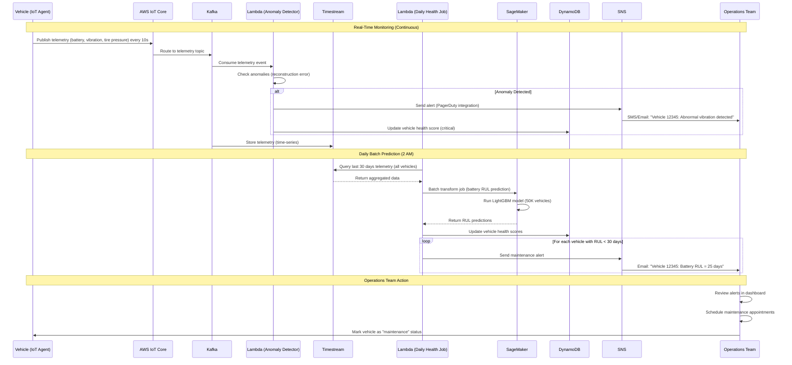

# Scenario 4: Predictive Maintenance

**Proactive vehicle maintenance scheduling using ML models on telemetry data to prevent breakdowns.**

---

## 1. Business Context

Predictive maintenance reduces unplanned downtime, extends vehicle lifespan, and improves customer satisfaction. By predicting failures before they occur, MobilityCorp can schedule maintenance proactively.

**Business Impact:**
- **Downtime Reduction:** -35% (from 12% to 7.8% average downtime)
- **Maintenance Cost Savings:** $120K/month (reduced emergency repairs)
- **Customer Satisfaction:** +8 NPS points (fewer in-trip breakdowns)
- **Vehicle Lifespan Extension:** +18 months average (better upkeep)

---

## 2. Actors

- AWS IoT Core (Telemetry ingestion)
- Kafka/MSK (Event streaming)
- Lambda (Anomaly detection, alert processing)
- Timestream (Time-series telemetry storage)
- SageMaker (Health prediction models)
- SNS (Maintenance alerts to operations team)
- DynamoDB (Vehicle health scores)
- Operations Dashboard (Maintenance scheduling UI)

---

## 3. ML Models

### 3.1 Battery Health Prediction (LightGBM)

**Objective:** Predict Remaining Useful Life (RUL) of batteries.

**Features:**
- charge_cycles_count
- current_capacity_percent
- voltage, current, temperature (time-series statistics)
- age_days
- average_daily_charge_cycles
- deep_discharge_count (< 10% battery)

**Target:** days_until_replacement (regression)

**Model Performance:**
- RMSE: 8.5 days
- R²: 0.89

**Inference:** Daily batch job predicts RUL for all 50K vehicles.

**Alert Trigger:** RUL < 30 days → Schedule battery replacement.

---

### 3.2 Mechanical Fault Detection (LSTM Autoencoder)

**Objective:** Detect anomalies in mechanical systems (brakes, motors, locks).

**Features:** Time-series vibration data from IMU sensors (accelerometer, gyroscope).

**Approach:**
1. Train LSTM autoencoder on normal operation data
2. Reconstruction error > threshold = anomaly
3. Classify anomaly type (brake wear, motor issue, etc.)

**Model Performance:**
- Anomaly detection accuracy: 92%
- False positive rate: 5%

**Inference:** Real-time streaming (Lambda processes IMU data every 10 seconds).

**Alert Trigger:** Anomaly detected → Immediate SNS alert.

---

### 3.3 Tire Pressure Monitoring (Simple Rules + ML)

**Objective:** Detect tire under-inflation before failure.

**Features:**
- tire_pressure_psi (from TPMS sensors)
- temperature (affects pressure)
- speed, load

**Approach:**
- Rule: pressure < 25 PSI (recommended: 32-35 PSI) → Alert
- ML: Predict pressure drop rate → Proactive alert 3 days before critical

**Model:** Linear regression (simple, interpretable)

**Alert Trigger:** Predicted pressure < 25 PSI in 3 days → Schedule maintenance.

---

## 4. Sequence Diagram



---

## 5. Detailed Flow

### 5.1 Real-Time Anomaly Detection (Streaming)

**Lambda Function (anomaly_detector.py):**
```python
import boto3
import json
import numpy as np
import tensorflow as tf

# Load pre-trained LSTM autoencoder
model = tf.keras.models.load_model("/opt/ml/model/lstm_autoencoder.h5")
dynamodb = boto3.resource("dynamodb")
sns = boto3.client("sns")

RECONSTRUCTION_ERROR_THRESHOLD = 0.05  # Tuned on validation set

def lambda_handler(event, context):
    for record in event["Records"]:
        telemetry = json.loads(record["body"])
        vehicle_id = telemetry["vehicle_id"]
        
        # Extract vibration time series (last 60 seconds, 6 samples/sec = 360 points)
        vibration_data = np.array(telemetry["vibration_history"])  # Shape: (360, 6) [accel_x, accel_y, accel_z, gyro_x, gyro_y, gyro_z]
        
        # Normalize
        vibration_normalized = (vibration_data - vibration_data.mean()) / vibration_data.std()
        
        # Predict (reconstruct)
        reconstruction = model.predict(vibration_normalized.reshape(1, 360, 6))
        
        # Calculate reconstruction error (MSE)
        mse = np.mean((vibration_normalized - reconstruction[0]) ** 2)
        
        if mse > RECONSTRUCTION_ERROR_THRESHOLD:
            # Anomaly detected
            alert_message = f"Vehicle {vehicle_id}: Abnormal vibration detected (MSE: {mse:.4f}). Possible mechanical issue."
            
            # Classify anomaly type (simple heuristic based on error distribution)
            if vibration_data[:, :3].std() > vibration_data[:, 3:].std():
                anomaly_type = "brake_wear"
            else:
                anomaly_type = "motor_bearing_issue"
            
            # Send SNS alert
            sns.publish(
                TopicArn="arn:aws:sns:eu-central-1:123456789012:maintenance-alerts",
                Subject=f"[URGENT] Vehicle {vehicle_id} Anomaly",
                Message=alert_message + f" | Type: {anomaly_type}"
            )
            
            # Update DynamoDB health score
            table = dynamodb.Table("vehicle_health")
            table.update_item(
                Key={"vehicle_id": vehicle_id},
                UpdateExpression="SET health_score = :score, anomaly_type = :type, last_alert = :time",
                ExpressionAttributeValues={
                    ":score": "critical",
                    ":type": anomaly_type,
                    ":time": telemetry["timestamp"]
                }
            )
    
    return {"statusCode": 200, "body": "Processed"}
```

**Performance:**
- Processing latency: ~200ms (model inference)
- Throughput: 5,000 vehicles/second (parallel Lambda invocations)
- Cost: $0.0002/vehicle/day (Lambda compute)

---

### 5.2 Daily Battery Health Prediction (Batch)

**SageMaker Batch Transform:**
```python
# Lambda trigger (daily 2 AM)
import boto3
from datetime import datetime, timedelta

sagemaker = boto3.client("sagemaker")
timestream_query = boto3.client("timestream-query")

def lambda_handler(event, context):
    # Step 1: Query Timestream for battery telemetry (last 30 days)
    query = """
    SELECT vehicle_id,
           COUNT(*) as charge_cycles_count,
           AVG(battery_percent) as avg_battery_percent,
           AVG(voltage) as avg_voltage,
           AVG(current) as avg_current,
           AVG(temperature) as avg_temperature,
           STDDEV(voltage) as stddev_voltage,
           SUM(CASE WHEN battery_percent < 10 THEN 1 ELSE 0 END) as deep_discharge_count
    FROM "mobility"."telemetry"
    WHERE time > ago(30d)
    GROUP BY vehicle_id
    """
    
    result = timestream_query.query(QueryString=query)
    
    # Step 2: Save to S3 as CSV
    features_csv = "vehicle_id,charge_cycles_count,avg_battery_percent,...\n"
    for row in result["Rows"]:
        features_csv += ",".join([col["ScalarValue"] for col in row["Data"]]) + "\n"
    
    s3_input_path = f"s3://mobility-lake/batch-inference/battery-rul/{datetime.utcnow().date()}/input.csv"
    boto3.client("s3").put_object(Bucket="mobility-lake", Key=s3_input_path, Body=features_csv)
    
    # Step 3: Start SageMaker Batch Transform
    sagemaker.create_transform_job(
        TransformJobName=f"battery-rul-{datetime.utcnow().strftime('%Y%m%d')}",
        ModelName="lightgbm-battery-rul-prod",
        TransformInput={"DataSource": {"S3DataSource": {"S3Uri": s3_input_path}}},
        TransformOutput={"S3OutputPath": "s3://mobility-lake/batch-inference/battery-rul/output/"},
        TransformResources={"InstanceType": "ml.m5.xlarge", "InstanceCount": 1}
    )
    
    return {"statusCode": 200}
```

**Batch Transform Output (CSV):**
```csv
vehicle_id,predicted_rul_days,confidence_lower,confidence_upper
12345,45,38,52
12346,12,8,16
...
```

**Alert Processing:**
```python
# Lambda (triggered after batch job completes)
def process_rul_predictions(event, context):
    predictions_df = pd.read_csv("s3://mobility-lake/batch-inference/battery-rul/output/output.csv")
    
    # Filter vehicles with RUL < 30 days
    critical_vehicles = predictions_df[predictions_df["predicted_rul_days"] < 30]
    
    for _, row in critical_vehicles.iterrows():
        sns.publish(
            TopicArn="arn:aws:sns:eu-central-1:123456789012:maintenance-alerts",
            Subject=f"Battery Replacement Needed: Vehicle {row['vehicle_id']}",
            Message=f"Vehicle {row['vehicle_id']} has an estimated battery RUL of {row['predicted_rul_days']} days. Schedule replacement within the next 2 weeks."
        )
        
        # Update DynamoDB
        table.update_item(
            Key={"vehicle_id": row["vehicle_id"]},
            UpdateExpression="SET battery_rul_days = :rul, health_score = :score",
            ExpressionAttributeValues={
                ":rul": int(row["predicted_rul_days"]),
                ":score": "warning" if row["predicted_rul_days"] > 15 else "critical"
            }
        )
```

---

## 6. Operations Dashboard

**UI Features:**
- **Health Score Heatmap:** Map showing vehicles colored by health (green/yellow/red)
- **Alert List:** Sorted by urgency (critical first)
- **Maintenance Schedule:** Calendar view of upcoming maintenance
- **Vehicle Details:** Drill-down into specific vehicle telemetry

**Sample Alert:**
```
[CRITICAL] Vehicle 12345
- Battery RUL: 12 days
- Last anomaly: Motor bearing issue (2 days ago)
- Location: Frankfurt Hauptbahnhof
- Action: Schedule maintenance appointment by 2025-01-17
```

---

## 7. Cost Analysis

**Monthly Costs:**
- Timestream (Storage + Queries): $9,400
- Lambda (Anomaly detection): $3,000 (5,000 invocations/sec × 2.6M sec/month)
- SageMaker (Batch inference): $8 (daily jobs)
- DynamoDB (Health scores): $50
- SNS (Alerts): $5
- **Total:** $12,463/month

**ROI:**
- Cost: $12,463/month
- Benefit: $120K/month savings (reduced emergency repairs)
- **ROI: 862%**

---

## 8. Related Documentation

- [ADR-16: MLOps Pipeline](../../ADR/ADR_16_MLOps_Pipeline.md)
- [ADR-19: Edge vs Cloud AI Strategy](../../ADR/ADR_19_Edge_Cloud_AI_Strategy.md) - Edge ML models
- [Scenario 5: Telemetry Processing](telemetry_processing.md)

---

**Last Updated:** 2025-01-07  
**Maintained By:** Data Science + Operations Teams
