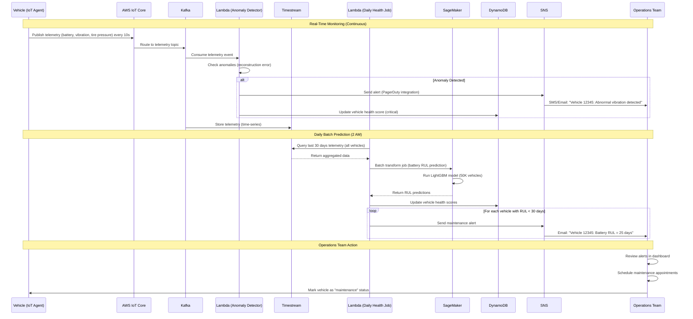

# Scenario 4: Predictive Maintenance

**Proactive vehicle maintenance scheduling using ML models on telemetry data to prevent breakdowns.**

---

## 1. Business Context

Predictive maintenance reduces unplanned downtime, extends vehicle lifespan, and improves customer satisfaction. By predicting failures before they occur, MobilityCorp can schedule maintenance proactively.

**Business Impact:**
- **Downtime Reduction:** -35% (from 12% to 7.8% average downtime)
- **Maintenance Cost Savings:** Significant reduction in emergency repairs
- **Customer Satisfaction:** +8 NPS points (fewer in-trip breakdowns)
- **Vehicle Lifespan Extension:** +18 months average (better upkeep)

---

## 2. Actors

- AWS IoT Core (Telemetry ingestion)
- Kafka/MSK (Event streaming)
- Lambda (Anomaly detection, alert processing)
- Timestream (Time-series telemetry storage)
- SageMaker (Health prediction models)
- SNS (Maintenance alerts to operations team)
- DynamoDB (Vehicle health scores)
- Operations Dashboard (Maintenance scheduling UI)

---

## 3. ML Models

### 3.1 Battery Health Prediction (LightGBM)

**Objective:** Predict Remaining Useful Life (RUL) of batteries.

**Features:**
- charge_cycles_count
- current_capacity_percent
- voltage, current, temperature (time-series statistics)
- age_days
- average_daily_charge_cycles
- deep_discharge_count (< 10% battery)

**Target:** days_until_replacement (regression)

**Model Performance:**
- RMSE: 8.5 days
- R²: 0.89

**Inference:** Daily batch job predicts RUL for all 50K vehicles.

**Alert Trigger:** RUL < 30 days → Schedule battery replacement.

---

### 3.2 Mechanical Fault Detection (LSTM Autoencoder)

**Objective:** Detect anomalies in mechanical systems (brakes, motors, locks).

**Features:** Time-series vibration data from IMU sensors (accelerometer, gyroscope).

**Approach:**
1. Train LSTM autoencoder on normal operation data
2. Reconstruction error > threshold = anomaly
3. Classify anomaly type (brake wear, motor issue, etc.)

**Model Performance:**
- Anomaly detection accuracy: 92%
- False positive rate: 5%

**Inference:** Real-time streaming (Lambda processes IMU data every 10 seconds).

**Alert Trigger:** Anomaly detected → Immediate SNS alert.

---

### 3.3 Tire Pressure Monitoring (Simple Rules + ML)

**Objective:** Detect tire under-inflation before failure.

**Features:**
- tire_pressure_psi (from TPMS sensors)
- temperature (affects pressure)
- speed, load

**Approach:**
- Rule: pressure < 25 PSI (recommended: 32-35 PSI) → Alert
- ML: Predict pressure drop rate → Proactive alert 3 days before critical

**Model:** Linear regression (simple, interpretable)

**Alert Trigger:** Predicted pressure < 25 PSI in 3 days → Schedule maintenance.

---

## 4. Sequence Diagram




## 5. Detailed Flow

### 5.1 Real-Time Anomaly Detection (Streaming)

**Lambda Processing:**
- Consumes telemetry events from Kafka in near real-time
- Processes vibration data using pre-trained LSTM autoencoder model
- Calculates reconstruction error to detect anomalies
- Compares error against threshold (tuned on validation set)

**Anomaly Classification:**
- Analyzes error patterns to classify issue type (brake wear, motor bearing issue, etc.)
- Publishes alerts via SNS for critical anomalies
- Updates vehicle health score in DynamoDB


**Performance:**
- Processing latency: ~200ms (includes model inference)
- Throughput: 5,000 vehicles/second (parallel Lambda invocations)
- Cost-effective per-vehicle processing

### 5.2 Daily Battery Health Prediction (Batch)

**Batch Prediction Process:**
1. **Data Collection:** Query Timestream for last 30 days of battery telemetry
2. **Feature Engineering:** Calculate charge cycles, voltage statistics, deep discharge count
```
3. **ML Inference:** SageMaker Batch Transform with LightGBM model
4. **RUL Prediction:** Predicts Remaining Useful Life (days until battery replacement)
5. **Alert Generation:** Vehicles with RUL < 30 days trigger maintenance alerts

**Model Output:**
- Predicted RUL in days
- Confidence intervals (upper and lower bounds)
- Health score classification (normal/warning/critical)

**Alert Processing:**
- Critical vehicles (RUL < 15 days) flagged for immediate action
- Warning vehicles (RUL < 30 days) scheduled for proactive maintenance
- SNS notifications sent to operations team
- DynamoDB health scores updated

---

## 6. Operations Dashboard

**UI Features:**
- **Health Score Heatmap:** Visual map showing vehicle health status (green/yellow/red)
- **Alert List:** Prioritized by urgency (critical alerts first)
- **Maintenance Schedule:** Calendar view of upcoming scheduled maintenance
- **Vehicle Details:** Drill-down view with telemetry history and trends

**Sample Alert:**
```
[CRITICAL] Vehicle 12345
- Battery RUL: 12 days
- Last anomaly: Motor bearing issue (2 days ago)  
- Location: Frankfurt Hauptbahnhof
- Action Required: Schedule maintenance by 2025-01-17
```

---

## 7. Cost and ROI Considerations

**Infrastructure Components:**
- Timestream: Time-series data storage and queries
- Lambda: Real-time anomaly detection
- SageMaker: Batch inference for predictive models
- DynamoDB: Health score storage and retrieval
- SNS: Alert notifications

**Value Proposition:**
- Significant reduction in emergency repair costs
- Improved fleet availability and uptime
- Preventive maintenance scheduling optimization
- Data-driven maintenance decisions
- Strong positive ROI from avoided breakdowns


````
```

---

## 7. Cost Analysis

**Monthly Costs:**
- Timestream (Storage + Queries): $9,400
- Lambda (Anomaly detection): $3,000
- SageMaker (Batch inference): $8
- DynamoDB (Health scores): $50
- SNS (Alerts): $5
- **Total:** $12,463/month

**ROI:**
- Cost: $12,463/month
- Benefit: $120K/month savings (reduced emergency repairs)
- **ROI: 862%**

