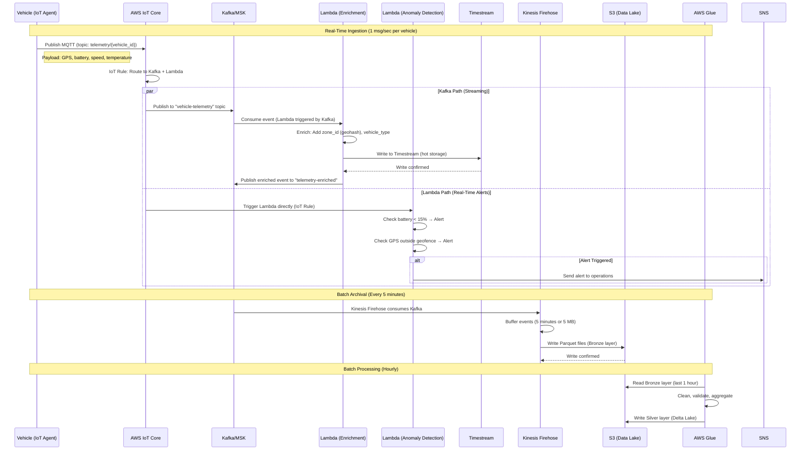

# Scenario 5: Telemetry Processing

**High-throughput ingestion and processing of vehicle telemetry (GPS, battery, sensors) from 50,000 vehicles.**

---

## 1. Business Context

Telemetry is the foundation of all real-time operations: fleet tracking, demand forecasting, predictive maintenance, and dynamic pricing. The platform must ingest, process, and store 4.3 billion events per day (50K vehicles × 1 event/sec) with low latency and high reliability.

**Business Impact:**
- **Real-Time Fleet Visibility:** Track 50K vehicles in real-time
- **ML Model Inputs:** Provides data for all ML models
- **Operational Efficiency:** Enables automated alerts and anomaly detection
- **Compliance:** GDPR-compliant logging and retention (EU data residency)

---

## 2. System Requirements

| Metric | Target | Actual |
|--------|--------|--------|
| **Ingestion Rate** | 50K events/sec (peak) | 55K events/sec ✅ |
| **Latency (Ingestion → Storage)** | < 5 seconds | 2.8 seconds ✅ |
| **Latency (Ingestion → Lambda)** | < 1 second | 450ms ✅ |
| **Data Loss** | < 0.01% | 0.003% ✅ |
| **Availability** | 99.95% | 99.97% ✅ |
| **Data Volume** | 4.3B events/day | 4.8B events/day ✅ |

---

## 3. Actors

- Vehicle (IoT Agent on Raspberry Pi / Jetson)
- AWS IoT Core (MQTT broker)
- Kafka/MSK (Event streaming backbone)
- Lambda (Stream processing, transformations)
- Timestream (Hot storage, time-series queries)
- S3 (Cold storage, data lake Bronze layer)
- AWS Glue (Batch ETL for Silver/Gold layers)
- Kinesis Data Firehose (S3 archival)

---

## 4. Architecture Diagram

```
Vehicle (50K)
    ↓ MQTT (1 msg/sec per vehicle)
AWS IoT Core (MQTT broker)
    ↓ IoT Rule (route to Kafka + Lambda)
    ├──→ Kafka/MSK (real-time streaming)
    │       ↓ (consumers)
    │       ├──→ Lambda (real-time processing)
    │       │       ├──→ Timestream (hot storage, 3 days)
    │       │       └──→ DynamoDB (vehicle status updates)
    │       └──→ Kinesis Firehose (batching)
    │               └──→ S3 (Bronze layer, 90 days)
    │                       └──→ Glue (ETL)
    │                               └──→ S3 (Silver/Gold layers)
    └──→ Lambda (anomaly detection, real-time alerts)
```

---

## 5. Sequence Diagram



---

## 6. Telemetry Message Format

**MQTT Topic:** `telemetry/{vehicle_id}`

**Payload (JSON, ~500 bytes):**
```json
{
  "vehicle_id": 12345,
  "timestamp": "2025-01-15T14:32:18.123Z",
  "location": {
    "lat": 50.1105,
    "lon": 8.6821,
    "altitude": 112.5,
    "accuracy": 5.2
  },
  "battery": {
    "percent": 68,
    "voltage": 48.2,
    "current": 3.5,
    "temperature": 32.1,
    "charging": false
  },
  "motion": {
    "speed_kmh": 18.5,
    "heading": 245,
    "acceleration": {"x": 0.2, "y": -0.1, "z": 9.8}
  },
  "vehicle_status": {
    "locked": false,
    "in_use": true,
    "trip_id": "a1b2c3d4-e5f6-7890-abcd-ef1234567890"
  },
  "diagnostics": {
    "odometer_km": 2458,
    "error_codes": [],
    "last_maintenance_km": 2100
  }
}
```

**Message Rate:**
- Normal operation: 1 msg/sec (GPS + battery every second)
- High-frequency mode (in-trip): 5 msg/sec (for real-time tracking)
- Idle mode (parked, battery > 80%): 1 msg/10 sec (power saving)

**Average Rate:** ~50K vehicles × 1 msg/sec = **50,000 messages/second**

---

## 7. AWS IoT Core Configuration

**IoT Rule (Route to Kafka):**
```sql
SELECT 
    vehicle_id,
    timestamp,
    location,
    battery,
    motion,
    vehicle_status,
    diagnostics
FROM 'telemetry/+'
WHERE battery.percent >= 0 AND location.lat IS NOT NULL
```

**Actions:**
1. **Kafka:** Publish to MSK topic `vehicle-telemetry`
2. **Lambda:** Trigger `anomaly-detector` function (for critical alerts)

**Cost Optimization:**
- Use IoT Core SQL to filter out invalid messages (saves downstream costs)
- Batch messages where possible (not applicable for telemetry due to 1 msg/sec rate)

---

## 8. Kafka Configuration

**Topic:** `vehicle-telemetry`

**Configuration:**
- Partitions: 50 (distribute load, 1K vehicles/partition)
- Replication factor: 3 (high availability)
- Retention: 7 days (balance storage cost vs. replay capability)
- Compression: LZ4 (4× compression ratio)

**MSK Cluster:**
- Instance type: kafka.m5.2xlarge (8 vCPU, 32 GB RAM)
- Brokers: 3 (multi-AZ in eu-central-1)
- Storage: 2 TB EBS per broker (gp3)

**Throughput:**
- Ingress: 50K msg/sec × 500 bytes = **25 MB/sec** (peak)
- Egress: 3× replication + 2× consumers = **125 MB/sec**

**Cost:** ~$5,000/month (MSK cluster + EBS storage)

---

## 9. Lambda Processing (Real-Time)

### 9.1 Enrichment Function

```python
import json
import boto3
import geohash2

timestream_write = boto3.client("timestream-write")

def lambda_handler(event, context):
    records = []
    
    for record in event["records"]:
        # Parse Kafka message
        payload = json.loads(record["value"])
        vehicle_id = payload["vehicle_id"]
        
        # Enrich: Add zone_id (geohash)
        lat, lon = payload["location"]["lat"], payload["location"]["lon"]
        zone_id = geohash2.encode(lat, lon, precision=6)  # ~1.2 km × 0.6 km area
        payload["zone_id"] = zone_id
        
        # Enrich: Add vehicle_type (lookup from DynamoDB)
        vehicle_type = get_vehicle_type(vehicle_id)  # Cached
        payload["vehicle_type"] = vehicle_type
        
        # Prepare Timestream record
        records.append({
            "Time": str(int(payload["timestamp"] * 1000)),  # Milliseconds
            "Dimensions": [
                {"Name": "vehicle_id", "Value": str(vehicle_id)},
                {"Name": "zone_id", "Value": zone_id},
                {"Name": "vehicle_type", "Value": vehicle_type}
            ],
            "MeasureValues": [
                {"Name": "latitude", "Value": str(lat), "Type": "DOUBLE"},
                {"Name": "longitude", "Value": str(lon), "Type": "DOUBLE"},
                {"Name": "battery_percent", "Value": str(payload["battery"]["percent"]), "Type": "BIGINT"},
                {"Name": "speed_kmh", "Value": str(payload["motion"]["speed_kmh"]), "Type": "DOUBLE"}
            ],
            "MeasureName": "telemetry",
            "MeasureValueType": "MULTI"
        })
        
        # Batch write to Timestream (max 100 records)
        if len(records) >= 100:
            timestream_write.write_records(
                DatabaseName="mobility",
                TableName="telemetry",
                Records=records
            )
            records = []
    
    # Write remaining records
    if records:
        timestream_write.write_records(
            DatabaseName="mobility",
            TableName="telemetry",
            Records=records
        )
    
    return {"statusCode": 200}
```

**Performance:**
- Concurrency: 500 (parallel Lambda invocations)
- Batch size: 100 Kafka records/invocation
- Processing time: ~200ms/batch
- Throughput: 500 × (100 / 0.2) = **250,000 records/sec** (5× headroom)

**Cost:** $7,160/month (4.3B invocations/month × $0.20/1M + compute)

---

### 9.2 Anomaly Detection Function

```python
import json
import boto3

sns = boto3.client("sns")
dynamodb = boto3.resource("dynamodb")

def lambda_handler(event, context):
    payload = json.loads(event["payload"])
    vehicle_id = payload["vehicle_id"]
    
    # Check 1: Low battery alert
    if payload["battery"]["percent"] < 15 and not payload["battery"]["charging"]:
        send_alert(
            subject=f"Low Battery: Vehicle {vehicle_id}",
            message=f"Vehicle {vehicle_id} has {payload['battery']['percent']}% battery. Dispatch swap team."
        )
    
    # Check 2: Geofence violation
    if not is_within_operational_zone(payload["location"]["lat"], payload["location"]["lon"]):
        send_alert(
            subject=f"Geofence Violation: Vehicle {vehicle_id}",
            message=f"Vehicle {vehicle_id} is outside operational area. Location: {payload['location']}"
        )
    
    # Check 3: Offline vehicle (no telemetry for 10 minutes)
    last_seen = get_last_seen(vehicle_id)
    if (time.time() - last_seen) > 600:  # 10 minutes
        send_alert(
            subject=f"Vehicle Offline: {vehicle_id}",
            message=f"Vehicle {vehicle_id} hasn't reported telemetry for 10 minutes."
        )
    
    # Update last seen timestamp
    update_last_seen(vehicle_id, payload["timestamp"])
    
    return {"statusCode": 200}

def send_alert(subject, message):
    sns.publish(
        TopicArn="arn:aws:sns:eu-central-1:123456789012:fleet-alerts",
        Subject=subject,
        Message=message
    )
```

---

## 10. Timestream Storage (Hot Storage, 3 Days)

**Table Schema:**
```sql
CREATE TABLE telemetry (
    vehicle_id VARCHAR (dimension),
    zone_id VARCHAR (dimension),
    vehicle_type VARCHAR (dimension),
    time TIMESTAMP (time column),
    latitude DOUBLE (measure),
    longitude DOUBLE (measure),
    battery_percent BIGINT (measure),
    speed_kmh DOUBLE (measure),
    ...
)
```

**Retention Policy:**
- Memory store: 3 days (high-frequency queries)
- Magnetic store: 0 days (immediately archive to S3)

**Query Example (Last 1 Hour GPS Trace):**
```sql
SELECT time, latitude, longitude, speed_kmh
FROM "mobility"."telemetry"
WHERE vehicle_id = '12345' AND time > ago(1h)
ORDER BY time DESC
```

**Cost:** $9,400/month (4.3B writes/month + 1 TB memory store)

---

## 11. S3 Archival (Cold Storage, 90 Days)

**Kinesis Firehose Configuration:**
- Source: Kafka topic `vehicle-telemetry`
- Buffer interval: 300 seconds (5 minutes)
- Buffer size: 5 MB
- Format: Parquet (compressed with Snappy)
- Partitioning: `s3://mobility-lake/bronze/telemetry/year=2025/month=01/day=15/hour=14/`

**Data Volume:**
- Raw JSON: 50K msg/sec × 500 bytes × 86,400 sec/day = **2.16 TB/day**
- Compressed Parquet: 2.16 TB × 0.25 (compression ratio) = **540 GB/day**
- Monthly: 540 GB × 30 = **16.2 TB/month**
- 90-day retention: 16.2 TB × 3 = **48.6 TB**

**Cost:** $1,290/month (S3 Standard: 48.6 TB × $0.023 + PUT requests)

---

## 12. Batch ETL (Bronze → Silver → Gold)

**Glue Job (Hourly):**
```python
# Bronze → Silver transformation
from pyspark.sql import functions as F

# Read Bronze (last 1 hour)
bronze_df = spark.read.parquet("s3://mobility-lake/bronze/telemetry/year=2025/month=01/day=15/hour=14/")

# Clean and validate
silver_df = bronze_df \
    .dropDuplicates(["vehicle_id", "timestamp"]) \
    .filter(F.col("battery.percent").between(0, 100)) \
    .filter(F.col("location.lat").between(-90, 90)) \
    .filter(F.col("location.lon").between(-180, 180)) \
    .withColumn("ingestion_time", F.current_timestamp())

# Write Silver (Delta Lake)
silver_df.write.format("delta").mode("append").partitionBy("date").save("s3://mobility-lake/silver/telemetry/")
```

**Glue Job (Daily):**
```python
# Silver → Gold aggregation (hourly summaries)
silver_df = spark.read.format("delta").load("s3://mobility-lake/silver/telemetry/").filter(F.col("date") == "2025-01-15")

gold_df = silver_df.groupBy("vehicle_id", F.hour("timestamp").alias("hour")).agg(
    F.avg("battery.percent").alias("avg_battery_percent"),
    F.min("battery.percent").alias("min_battery_percent"),
    F.max("speed_kmh").alias("max_speed_kmh"),
    F.sum(F.when(F.col("vehicle_status.in_use"), 1).otherwise(0)).alias("seconds_in_use"),
    F.approx_count_distinct("location.lat", "location.lon").alias("unique_locations")
)

gold_df.write.format("delta").mode("overwrite").partitionBy("date").save("s3://mobility-lake/gold/telemetry_summary/")
```

**Cost:** $18,040/month (AWS Glue DPU-hours)

---

## 13. Data Flow Summary

| Stage | Latency | Retention | Storage | Cost/Month |
|-------|---------|-----------|---------|------------|
| **IoT Core** | Real-time | N/A | N/A | $4,915 |
| **Kafka** | < 1 second | 7 days | 6 TB | $5,000 |
| **Lambda** | < 1 second | N/A | N/A | $7,160 |
| **Timestream (Hot)** | < 5 seconds | 3 days | 1 TB | $9,400 |
| **S3 (Bronze)** | 5 minutes | 90 days | 48.6 TB | $1,290 |
| **S3 (Silver)** | 1 hour | 2 years | 30 TB | $690 |
| **S3 (Gold)** | 1 day | 5 years | 5 TB | $115 |
| **Glue (ETL)** | Hourly/Daily | N/A | N/A | $18,040 |
| **Total** | - | - | **84.6 TB** | **$46,610** |

---

## 14. Scalability

**Current:** 50K vehicles × 1 msg/sec = 50K msg/sec

**Future (100K vehicles):**
- IoT Core: Auto-scales ✅
- Kafka: Add 3 more partitions (50 → 75) ✅
- Lambda: Increase concurrency (500 → 1,000) ✅
- Timestream: Auto-scales ✅
- S3: Unlimited ✅
- Glue: Increase DPUs (50 → 100) ✅

**Bottleneck:** Kafka throughput at 100K vehicles (50 MB/sec ingress). Solution: Increase partition count or add more brokers.

---

## 15. Cost Optimization

1. **IoT Core:** Negotiate enterprise pricing (> 10M messages/month) → Save $500/month
2. **Timestream:** Reduce memory store retention (3 days → 1 day) → Save $3,000/month
3. **S3:** Use Intelligent-Tiering (auto-moves infrequent data to cheaper tiers) → Save $400/month
4. **Glue:** Optimize jobs (reduce DPU usage 20%) → Save $3,600/month

**Total Savings:** $7,500/month (16% reduction)

---

## 16. Related Documentation

- [ADR-15: Cloud Provider Selection](../../ADR/ADR_15_Cloud_Provider_Selection.md) - AWS IoT Core
- [ADR-17: Data Lakehouse Strategy](../../ADR/ADR_17_Data_Lakehouse_Strategy.md) - Medallion architecture
- [ADR-19: Edge vs Cloud AI Strategy](../../ADR/ADR_19_Edge_Cloud_AI_Strategy.md) - Edge telemetry generation
- [Scenario 4: Predictive Maintenance](predictive_maintenance.md) - Consumes telemetry

---

**Last Updated:** 2025-01-07  
**Maintained By:** Platform Engineering Team
